# Lab 02: Deploy a Flask App on Minikube using kubectl and YAML

## Objective
Use Minikube to run a single-node Kubernetes cluster locally, build a small Flask application into a Docker image directly inside Minikube's Docker daemon, deploy it with a Kubernetes `Deployment` manifest, and then expose it with a `NodePort` `Service` so that it can be reached from the Windows host through `minikube service --url`.

---

## Environment
| Item | Version / value |
|------|-----------------|
| OS | Windows 11 Home Single Language 25H2 |
| Shell | Windows PowerShell 5.1 |
| Docker Desktop engine | 29.8.0 (WSL2 backend) |
| Docker engine inside the Minikube node | 29.2.1 |
| Minikube | v1.38.1 (driver: `docker`, profile `minikube`) |
| Kubernetes (server) | v1.35.1 |
| kubectl (client) | v1.37.0 |
| Container base image | `python:3.8-slim` (Flask 3.0.3 installed by pip during the build) |

## Files in this folder
| File | Purpose |
|------|---------|
| `app.py` | Flask application that returns `Hello from Flask on Kubernetes!` on port 15000 |
| `Dockerfile` | Builds the `flask-app` image from `python:3.8-slim` |
| `flask-deployment.yaml` | Final version of the manifest: the `Deployment` plus the `NodePort` `Service` added in Step 13 |
| `screenshot/` | Proof of every step, numbered in execution order |

---

## Step-by-Step Execution

### Step 1: Start Minikube
```powershell
minikube start
```
**Status:** The existing `minikube` profile (docker driver) started successfully, and kubectl was configured to use the `minikube` context.

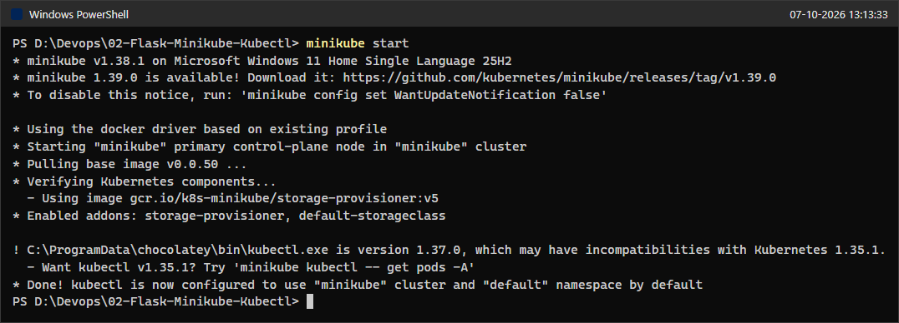

To confirm the cluster was healthy, I also checked the status and the node:
```powershell
minikube status
kubectl get nodes
```
**Status:** host, kubelet and apiserver are `Running`, kubeconfig is `Configured`, and the node `minikube` is `Ready` on v1.35.1.

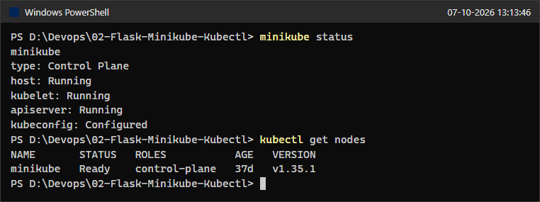

### Steps 2 and 3: Create the Flask application and the Dockerfile
I created `app.py` and `Dockerfile` exactly as given in the exercise.
```powershell
Get-ChildItem -Name
Get-Content app.py
Get-Content Dockerfile
```
**Status:** Both files exist in the lab folder with the exact content from the instructions. I created all three files at the start, so the listing in this screenshot already includes `flask-deployment.yaml`. Until Step 13 that file held only the Deployment.

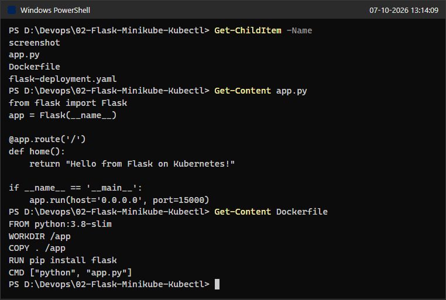

### Step 4: Build the Docker image with Minikube's Docker daemon
First I displayed the variables that `minikube docker-env` would set. Because this is PowerShell, I asked for the PowerShell syntax:
```powershell
minikube docker-env --shell powershell
```
**Status:** Minikube printed `DOCKER_TLS_VERIFY`, `DOCKER_HOST` (`tcp://127.0.0.1:54504`), `DOCKER_CERT_PATH` and `MINIKUBE_ACTIVE_DOCKERD`, plus the PowerShell command to apply them.

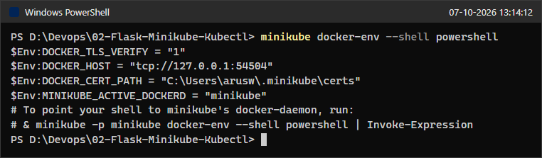

The exercise's command `eval $(minikube docker-env)` is Bash syntax. I ran it as written first, and it fails in PowerShell because `eval` does not exist there:
```powershell
eval $(minikube docker-env)
```
**Status:** Failed as expected (`The term 'eval' is not recognized ...`). See Issues & Fixes.

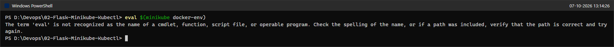

I used the PowerShell equivalent, and ran the build in the same shell session so the variables were in effect:
```powershell
& minikube -p minikube docker-env --shell powershell | Invoke-Expression
$env:DOCKER_HOST
docker build -t flask-app .
docker images flask-app
```
**Status:** `DOCKER_HOST` points to Minikube's daemon (`tcp://127.0.0.1:54504`). The build succeeded. The log shows `Successfully installed ... flask-3.0.3` and `naming to docker.io/library/flask-app done`, and `docker images flask-app` (run against Minikube's daemon) lists `flask-app:latest` (136 MB). The middle of the long build log is shortened in the screenshot (`79 lines omitted`).

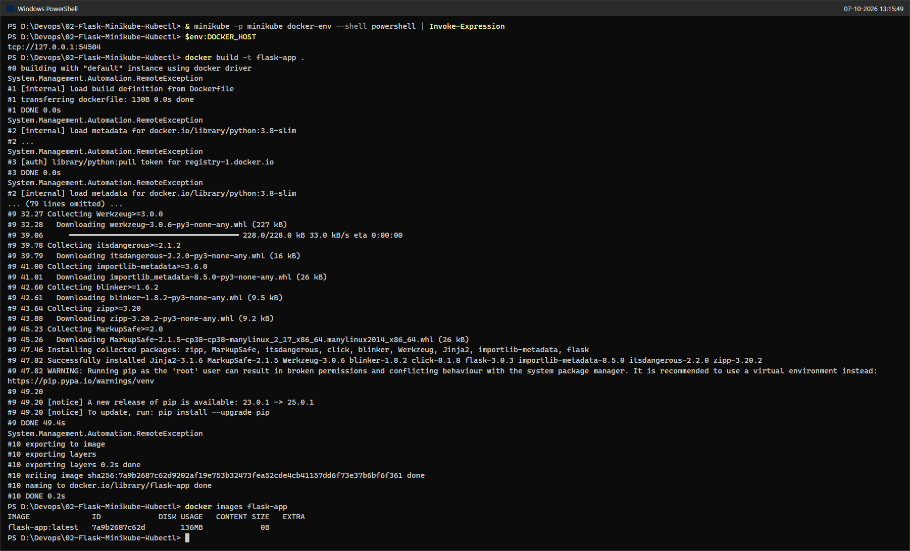

### Steps 5 and 6: Create the Deployment YAML and deploy it
`flask-deployment.yaml` (created at the start, see Steps 2 and 3) contains the Deployment exactly as given (one replica, `image: flask-app:latest`, `imagePullPolicy: Never`, `containerPort: 15000`) and applied it.
```powershell
Get-Content flask-deployment.yaml
kubectl apply -f flask-deployment.yaml
```
**Status:** `deployment.apps/flask-app created`.

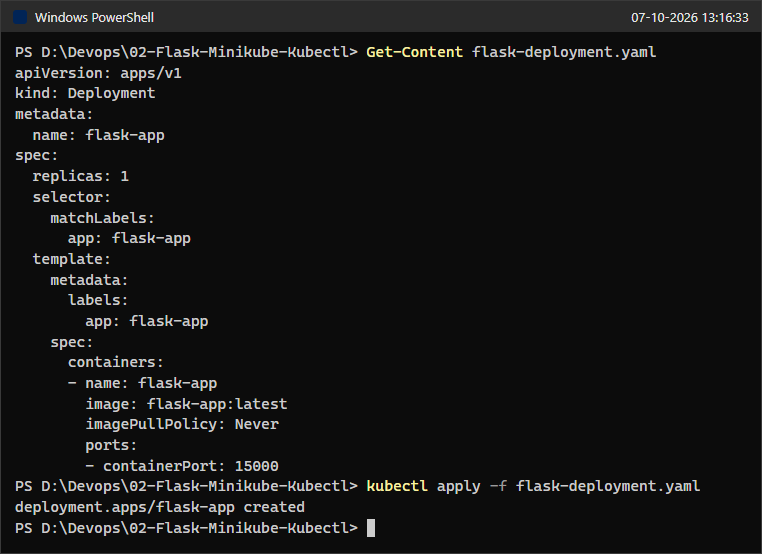

### Step 7: Check the Deployment status
```powershell
kubectl get deployments
```
**Status:** `flask-app` is `1/1` ready, `1` up to date and `1` available.

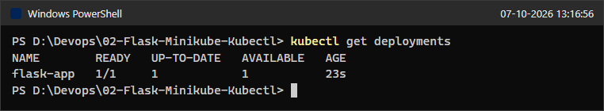

### Step 8: Verify the Pods created by the Deployment
```powershell
kubectl get pods -l app=flask-app
```
**Status:** Pod `flask-app-6d58f88547-2dpb4` is `1/1 Running` with 0 restarts. Because `imagePullPolicy: Never` is set, the pod started from the locally built image without contacting a registry.

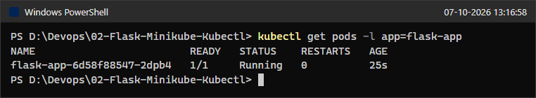

### Step 9: Describe the Deployment
```powershell
kubectl describe deployment flask-app
```
**Status:** 1 desired, 1 updated, 1 total, 1 available, 0 unavailable. The conditions `Available=True (MinimumReplicasAvailable)` and `Progressing=True (NewReplicaSetAvailable)` are present, and the event shows the ReplicaSet `flask-app-6d58f88547` being scaled from 0 to 1.

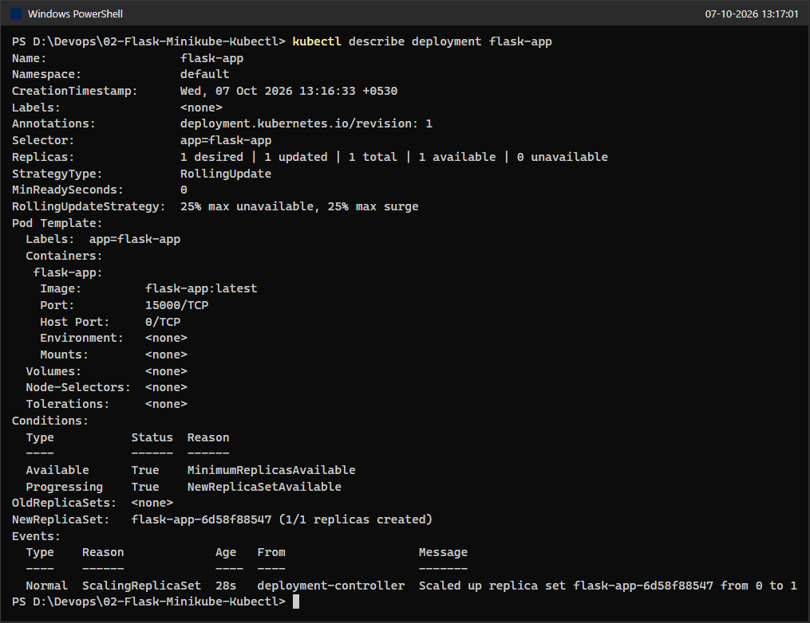

### Step 10: View the application logs
```powershell
kubectl logs flask-app-6d58f88547-2dpb4
```
**Status:** Flask reports `Running on all addresses (0.0.0.0)` on port 15000, both on `127.0.0.1` and on the pod IP `10.244.0.6`, so the app is up inside the cluster.

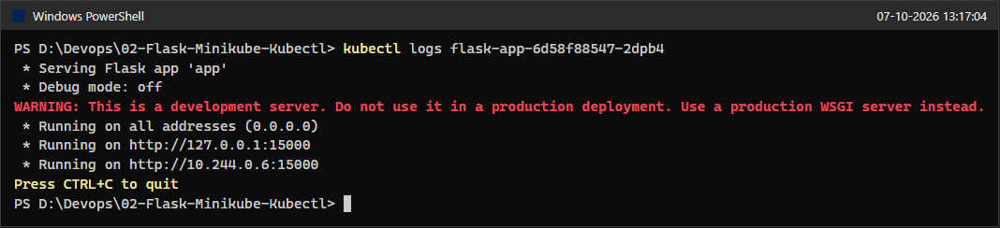

### Step 11: Check Services
```powershell
kubectl get services
```
**Status:** There is no service for the Flask app yet. Only the default `kubernetes` ClusterIP service and the `hello-k8s` NodePort service left over from Lab 01 are listed.

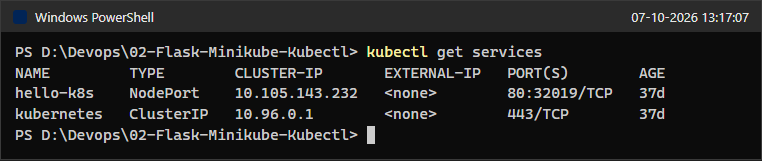

### Step 12: Try to access the app on port 15000 from the host
```powershell
curl.exe http://127.0.0.1:15000
```
**Status:** Failed as the exercise predicts: `curl: (7) Failed to connect to 127.0.0.1:15000 ... Could not connect to server`. Port 15000 is only open inside the pod's network namespace in the cluster, and nothing publishes it on the Windows host.

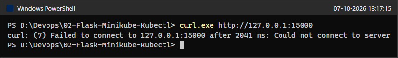

### Step 13: Add a Service to the YAML and access the app
I appended the `Service` section (separated by `---`) to the same `flask-deployment.yaml` and re-applied the file.
```powershell
Get-Content flask-deployment.yaml
kubectl apply -f flask-deployment.yaml
kubectl get services flask-app-service
kubectl get endpoints flask-app-service
```
**Status:** `deployment.apps/flask-app unchanged` and `service/flask-app-service created`, exactly as the exercise shows. The service is `NodePort` with mapping `15000:32423/TCP`, and its endpoint is the pod at `10.244.0.6:15000`, which proves the selector `app: flask-app` matched the pod. (The endpoints command also prints a harmless deprecation warning recommending EndpointSlices.)

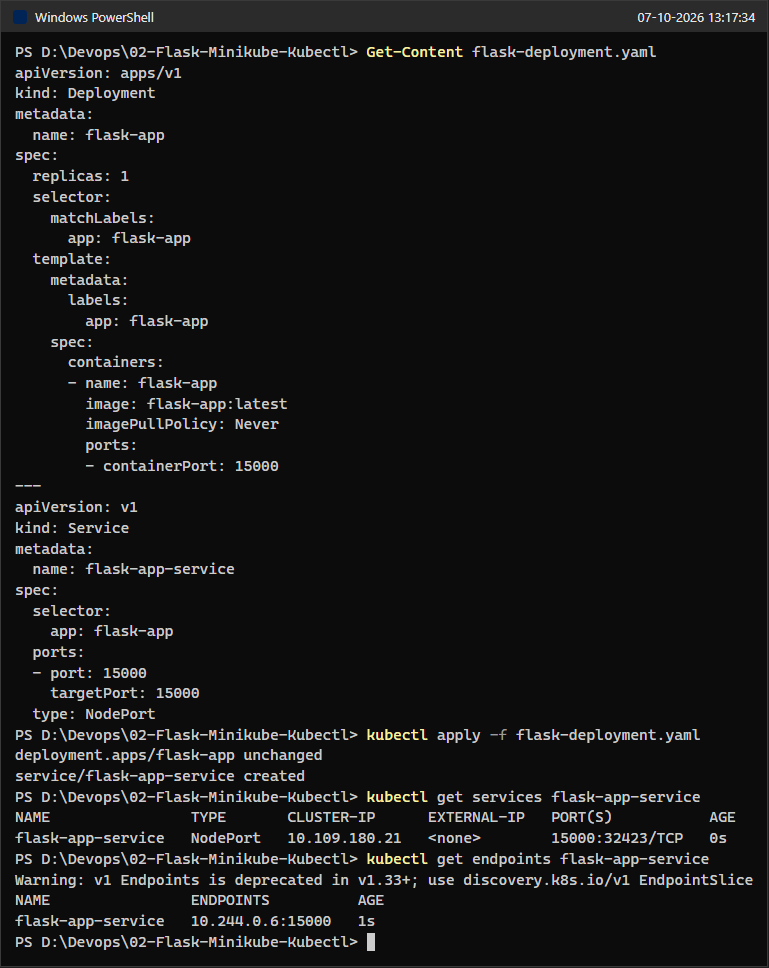

Next I asked Minikube for a URL. On the Windows docker driver this command keeps running, because it holds open a tunnel from a local port to the service. I therefore started it in the background with its output redirected to a file (this plays the role of "terminal 1" that must stay open):
```powershell
minikube service flask-app-service --url
```
**Status:** Minikube returned `http://127.0.0.1:50072` and warned: `Because you are using a Docker driver on windows, the terminal needs to be open to run it.`

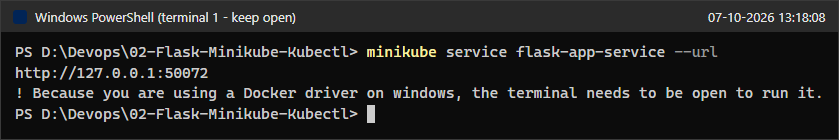

*Note:* This image was rendered from the stdout and stderr that the background process wrote to its redirect files. The command did not actually return to a prompt. It kept running until I stopped it with `taskkill` (screenshot 19), so the trailing `PS ...>` prompt in the image is only part of the rendering.

While the tunnel was running, I called the URL from a second session ("terminal 2"):
```powershell
curl.exe -s http://127.0.0.1:50072
```
**Status:** The response is `Hello from Flask on Kubernetes!`. The application is reachable from the host.

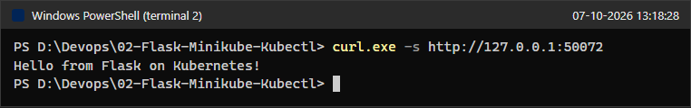

I also opened the same URL in a browser (headless Microsoft Edge):

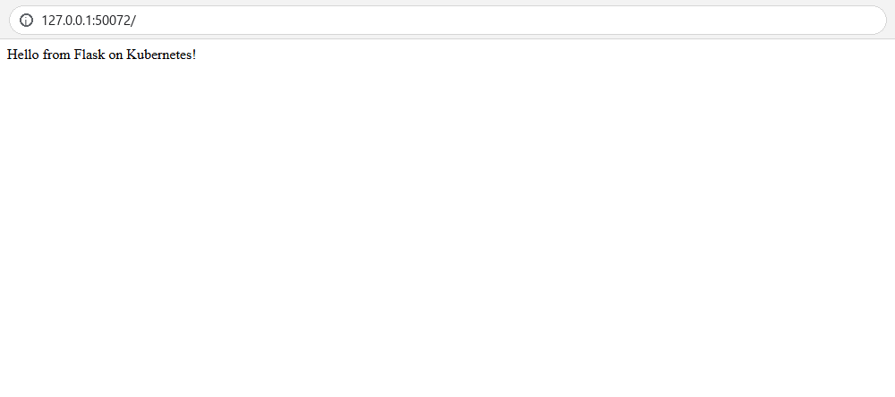

### Extra: Cheat-sheet commands
```powershell
kubectl cluster-info
minikube service list
```
**Status:** The control plane and CoreDNS are running behind `https://127.0.0.1:54500`. `minikube service list` shows `flask-app-service` with target port 15000. The URL column is empty, even though the background `minikube service flask-app-service --url` tunnel was still running when this screenshot was taken (it was stopped later, in screenshot 19). `minikube service list` does not open tunnels. Only `minikube service <name>` does that. With the docker driver on Windows, the node IP `192.168.49.2` cannot be routed from the host, so `service list` has no reachable NodePort URL to show (see Issues & Fixes item 4).

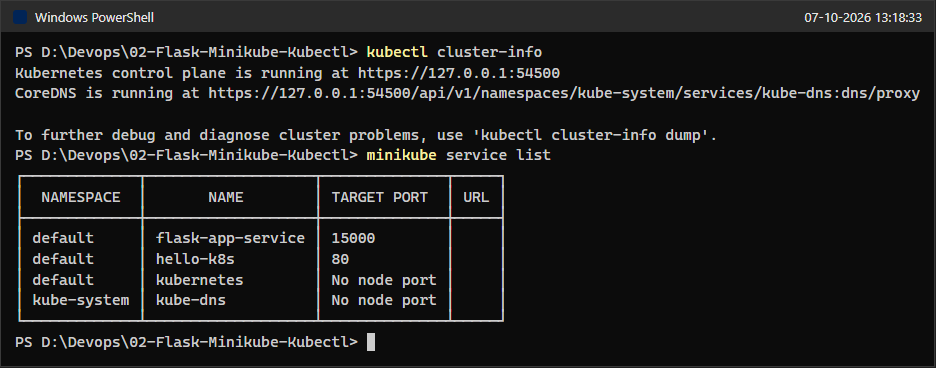

### Extra: Why the tunnel is needed, and stopping it
```powershell
curl.exe -sS -m 5 http://192.168.49.2:32423
taskkill /T /F /PID 32676
curl.exe -sS -m 5 http://127.0.0.1:50072
```
**Status:** The node IP plus NodePort (`192.168.49.2:32423`) times out from Windows, because the Minikube node lives on a Docker network inside the WSL2 VM that the Windows host cannot route to. I then stopped the background `minikube service` process and its children (the tunnel), and the tunnel URL immediately stops answering. This shows that the "keep the terminal open" requirement is real.

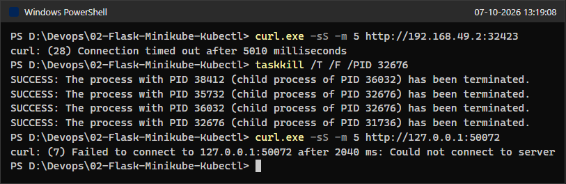

---

## Issues & Fixes
1. **`eval $(minikube docker-env)` does not work in PowerShell.** It is Bash syntax and fails with `The term 'eval' is not recognized` (screenshot 05). I used the PowerShell form that Minikube itself recommends, `& minikube -p minikube docker-env --shell powershell | Invoke-Expression`. Because those variables only last for the current shell session, I ran it in the same session as `docker build`. For the earlier display step, where the exercise says to run plain `minikube docker-env`, I added `--shell powershell` to ask for PowerShell syntax explicitly (screenshot 04). The variables are the same, but they are printed as `$Env:NAME = "value"` lines instead of Bash `export` lines.
2. **`curl` in Windows PowerShell 5.1 is an alias for `Invoke-WebRequest`.** I called the real curl binary as `curl.exe`. For the successful request I added `-s`, because when output is captured curl otherwise prints its progress meter around the response. For the failure checks I used `-sS` so that the error is still printed.
3. **`minikube service flask-app-service --url` blocks.** With the docker driver on Windows, Minikube keeps a tunnel open for as long as the command runs, so it never returns to the prompt. I ran it in the background (`Start-Process` with stdout and stderr redirected to files), read the URL from the file, tested it from a second session, and then stopped the process tree with `taskkill /T`. The local port is random on each run (`50072` here instead of `36157` in the exercise), and the warning text says "windows" instead of "linux".
4. **The NodePort is not directly reachable from Windows.** `http://192.168.49.2:32423` timed out (screenshot 19), so on this machine the tunnel opened by `minikube service` is the correct way to reach the service. For the same reason, `minikube service list` shows an empty URL column.
5. **`System.Management.Automation.RemoteException` lines in the build log (screenshot 06).** BuildKit writes its progress to stderr, and Windows PowerShell 5.1 turns each blank stderr line into an error record with that text. This is only cosmetic. The build finished (`naming to docker.io/library/flask-app done`), and the image is listed.
6. **kubectl version skew warning.** The kubectl client is v1.37.0 and the cluster is v1.35.1, which exceeds the supported skew of ±1 minor version. Every command used in this lab worked normally, so I left it as is. `minikube kubectl --` would give a matching client if needed.
7. **Leftovers from Lab 01.** The `hello-k8s` pod and service from Lab 01 still exist in the cluster and show up in `kubectl get services` and `minikube service list`. I did not touch them.
8. **Differences from the expected output in the exercise.** Pod and ReplicaSet names, the pod IP (`10.244.0.6` instead of `10.0.0.210`) and the tunnel port are generated by the cluster, so they naturally differ. `python:3.8-slim` is an end-of-life Python version, so pip installed Flask 3.0.3, the last release that supports Python 3.8. The Dockerfile was kept exactly as written.

---

## Verification Summary
| Check | Result |
|-------|--------|
| Minikube cluster | `minikube` profile Running, node `Ready`, Kubernetes v1.35.1 |
| Image | `flask-app:latest` built inside Minikube's Docker daemon (136 MB) |
| Deployment | `flask-app` 1/1 Ready, Available |
| Pod | `flask-app-6d58f88547-2dpb4` 1/1 Running, 0 restarts, Flask listening on 0.0.0.0:15000 |
| Direct access before the Service | `curl.exe http://127.0.0.1:15000` fails (expected) |
| Service | `flask-app-service` NodePort `15000:32423/TCP`, endpoint `10.244.0.6:15000` |
| Access through Minikube | `http://127.0.0.1:50072` returned `Hello from Flask on Kubernetes!` in curl and in the browser |

---

## Q&A

**Q1: What is the purpose of `minikube service flask-app-service --url`?**
It gives you a URL that you can use from your own machine to reach the `flask-app-service` Service inside the Minikube cluster. With `--url` it only prints the address instead of opening a browser. With the docker driver on Windows, macOS and WSL (Docker Desktop) it also creates the tunnel that makes this address work.

**Q2: What happens when you run `minikube service flask-app-service --url`?**
Minikube looks up the Service in the cluster and checks that it exists and has a NodePort. It then works out how the host can reach it. If the node IP is routable, the URL is simply `http://<node-ip>:<nodePort>`. With the docker driver on Windows, Minikube starts an SSH tunnel from a random local port on `127.0.0.1` to the NodePort and prints `http://127.0.0.1:<port>`. In this lab that was `http://127.0.0.1:50072`. The command keeps running for as long as that tunnel is needed.

**Q3: Why is `targetPort` used in a Kubernetes Service configuration?**
`targetPort` tells the Service which port on the selected pods it should forward traffic to, which is the port the container actually listens on. Here Flask listens on 15000 inside the container, so `targetPort: 15000` makes the Service deliver traffic to the right place. Without it, `targetPort` defaults to the same value as `port`.

**Q4: What is the difference between `port` and `targetPort` in a Kubernetes Service configuration?**
`port` is the port that the Service itself exposes on its ClusterIP, and other workloads in the cluster connect to it there (for example `flask-app-service:15000`). `targetPort` is the port on the pod or container that receives the traffic. They can differ, for example `port: 80` with `targetPort: 15000`. A NodePort Service also has a third number, the `nodePort` (here 32423), which is the port opened on every node for traffic from outside the cluster.

**Q5: How do you access a Flask application running in Minikube?**
First, expose the pods with a Service (here a NodePort Service). Then run `minikube service <service-name> --url` to get a reachable URL, and open it with curl or a browser while the command is still running. Other options are `kubectl port-forward service/flask-app-service 8085:15000`, or a LoadBalancer Service combined with `minikube tunnel`.

**Q6: Why does the terminal need to remain open when using Docker driver on Linux with Minikube?**
With the docker driver, the Minikube "node" is a Docker container on a private Docker network. On Windows and macOS that network sits inside Docker Desktop's VM, so the host cannot reach the node IP and NodePort directly (the request to `192.168.49.2:32423` timed out in this lab). `minikube service` works around this by running a tunnel process that forwards a local `127.0.0.1` port into the cluster. That tunnel only exists while the command is running, so closing the terminal (or stopping the process) ends it, and the URL stops working, as screenshot 19 shows. The exercise's "Linux" case is a WSL shell that uses Docker Desktop. There the Minikube Docker network is also unreachable from the shell, so Minikube opens the same SSH tunnel and prints the "Docker driver on linux" warning, and that tunnel also needs the terminal to stay open. (On a native Linux host running Docker Engine, the node IP is normally routable and no tunnel is needed.)

**Q7: What is the benefit of using the `--url` flag with the `minikube service` command?**
It prints a ready-to-use URL instead of trying to open a browser. You do not have to look up the node IP, the NodePort or the tunnel port yourself, and the URL can be passed straight to tools such as curl, scripts or tests.

**Q8: What command is used to expose a service in Kubernetes?**
You can do it imperatively with `kubectl expose`, for example `kubectl expose deployment flask-app --type=NodePort --port=15000`. You can also do it declaratively by writing a `Service` manifest and applying it with `kubectl apply -f <file>.yaml`, which is what this lab did with `flask-deployment.yaml`.

**Q9: How does Minikube help in local Kubernetes testing?**
Minikube runs a complete single-node Kubernetes cluster on a laptop, here as a Docker container. You can practise real `kubectl` workflows (Deployments, Services, logs, rollouts) without a cloud account or a multi-machine cluster. It also adds helpers for local work, such as `minikube docker-env` for building images straight into the cluster without a registry, `minikube service` and `minikube tunnel` for reaching services, add-ons, and quick start, stop and delete commands.

**Q10: What is the role of kubectl in this setup?**
kubectl is the command-line client for the Kubernetes API server. In this lab I used it to send the desired state to the cluster (`kubectl apply`) and to inspect the result (`get deployments`, `get pods`, `describe deployment`, `get services`, `get endpoints`, `cluster-info`). I also used it to read the application's output (`kubectl logs`). Minikube creates and manages the cluster, and kubectl is how you work with what runs inside it.

---

## Cleanup / State Left Running
* The Minikube cluster (profile `minikube`) is **intentionally left running**, together with the `flask-app` Deployment and `flask-app-service` Service, because the next Kubernetes exercise in this series reuses and then deletes the cluster.
* The background `minikube service flask-app-service --url` tunnel was stopped (`taskkill /T /F /PID 32676`, which also ended its child processes). No tunnels or port-forwards are left running.
* The `docker-env` variables were only set inside the temporary PowerShell session used for the build, so no shell or system settings were changed permanently.
* Nothing was committed or pushed.
