# Lab 03: Scaling a Flask App on a Single Node using ReplicaSets

## Objective
Build a small "flash sale" Flask application into a Docker image, run it on a fresh single-node Minikube cluster with a Kubernetes `ReplicaSet` (3 replicas) behind a `ClusterIP` Service, scale it out to 5 replicas, delete a Pod to watch the ReplicaSet heal itself, and look at how the Pods are spread across the node and how requests are distributed between them. The scenario is an e-commerce flash sale: scale out when traffic spikes, scale back in when the sale is over.

---

## Environment
| Item | Version / value |
|------|-----------------|
| OS | Windows 11 Home Single Language 25H2 |
| Shell | Windows PowerShell 5.1 |
| Docker Desktop engine | 29.8.0 (WSL2 backend) |
| Docker engine inside the Minikube node | 29.2.1 |
| Minikube | v1.38.1 (driver: `docker`, profile `minikube`, base image v0.0.50) |
| Kubernetes (server) | v1.35.1, 1 node (`minikube`, Debian GNU/Linux 12, kernel 6.18.33.2-microsoft-standard-WSL2) |
| kubectl (client) | v1.37.0 (installed with Chocolatey) |
| Container image | `flashsale:1.0`, built from `python:3.11-slim` (Python 3.11.17, Flask 3.1.3, gunicorn 26.2.0) |
| Test client image | `curlimages/curl` (latest), used for in-cluster requests |

## Files in this folder
| File | Purpose |
|------|---------|
| `app.py` | The flash-sale Flask app with the `/`, `/buy` and `/health` endpoints, exactly as given in the exercise |
| `Dockerfile` | Builds `flashsale:1.0`. One line differs from the exercise: `COPY app.py .` instead of `COPY ex3-flash-sale.py .` (see Issues & Fixes) |
| `flashsale-replicaset.yaml` | The `ReplicaSet` `flashsale-rs` (3 replicas, readiness/liveness probes, resource requests/limits) and the `ClusterIP` Service `flashsale-svc`, exactly as given |
| `flashsale-deployment.yaml` | Additional challenge: the same app as a `Deployment` (`flashsale-deploy`, label `app: flashsale-deploy`) |
| `screenshot/` | Proof of every step, numbered in execution order |

---

## Step-by-Step Execution

### Preparation: Create the app, the Dockerfile and the manifest
I saved the flash-sale code as `app.py` (the code itself starts with the comment `# app.py`, and gunicorn is told to load `app:app`). The Dockerfile copies `app.py` into the image.
```powershell
Get-ChildItem -Name
Get-Content app.py
Get-Content Dockerfile
```
**Status:** All files are in place.

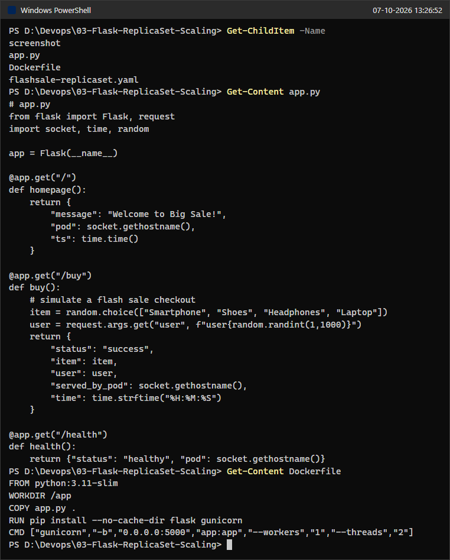

This is Step 3 of the exercise, the `flashsale-replicaset.yaml` manifest. I created it now so that all files were ready before the cluster work started.
```powershell
Get-Content flashsale-replicaset.yaml
```
**Status:** The manifest contains the `ReplicaSet` `flashsale-rs` with `replicas: 3` and the image `flashsale:1.0`, plus the `ClusterIP` Service `flashsale-svc` (port 80 to container port 5000).

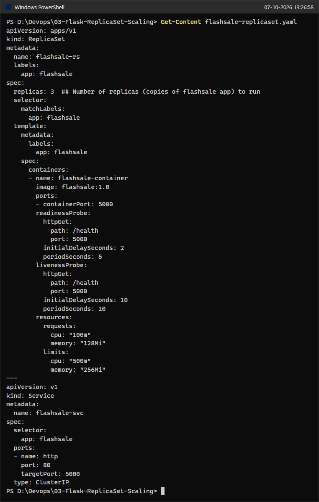

**Build and push:** The exercise builds `<your-dockerhub-username>/flashsale:1.0` and pushes it to Docker Hub at this point. Docker Desktop on this machine is not logged in to Docker Hub, so I did not push. Instead I built the image directly inside Minikube's Docker daemon in Step 5, with the tag `flashsale:1.0` that the manifest uses. The build has to happen after Step 1 anyway, because Step 1 deletes the cluster and with it every image stored inside the cluster.

### Step 1: Clean up the previous Minikube cluster
```powershell
minikube stop
minikube delete
minikube profile list
docker ps -a --filter "name=^minikube$"
```
**Status:** This step failed at first. It worked only after I fixed a file-permission problem, described below.

My first run did stop the old cluster from Lab 02, and `minikube delete` removed the node container. However, my screenshot helper crashed while printing minikube's output, because the Windows console could not encode minikube's box-drawing characters, so that output was never captured. I fixed the helper's output encoding (`PYTHONIOENCODING=utf-8`) and ran the step again, adding two check commands at the end. Screenshot 03 shows this second run:
- `minikube stop` now failed with `GUEST_NOT_FOUND`, because the first run's `minikube delete` had already removed `config.json` from the machine folder.
- `minikube delete` showed the real reason the first delete had stopped half-way: it could not delete the old SSH public key `id_rsa.pub` (`Access is denied`).
- `minikube profile list` still listed the `minikube` profile, with an empty status and errors about the missing `config.json`.
- `docker ps -a` found no `minikube` container, which confirms that the node container itself was already gone.

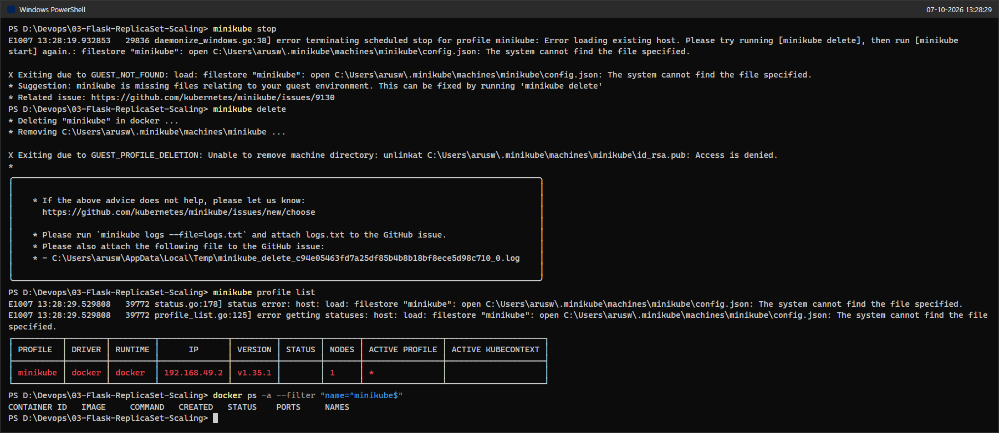

The old cluster was first created on 30 Aug 2026 by an elevated (administrator) minikube run. The key file it created then has permissions that do not let the normal user read or delete it. Moving the whole machine folder out of minikube's way needs no access to the file itself, so I moved the folder aside and ran `minikube delete` again:
```powershell
Move-Item "$env:USERPROFILE\.minikube\machines\minikube" "$env:USERPROFILE\.minikube\stale-minikube-machine-20261007"
minikube delete
minikube profile list
```
**Status:** `Removed all traces of the "minikube" cluster.` `minikube profile list` now reports that no profile exists.

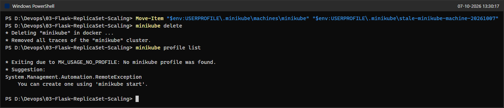

Note: deleting the cluster also removed the Lab 02 `flask-app` Deployment and Service and the Lab 01 `hello-k8s` Pod, which were still running in it. This is what the exercise intends ("clean up previous minikube"). The Lab 01 and Lab 02 folders and their screenshots are not affected.

### Step 2: Start Minikube with a single node
```powershell
minikube start --nodes=1
kubectl get nodes
```
**Status:** A new single-node cluster started (Kubernetes v1.35.1). Right after the start, the node was still `NotReady` (4 seconds old).

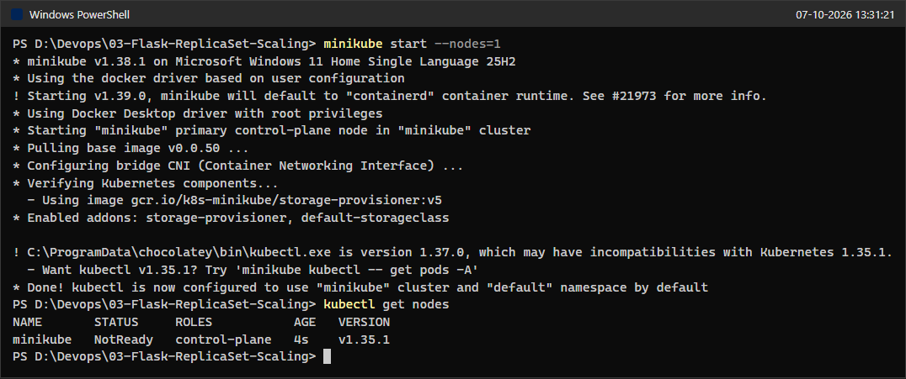

```powershell
kubectl wait --for=condition=Ready node/minikube --timeout=180s
kubectl get nodes
minikube status
```
**Status:** The node `minikube` is `Ready`. Host, kubelet and apiserver are `Running`.

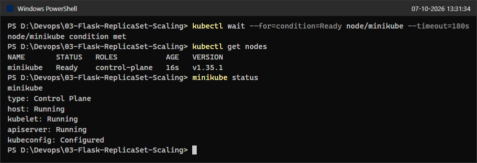

### Step 4: Apply the ReplicaSet configuration
```powershell
kubectl apply -f flashsale-replicaset.yaml
kubectl get rs
kubectl get pods
kubectl get svc flashsale-svc
```
**Status:** `replicaset.apps/flashsale-rs created` and `service/flashsale-svc created`. The ReplicaSet immediately created 3 Pods (`DESIRED 3 / CURRENT 3 / READY 0`).

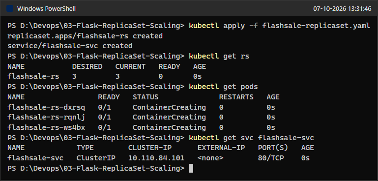

The exercise applies the ReplicaSet before it builds the image, so the image `flashsale:1.0` did not exist yet. The kubelet therefore tried to pull it from Docker Hub, which failed:
```powershell
kubectl get pods
$p = kubectl get pods -l app=flashsale -o jsonpath='{.items[0].metadata.name}'
kubectl describe pod $p | Select-Object -Last 9
```
**Status:** All 3 Pods are in `ErrImagePull` / `ImagePullBackOff`. The error reads `pull access denied for flashsale, repository does not exist`. This failure is expected at this point.

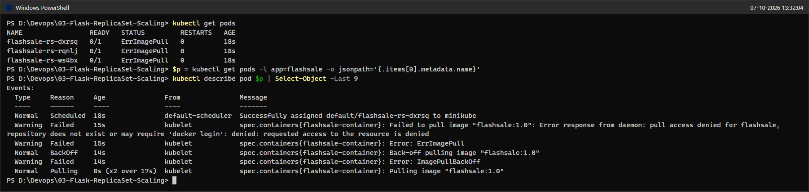

### Step 5: Point Docker at Minikube and build the image
```powershell
minikube docker-env
eval $(minikube docker-env)                                               # as written in the exercise (Bash syntax)
& minikube -p minikube docker-env --shell powershell | Invoke-Expression   # PowerShell equivalent
docker info --format "Docker daemon now in use: {{.Name}}"
```
**Status:** `eval` does not exist in PowerShell, so the exercise's line fails. The PowerShell equivalent works: the Docker CLI now talks to the daemon named `minikube`.

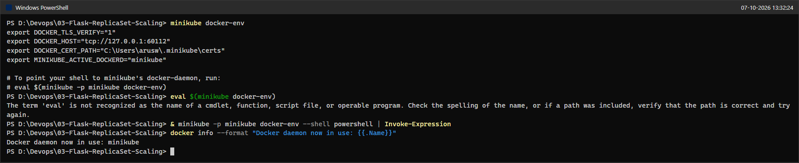

Next I built the Dockerfile exactly as the exercise gives it, with `COPY ex3-flash-sale.py .`. I generated that version from my Dockerfile and piped it into `docker build`:
```powershell
& minikube -p minikube docker-env --shell powershell | Invoke-Expression
(Get-Content Dockerfile) -replace '^COPY app.py \.$','COPY ex3-flash-sale.py .' | Select-String COPY
(Get-Content Dockerfile) -replace '^COPY app.py \.$','COPY ex3-flash-sale.py .' | docker build -t flashsale:1.0 -f - .
```
**Status:** The `Select-String` line confirms that the generated Dockerfile contains the exercise's `COPY ex3-flash-sale.py .`. The build failed with `"/ex3-flash-sale.py": not found`. The exercise's Dockerfile copies a file name that does not match the code file. Renaming the code file would not help either, because the container command `gunicorn ... app:app` needs a module called `app.py`.

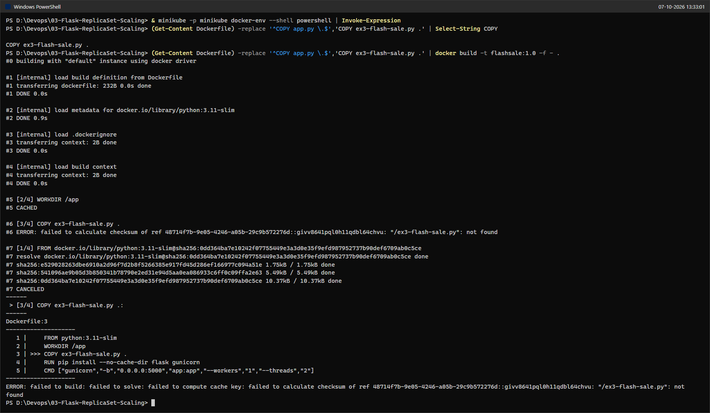

Then I built the corrected Dockerfile, using the tag that the ReplicaSet expects. The exercise's `docker build -t flask-app .` uses a tag that nothing references.
```powershell
& minikube -p minikube docker-env --shell powershell | Invoke-Expression
docker build -t flashsale:1.0 .
docker images flashsale
```
**Status:** The build succeeded. `flashsale:1.0` (143 MB) now exists inside Minikube's Docker daemon.

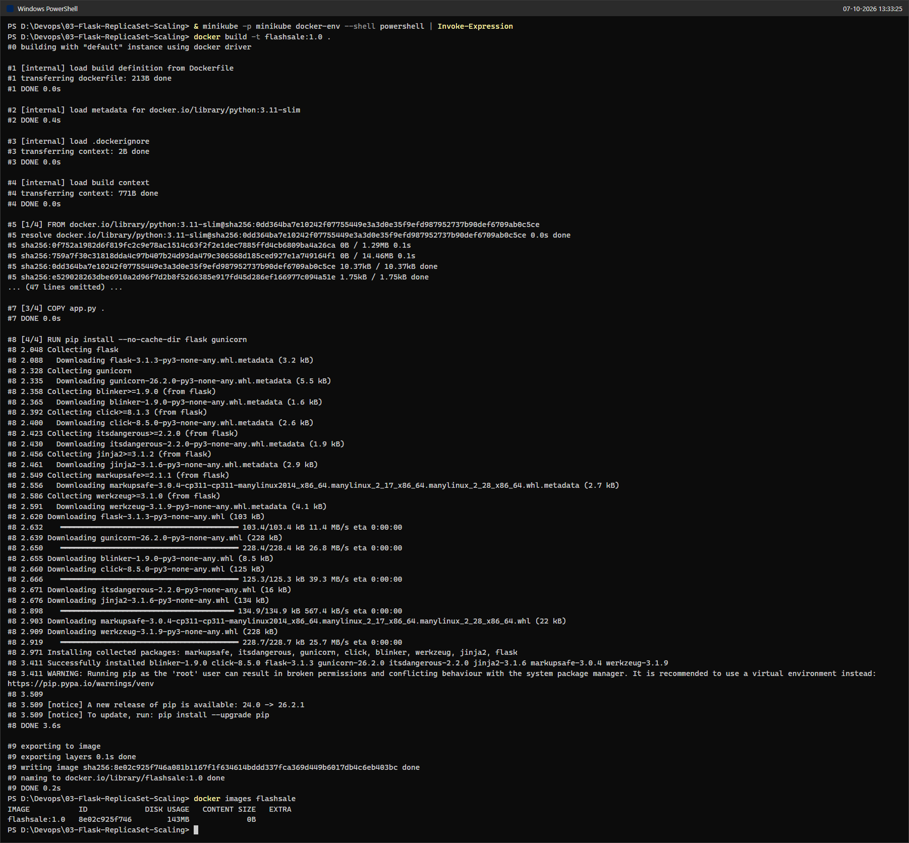

### Step 6: Verify the Pods and the ReplicaSet
I did not delete the failing Pods by hand. The image tag is not `latest`, so the pull policy is `IfNotPresent`. At its next back-off retry, the kubelet found the image locally and started the containers, about 1 minute 40 seconds after the first pull failure.
```powershell
kubectl get pods
kubectl get rs
kubectl get events --field-selector involvedObject.name=flashsale-rs-dxrsq --sort-by=.lastTimestamp | Select-Object -Last 4
```
**Status:** 3/3 Pods are `1/1 Running`, and `flashsale-rs` reports `DESIRED 3 / CURRENT 3 / READY 3`. The events show the change from `ErrImagePull` to `Container image "flashsale:1.0" already present on machine` and then `Started`.

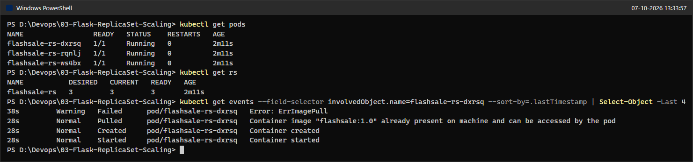

### Steps 7 and 8: Scale the ReplicaSet to 5 replicas and verify it
```powershell
kubectl scale rs flask-app-rs --replicas=5     # name used in the exercise text
kubectl scale rs flashsale-rs --replicas=5     # real name from the manifest
kubectl get rs
kubectl get pods
```
**Status:** The exercise's name `flask-app-rs` returns `NotFound`, because the manifest creates `flashsale-rs`. With the correct name, the result is `replicaset.apps/flashsale-rs scaled`. `DESIRED` and `CURRENT` changed to 5 immediately, and the 2 new Pods (`9d7qs`, `rkg66`) were in `ContainerCreating`.

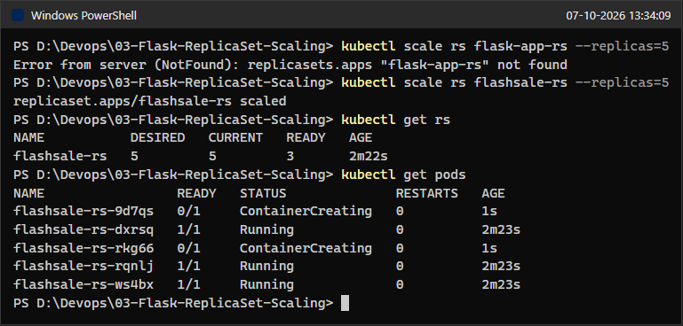

### Step 9: Verify the updated Pods
```powershell
kubectl wait --for=condition=Ready pod -l app=flashsale --timeout=120s
kubectl get rs
kubectl get pods
```
**Status:** All 5 Pods are `1/1 Running`, and the ReplicaSet reports `5 / 5 / 5`. The 3 original Pods are about 2m26s old and the 2 new ones about 4s old.

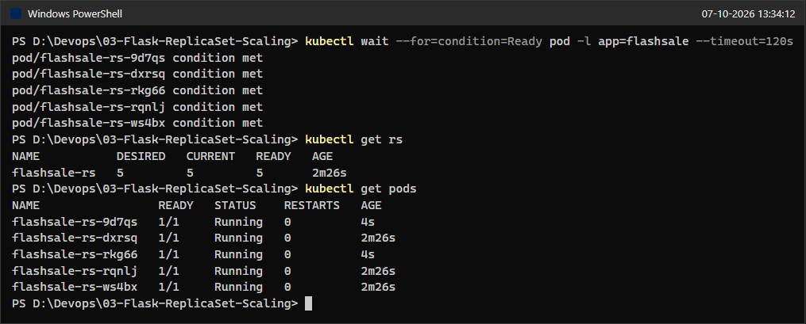

### Steps 10 and 11: Delete one Pod and watch the ReplicaSet heal itself
```powershell
kubectl delete pod flashsale-rs-dxrsq
kubectl get pods
kubectl wait --for=condition=Ready pod -l app=flashsale --timeout=120s
kubectl get pods
kubectl get rs
```
**Status:** The ReplicaSet created a replacement Pod, `flashsale-rs-58lw2`, at once. It was 1 second old and not yet ready in the first listing, and `1/1 Running` a moment later. The total went back to 5, with `DESIRED 5 / CURRENT 5 / READY 5`.

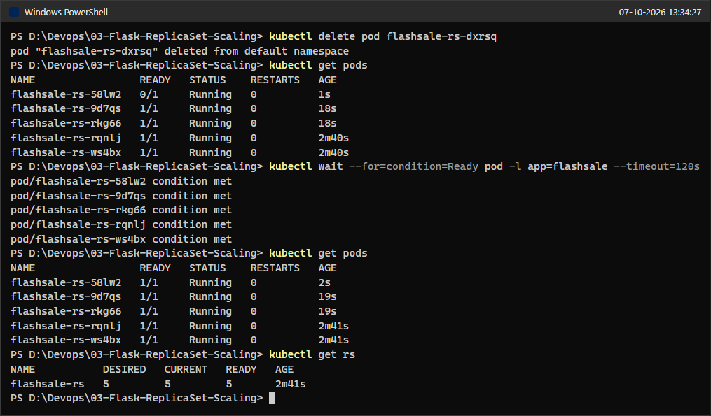

### Viewing the Pod distribution across nodes
```powershell
kubectl get pods -o wide
kubectl get nodes -o wide
```
**Status:** All 5 Pods run on the only node, `minikube` (192.168.49.2). Each Pod has its own IP address in the Pod network (10.244.0.3 to 10.244.0.8).

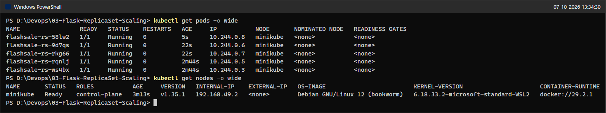

### Load distribution across the Pods (the "flash sale" traffic)
`flashsale-svc` is a `ClusterIP` Service, so it is reachable only from inside the cluster. To see how requests are spread, I ran a short-lived curl Pod inside the cluster and sent 12 `/buy` requests through the Service:
```powershell
kubectl get endpointslices -l kubernetes.io/service-name=flashsale-svc
kubectl run curl-test --rm -i --restart=Never --image=curlimages/curl -- sh -c 'for i in $(seq 1 12); do curl -s http://flashsale-svc/buy?user=$i; echo; done'
```
**Status:** The Service has 5 endpoints. The 12 requests were answered by all 5 Pods (`ws4bx` 3 times, `rkg66` 3, `rqnlj` 3, `9d7qs` 2, `58lw2` 1). This shows that kube-proxy spreads new connections across the replicas. The curl Pod deleted itself afterwards.

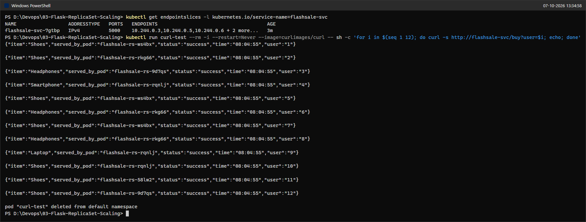

To open the app in a browser on Windows, I started a port-forward in the background on a free lab port (8085):
```powershell
kubectl port-forward svc/flashsale-svc 8085:80
```
**Status:** `Forwarding from 127.0.0.1:8085 -> 5000`. Each browser or curl request shows up as `Handling connection for 8085`.

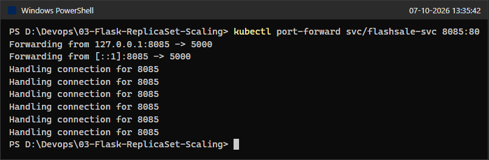

`http://127.0.0.1:8085/` returns the welcome message, the serving Pod and a timestamp:

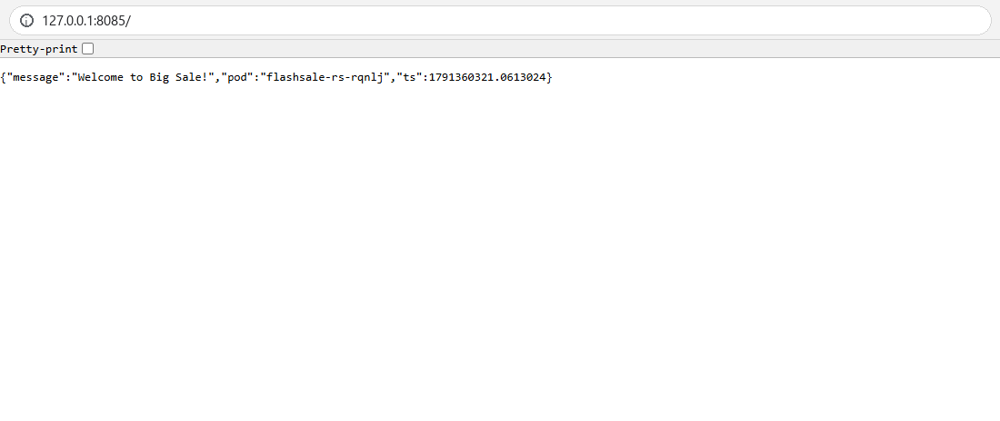

`http://127.0.0.1:8085/buy?user=123` returns a simulated checkout for user `123`:

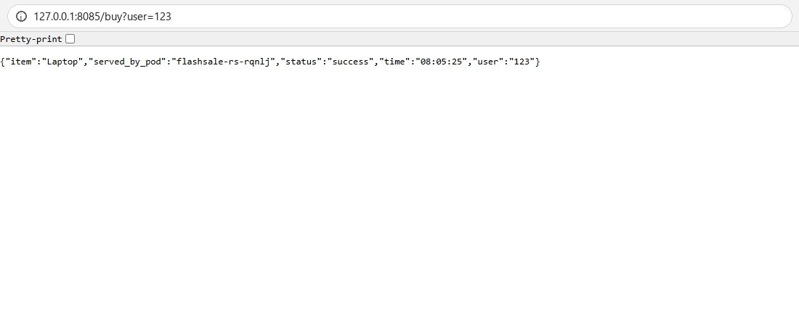

`http://127.0.0.1:8085/health` returns the health endpoint used by the readiness and liveness probes:

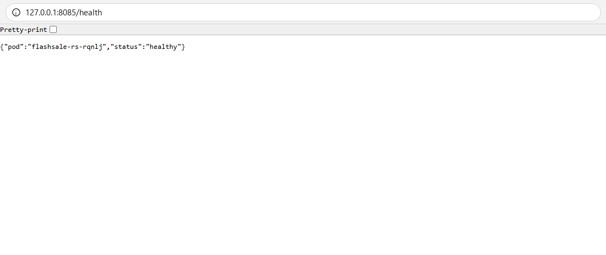

All three browser responses come from the same Pod (`flashsale-rs-rqnlj`). This is expected: `kubectl port-forward svc/...` picks one Pod behind the Service and tunnels to that Pod only. The in-cluster test above is the real load-balancing proof. I stopped the port-forward afterwards.

---

## Additional Challenges

### Use `kubectl describe` to inspect the ReplicaSet and a Pod
```powershell
kubectl describe rs flashsale-rs
```
**Status:** The output shows the selector `app=flashsale`, `5 current / 5 desired` and the Pod template (image, probes, requests and limits). The events list every Pod the replicaset-controller created: 3 at the start, 2 for the scale-out and 1 replacement for the deleted Pod.

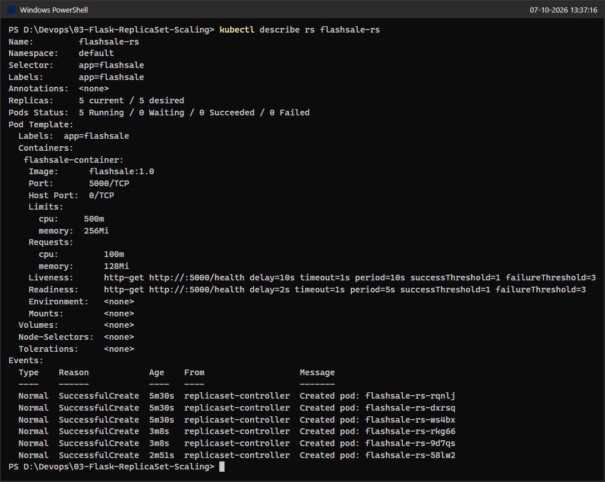

```powershell
kubectl describe pod flashsale-rs-rqnlj
```
**Status:** The output shows `Controlled By: ReplicaSet/flashsale-rs`, the node, the Pod IP, QoS class `Burstable` (requests are lower than limits) and the probes. The events show the whole history of this Pod: 3 failed pulls and back-offs, then `already present on machine`, `Created` and `Started`.

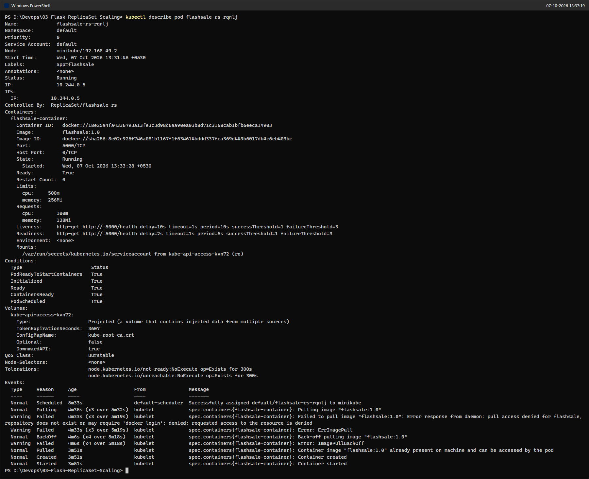

### `kubectl logs` and `kubectl exec`
```powershell
kubectl logs flashsale-rs-rqnlj
kubectl exec flashsale-rs-rqnlj -- hostname
kubectl exec flashsale-rs-rqnlj -- ls -l /app
kubectl exec flashsale-rs-rqnlj -- python --version
```
**Status:** The logs show gunicorn 26.2.0 listening on `0.0.0.0:5000` with the `gthread` worker. Requests are not logged, because no access log is configured. The container's hostname is the Pod name, which is exactly what the app reports as `served_by_pod`. `/app` contains `app.py`.

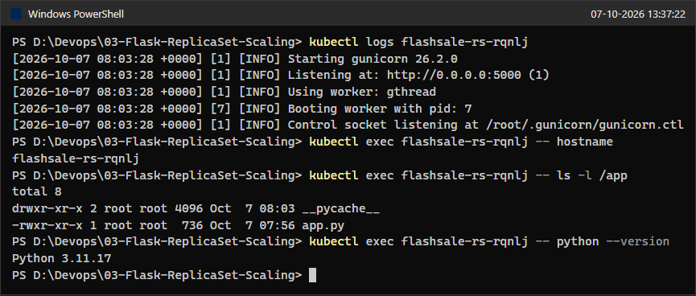

### Update the ReplicaSet to use a different image
To have a second image tag available, I tagged the existing image as `flashsale:1.1` inside Minikube. The content is the same; only the tag differs. That is enough to see which Pods use which image. I then changed the image in the ReplicaSet's Pod template, which has the same effect as editing the `image:` line in the YAML and running `kubectl apply` again:
```powershell
& minikube -p minikube docker-env --shell powershell | Invoke-Expression
docker tag flashsale:1.0 flashsale:1.1
docker images flashsale
kubectl set image rs/flashsale-rs flashsale-container=flashsale:1.1
kubectl get pods -o custom-columns=NAME:.metadata.name,IMAGE:.spec.containers[0].image,STATUS:.status.phase
kubectl delete pod flashsale-rs-rqnlj
kubectl wait --for=condition=Ready pod -l app=flashsale --timeout=120s
kubectl get pods -o custom-columns=NAME:.metadata.name,IMAGE:.spec.containers[0].image,STATUS:.status.phase
```
**Status:** `docker images flashsale` lists `flashsale:1.0` and `flashsale:1.1` with the same image ID (`8e02c925f746`). After the template change, all 5 existing Pods still ran `flashsale:1.0`. Only the replacement Pod created after I deleted one (`flashsale-rs-424j6`) used `flashsale:1.1`. A ReplicaSet only counts Pods. It never replaces running Pods when its template changes, and this is the reason Deployments exist.

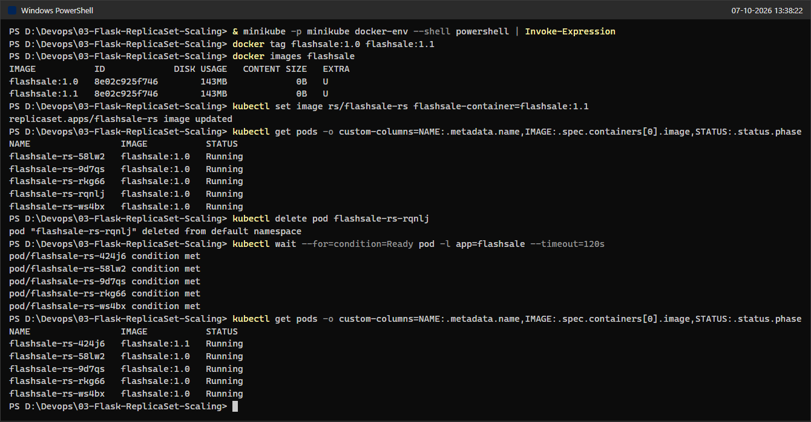

### Create a Deployment instead of a ReplicaSet
`flashsale-deployment.yaml` runs the same container as a `Deployment`. It uses its own name and label (`app: flashsale-deploy`), so it does not take over the ReplicaSet's Pods and is not selected by `flashsale-svc`.
```powershell
kubectl apply -f flashsale-deployment.yaml
kubectl rollout status deployment/flashsale-deploy --timeout=120s
kubectl get deploy,rs,pods -l app=flashsale-deploy
```
**Status:** The Deployment `flashsale-deploy` is `3/3`. It created and manages its own ReplicaSet (`flashsale-deploy-758475f6c8`), which created the 3 Pods.

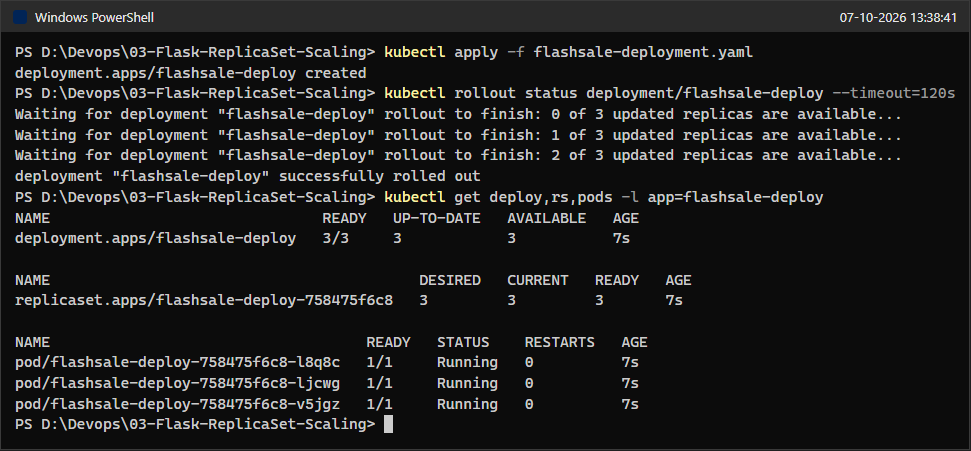

```powershell
kubectl set image deployment/flashsale-deploy flashsale-container=flashsale:1.1
kubectl rollout status deployment/flashsale-deploy --timeout=120s
kubectl get rs -l app=flashsale-deploy
kubectl get pods -l app=flashsale-deploy -o custom-columns=NAME:.metadata.name,IMAGE:.spec.containers[0].image,STATUS:.status.phase
kubectl rollout history deployment/flashsale-deploy
```
**Status:** Unlike the bare ReplicaSet, the Deployment performed a rolling update. It created a new ReplicaSet (`55cb9dc6df`, 3 Pods on `flashsale:1.1`) and scaled the old one (`758475f6c8`) down to 0, one Pod at a time. The rollout history now has 2 revisions. The last old Pod was still shutting down when the listing ran, which is why it still appears with `flashsale:1.0`.

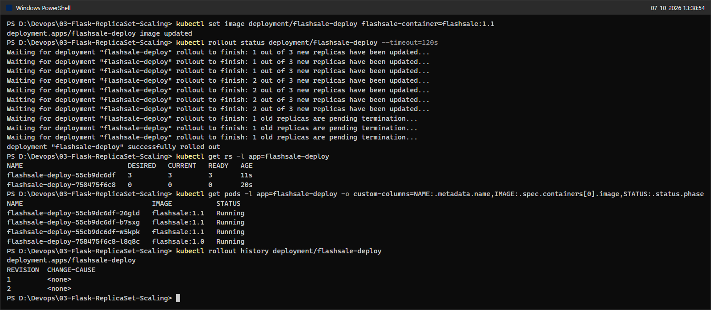

```powershell
kubectl get pods -l app=flashsale-deploy -o custom-columns=NAME:.metadata.name,IMAGE:.spec.containers[0].image,STATUS:.status.phase
kubectl delete -f flashsale-deployment.yaml
kubectl get deploy,rs
```
**Status:** Only the 3 `flashsale:1.1` Pods were left. I then deleted the Deployment, and with it its ReplicaSets and Pods, so only `flashsale-rs` remains.

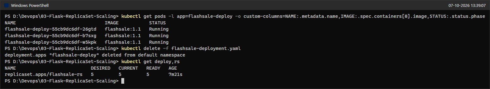

### The flash sale is over: scale back down
```powershell
kubectl scale rs flashsale-rs --replicas=3
kubectl apply -f flashsale-replicaset.yaml
kubectl get rs flashsale-rs -o wide
kubectl get pods -o wide
```
**Status:** `kubectl scale` brought the ReplicaSet back to 3 replicas. `kubectl apply` reset the Pod template to the image in the manifest (`flashsale:1.0`), which undoes the image-change challenge. The 2 extra Pods, including the `1.1` Pod, were shown as `Terminating`.

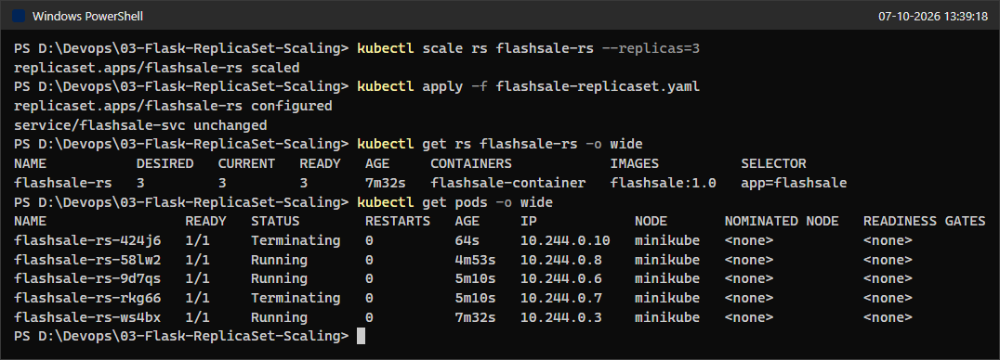

```powershell
kubectl get pods -o custom-columns=NAME:.metadata.name,IMAGE:.spec.containers[0].image,STATUS:.status.phase,NODE:.spec.nodeName
kubectl get rs,svc
minikube status
```
**Status:** The final state is 3 Pods, all running `flashsale:1.0` on node `minikube`. The ReplicaSet reports `3 / 3 / 3`, `flashsale-svc` is present, and the cluster is healthy.

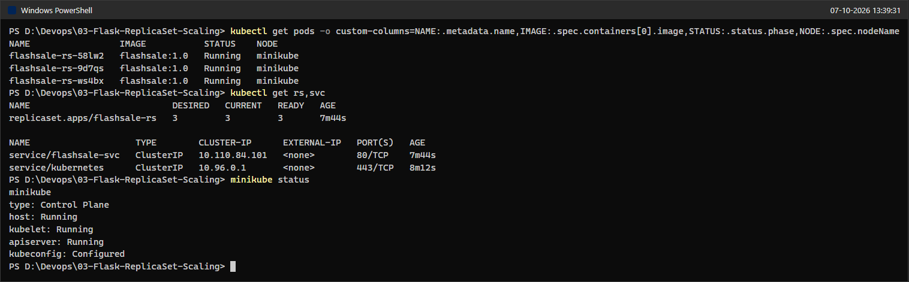

---

## Issues & Fixes
| # | Problem (as written in the exercise or on this machine) | What I did and why |
|---|---|---|
| 1 | My screenshot helper crashed during the first run of Step 1, because the Windows console encoding could not print minikube's Unicode output. The commands had already run, but their output was not captured. | I set `PYTHONIOENCODING=utf-8` for the helper and ran Step 1 again. I also made the helper hide the meaningless `System.Management.Automation.RemoteException` lines that PowerShell prints for empty stderr lines. This patch was applied after screenshot 04, which still shows one such line. |
| 2 | `minikube delete` failed with `GUEST_PROFILE_DELETION ... id_rsa.pub: Access is denied` (screenshot 03). The old machine folder had been created by an elevated (administrator) minikube run on 30 Aug 2026, and its key file cannot be read or deleted by the normal user. | I moved the folder `%USERPROFILE%\.minikube\machines\minikube` to `%USERPROFILE%\.minikube\stale-minikube-machine-20261007` and ran `minikube delete` again, which then succeeded (screenshot 04). The new cluster's files belong to the normal user, so later deletes will work. The moved folder holds only that one 381-byte public key; you can remove it from an **elevated** PowerShell with `Remove-Item -Recurse -Force "$env:USERPROFILE\.minikube\stale-minikube-machine-20261007"`. |
| 3 | The Dockerfile has `COPY ex3-flash-sale.py .`, but the code is `app.py` and gunicorn loads `app:app`. | I saved the code as `app.py` and changed the line to `COPY app.py .`. Screenshot 10 shows that the original Dockerfile fails (`"/ex3-flash-sale.py": not found`). |
| 4 | "Build and push to your Docker Hub repository": there is no Docker Hub login on this machine. | I did not push. I built the image inside Minikube's own Docker daemon (`docker-env`), so the kubelet finds `flashsale:1.0` locally. Because the tag is not `latest`, the default pull policy is `IfNotPresent` and no registry is needed. |
| 5 | The exercise applies the ReplicaSet (Step 4) before it builds the image (Step 5). | I kept that order. The Pods first went into `ErrImagePull` / `ImagePullBackOff` (screenshot 08). After the build, the kubelet's next retry found the image and the Pods started by themselves (screenshot 12). If you build first, the Pods start immediately. |
| 6 | Step 5 builds `docker build -t flask-app .`, but the manifest uses `image: flashsale:1.0`. | I built with `-t flashsale:1.0`. A `flask-app` image would never be used by the ReplicaSet. |
| 7 | `eval $(minikube docker-env)` is Bash syntax and fails in PowerShell (screenshot 09). | I used `& minikube -p minikube docker-env --shell powershell \| Invoke-Expression`, in the same shell session as the `docker` commands that need it. |
| 8 | Steps 6 to 11 use the name `flask-app-rs` (and their sample output mixes `flashsale-rs` with `flask-app-rs`), but the manifest creates `flashsale-rs`. | Screenshot 13 shows `flask-app-rs` returning `NotFound`. I used `flashsale-rs` for every command. |
| 9 | `flashsale-svc` is a `ClusterIP` Service, so it cannot be reached from Windows. | For load distribution I used a temporary in-cluster curl Pod (screenshot 17). For the browser I used `kubectl port-forward svc/flashsale-svc 8085:80`. A port-forward always talks to one Pod, so every browser page shows the same Pod name. |
| 10 | Stopping the background `kubectl port-forward` by its process ID left port 8085 open. | Chocolatey's `kubectl.exe` is a small launcher that starts the real kubectl as a child process. I stopped the child process as well and checked that port 8085 was free. |
| 11 | Minikube warns that kubectl v1.37.0 may have incompatibilities with Kubernetes v1.35.1. | Every command used in this lab worked. You can use `minikube kubectl -- ...` for an exactly matching client if needed. |
| 12 | The challenge says "Update the replicaset.yaml file to use a different image", but the lab has only one app image and no registry to pull another from. | I did not edit `flashsale-replicaset.yaml`, so the file still matches the exercise. I changed the live ReplicaSet's Pod template with `kubectl set image rs/flashsale-rs ...` instead, which has the same effect as editing the `image:` line and running `kubectl apply`. The "different image" `flashsale:1.1` is only a second tag of `flashsale:1.0` (same image ID, screenshot 25). That is enough to show which Pods run which image, but the app code did not change. At the end, `kubectl apply -f flashsale-replicaset.yaml` set the template back to `flashsale:1.0` (screenshot 29). |

---

## Verification Summary
- **Cluster:** a new single-node Minikube cluster. Node `minikube` is `Ready` on Kubernetes v1.35.1.
- **Image:** `flashsale:1.0` was built inside Minikube's Docker daemon from the corrected Dockerfile.
- **ReplicaSet:** `flashsale-rs` started with 3/3 ready Pods (after the expected image-pull back-off), was scaled to 5/5, and is now back at 3/3.
- **Self-healing:** deleting `flashsale-rs-dxrsq` caused the immediate creation of `flashsale-rs-58lw2`, and the count went back to 5.
- **Distribution:** all Pods ran on the single node `minikube`, each with its own Pod IP. 12 in-cluster requests through `flashsale-svc` were served by all 5 Pods.
- **Endpoints:** `/`, `/buy?user=123` and `/health` all answered correctly through `kubectl port-forward` on `127.0.0.1:8085`.
- **Challenges:** I ran `describe` for the ReplicaSet and a Pod, `logs`, `exec` and the ReplicaSet image change, and created a Deployment with a rolling update before deleting it.

---

## Q&A

**Q1. What is the initial number of replicas in the ReplicaSet?**
3. The manifest sets `spec.replicas: 3`, and right after `kubectl apply`, `kubectl get rs` showed `DESIRED 3`.

**Q2. How many pods are running after applying the ReplicaSet configuration?**
3 Pods were created immediately. In this run they first could not start (`ErrImagePull`), because the image was built only in Step 5. Once `flashsale:1.0` existed in Minikube, all 3 became `1/1 Running`, and the ReplicaSet reported `READY 3`.

**Q3. What happens when you scale the ReplicaSet to 5 replicas?**
The desired count in the ReplicaSet changes from 3 to 5. The ReplicaSet controller sees that only 3 matching Pods exist and creates 2 more from the same Pod template (`flashsale-rs-9d7qs` and `flashsale-rs-rkg66`). The existing 3 Pods are not touched. After their readiness probes passed, the ReplicaSet reported `5 / 5 / 5`, and the Service automatically added the new Pods as endpoints.

**Q4. What happens when you delete one pod?**
The Pod is gone, but the ReplicaSet notices at once that only 4 Pods match its selector while 5 are desired. It creates a replacement Pod with a new random name (`flashsale-rs-58lw2` replaced `flashsale-rs-dxrsq`). Within a few seconds the count is back at 5 ready Pods. A user hitting the Service would be served by the other 4 Pods in the meantime.

**Q5. How does Kubernetes maintain the desired number of replicas?**
Through a control loop. The ReplicaSet controller in the kube-controller-manager watches the API server for Pods that match the ReplicaSet's label selector (`app=flashsale`). It continuously compares the actual number of matching Pods with `spec.replicas`. If there are too few, it creates new Pods from the template; if there are too many, it deletes some. Pods are linked to their ReplicaSet through an owner reference (`Controlled By: ReplicaSet/flashsale-rs` in `kubectl describe pod`). The ReplicaSet only counts Pods, though: it does not update existing Pods when the template changes, which the image-change challenge showed. Rolling updates are the job of a Deployment.

**Q6. How many nodes are running?**
1. `kubectl get nodes` lists a single node, `minikube` (control plane, `Ready`), because the cluster was started with `minikube start --nodes=1`.

**Q7. Where are the pods running with respect to nodes?**
All 5 Pods ran on the same and only node, `minikube` (192.168.49.2), as `kubectl get pods -o wide` showed:

| Pod | Pod IP | Node |
|-----|--------|------|
| flashsale-rs-58lw2 | 10.244.0.8 | minikube |
| flashsale-rs-9d7qs | 10.244.0.6 | minikube |
| flashsale-rs-rkg66 | 10.244.0.7 | minikube |
| flashsale-rs-rqnlj | 10.244.0.5 | minikube |
| flashsale-rs-ws4bx | 10.244.0.3 | minikube |

With one node, the scheduler has no other choice, so the replicas protect against a crashed container or Pod but not against the node itself failing. Spreading replicas over several nodes is what a multi-node cluster adds.

---

## Cleanup / State Left Running
- **Left running on purpose:** the Minikube profile `minikube` (docker driver, Kubernetes v1.35.1, 1 node) with `ReplicaSet` `flashsale-rs` (3 Pods, `flashsale:1.0`) and `ClusterIP` Service `flashsale-svc`. The images `flashsale:1.0` and `flashsale:1.1` exist only inside Minikube's Docker daemon.
- **Removed:** the challenge Deployment `flashsale-deploy` (with its ReplicaSets and Pods) and the temporary `curl-test` Pod.
- **Stopped:** the background `kubectl port-forward` on port 8085. No port-forwards, tunnels or other background processes are left running.
- **Leftover file outside this folder:** `%USERPROFILE%\.minikube\stale-minikube-machine-20261007`, which holds the old cluster's locked public key (see Issues & Fixes #2). It does no harm, and you can delete it from an elevated PowerShell.
- To remove everything from this lab: `kubectl delete -f flashsale-replicaset.yaml`, or delete the whole cluster with `minikube delete`.
