# Lab 04: Docker Networking with Multiple Containers

## Objective
Understand Docker networking by creating a user-defined bridge network and running a three-container application on it: a Python Flask REST API (`flask`), a MySQL database (`mysql`) and a Redis cache (`redis`). The lab proves that the containers can reach each other by name through Docker's embedded DNS, that the Flask API is reachable from the Windows host through a published port, and finally cleans everything up.

---

## Environment
* **OS:** Windows 11 Home Single Language (10.0.26200), Windows PowerShell 5.1
* **Docker:** Docker Desktop, client and server `29.8.0`, WSL2 backend (kernel `6.18.33.2-microsoft-standard-WSL2`)
* **Flask image base:** `python:3.9-slim` (Debian GNU/Linux 13 "trixie")
* **Python packages in the image:** Flask `2.0.1`, Werkzeug `2.0.3` (pinned, see Issues & Fixes)
* **Other images:** `mysql:latest` (digest `9d48c42f8341…`, entrypoint reports MySQL Server 26.7.0), `redis:latest` (digest `c94085d298b7…`)
* **Host tools:** `curl.exe` (the real curl that ships with Windows)

---

## Files in this folder
| File | Purpose |
|------|---------|
| `app.py` | Flask REST API with a single `GET /about` endpoint. Changed from the exercise by adding `host='0.0.0.0'` to `app.run(...)` plus one explanatory comment line above it. |
| `requirements.txt` | `Flask==2.0.1` as in the exercise, plus `Werkzeug==2.0.3` so that Flask 2.0.1 can start. |
| `Dockerfile` | Exactly as given in the exercise (`python:3.9-slim`, copy files, `pip install`, `EXPOSE 5001`, `CMD ["python", "app.py"]`). |
| `screenshot/` | 13 PNG screenshots of the key commands and their output, in execution order. The numbering has gaps because screenshots of intermediate steps were removed. |

---

## Step-by-Step Execution
Each code block below lists exactly the commands that were run for that step. Where a screenshot follows the block, it shows those same commands and their output, including small helper commands such as `Start-Sleep` or `Get-Content`. Where a command from the exercise was wrapped for the screenshot (for example `cmd /c "... 2>&1"`), the status line says so and Issue 7 explains why.

### Task 1: Create a bridge network
```powershell
docker version --format "Client {{.Client.Version}} / Server {{.Server.Version}}"
docker network create --driver bridge my-bridge-net
```
* **Status:** The network was created and Docker printed its full ID (`107697fe579d…`).

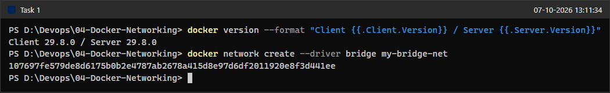

### Task 2: Verify the network
```powershell
docker network ls
```
* **Status:** `my-bridge-net` is listed with driver `bridge` and scope `local`, next to Docker's built-in `bridge`, `host` and `none` networks (the `minikube` network belongs to another lab).

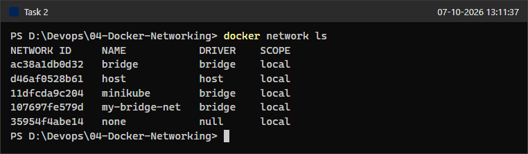

### Task 3: Inspect the network
```powershell
docker network inspect my-bridge-net
```
* **Status:** Docker's default IPAM driver assigned subnet `172.18.0.0/16` with gateway `172.18.0.1`. `"Containers": {}` is empty because nothing is attached yet.

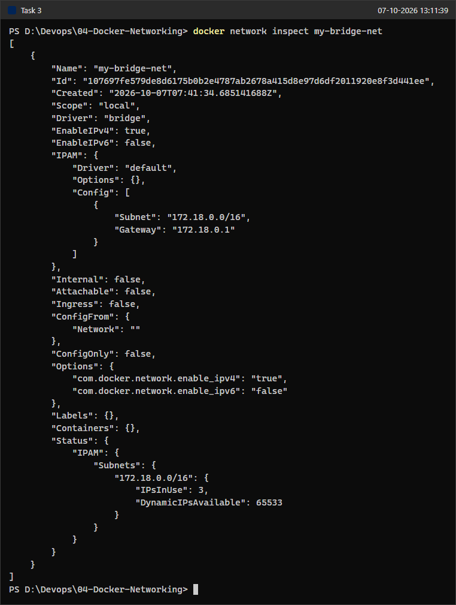

### Task 4: Create the Flask app files and build the image
The three files (`app.py`, `requirements.txt`, `Dockerfile`) were first created exactly as written in the exercise.

```powershell
cmd /c "docker build --no-cache -t flask-api . 2>&1"
docker images flask-api
```
* **Status:** The build succeeds. However, pip installs `Flask==2.0.1` together with **Werkzeug 3.1.9**, because Flask 2.0.1 only requires `Werkzeug>=2.0`. This becomes a problem at runtime (next steps). The command is the exercise's `docker build -t flask-api .`, wrapped in `cmd /c "... 2>&1"` (see Issue 7) and run with `--no-cache` so that pip's real dependency resolution is printed instead of cached steps.

### Task 4: Pull MySQL and Redis
```powershell
cmd /c "docker pull mysql:latest 2>&1"
cmd /c "docker pull redis:latest 2>&1"
docker images --format "table {{.Repository}}:{{.Tag}}\t{{.ID}}\t{{.Size}}" mysql
docker images --format "table {{.Repository}}:{{.Tag}}\t{{.ID}}\t{{.Size}}" redis
```
* **Status:** Both images downloaded (`mysql:latest` 1.3 GB, `redis:latest` 213 MB). `docker run` would also pull them automatically; pulling first just keeps the `docker run` output short. The pulls are wrapped in `cmd /c "... 2>&1"` (Issue 7).

### Task 4: Launch the containers exactly as written (first attempt)
```powershell
docker run -d --name mysql --net=my-bridge-net mysql:latest
docker run -d --name redis --net=my-bridge-net redis:latest
docker run -d --name flask --net=my-bridge-net -p 5001:5001 flask-api
Start-Sleep -Seconds 15
docker ps -a --filter "name=^(mysql|redis|flask)$" --format "table {{.Names}}\t{{.Image}}\t{{.Status}}\t{{.Ports}}"
```
* **Status:** All three containers start, but after 15 seconds only `redis` is still `Up`. Both `mysql` and `flask` are `Exited (1)`.

```powershell
docker logs mysql
docker logs flask
```
* **Status:** The logs show the two root causes. MySQL refuses to initialise an empty data directory without one of `MYSQL_ROOT_PASSWORD`, `MYSQL_ALLOW_EMPTY_PASSWORD` or `MYSQL_RANDOM_ROOT_PASSWORD`. Flask crashes on import with `ImportError: cannot import name 'url_quote' from 'werkzeug.urls'`.

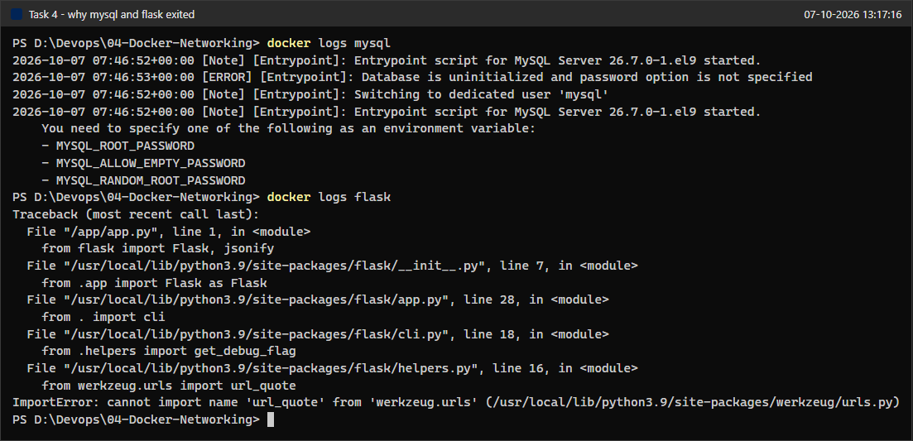

### Fix 1: Pin Werkzeug and rebuild
`requirements.txt` now contains:
```text
Flask==2.0.1
Werkzeug==2.0.3
```
```powershell
Get-Content requirements.txt
cmd /c "docker build --no-cache -t flask-api . 2>&1"
docker run --rm flask-api pip list --disable-pip-version-check
```
* **Status:** The image now contains Flask 2.0.1 with Werkzeug 2.0.3, a compatible pair. The same pinned install (`Werkzeug==2.0.3`) is visible in the pip output of the Fix 3 rebuild below (screenshot 12).

### Fix 2: Re-run MySQL with a generated root password, re-run Flask
```powershell
docker rm mysql flask
docker run -d --name mysql --net=my-bridge-net -e MYSQL_RANDOM_ROOT_PASSWORD=yes mysql:latest
docker run -d --name flask --net=my-bridge-net -p 5001:5001 flask-api
Start-Sleep -Seconds 20
docker ps -a --filter "name=^(mysql|redis|flask)$" --format "table {{.Names}}\t{{.Image}}\t{{.Status}}\t{{.Ports}}"
```
* **Status:** All three containers are now `Up`. `MYSQL_RANDOM_ROOT_PASSWORD=yes` lets MySQL initialise with a random root password, which is fine here because the lab only needs the database container to exist on the network; no password has to be typed or stored anywhere.

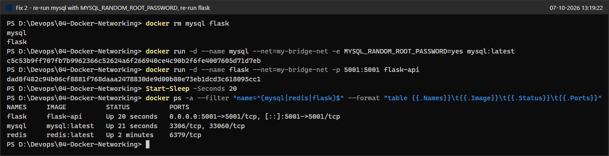

### Problem 3: The API is not reachable from the host yet
```powershell
docker logs flask
curl.exe -sS http://localhost:5001/about
docker exec flask python -c "import urllib.request as u; print(u.urlopen('http://127.0.0.1:5001/about').read().decode())"
```
* **Status:** Flask reports `Running on http://127.0.0.1:5001/`. From inside the container the endpoint answers, but from Windows `curl.exe` fails with `(52) Empty reply from server`. The server only listens on the container's loopback interface, so traffic arriving through the published port on the container's `eth0` (172.18.0.x) is never accepted. The Werkzeug debugger PIN is partially masked in the screenshot.
* **Note:** This set of commands was run twice, because the first capture attempt was redone. That is why the first `docker logs flask` output already ends with a `127.0.0.1 ... "GET /about HTTP/1.1" 200` line (logged at 07:49:26 UTC, 15 seconds before this screenshot): it is the in-container request from the earlier run. The `curl.exe` request from Windows never appears in the log, because it never reaches the server.

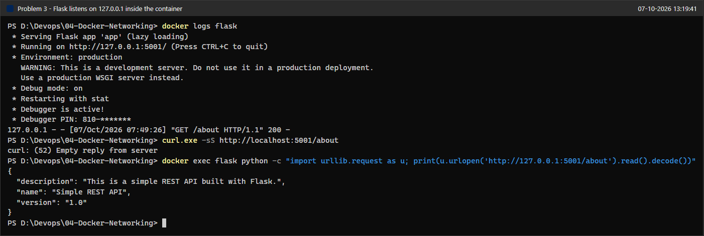

### Fix 3: Bind Flask to all interfaces, rebuild and re-run
The end of `app.py` becomes (the comment line is new, the `app.run(...)` line gains `host='0.0.0.0'`):
```python
if __name__ == '__main__':
    # host='0.0.0.0' so the server is reachable through the published port (-p 5001:5001)
    app.run(host='0.0.0.0', debug=True, port=5001)  # Specify the port number here
```
```powershell
Get-Content app.py | Select-Object -Last 3
cmd /c "docker build -t flask-api . 2>&1"
docker rm -f flask
docker run -d --name flask --net=my-bridge-net -p 5001:5001 flask-api
Start-Sleep -Seconds 5
docker logs flask
```
* **Status:** The rebuild installs Flask 2.0.1 with the pinned Werkzeug 2.0.3 (Fix 1), and the new container starts without the import error. Flask now reports `Running on all addresses` and `Running on http://172.18.0.4:5001/`.

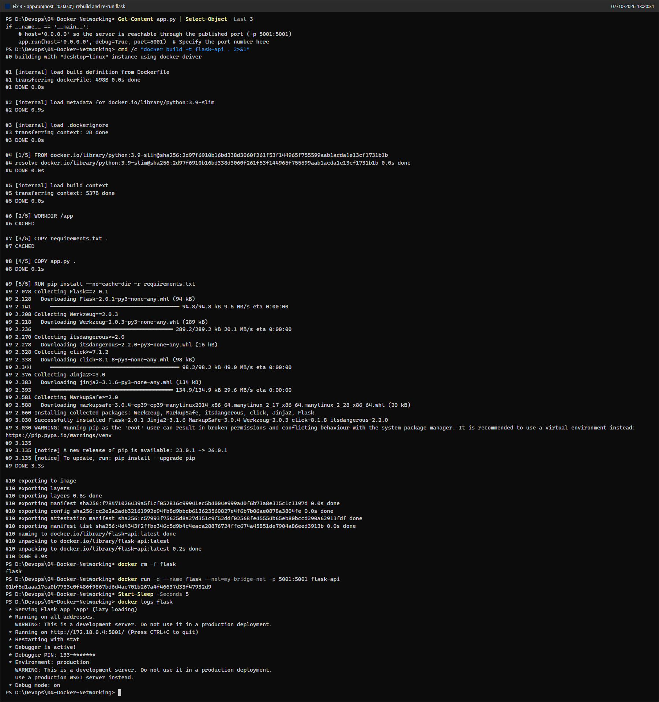

### Task 4 result: three containers on my-bridge-net, API reachable from the host
```powershell
docker ps --filter "name=^(mysql|redis|flask)$" --format "table {{.ID}}\t{{.Names}}\t{{.Image}}\t{{.Status}}\t{{.Ports}}\t{{.Networks}}"
docker port flask
curl.exe -sS http://localhost:5001/about
```
* **Status:** `flask`, `mysql` and `redis` are all `Up` and attached to `my-bridge-net`. Only `flask` publishes a port (`0.0.0.0:5001->5001/tcp`). `curl.exe` returns the JSON from `/about`.

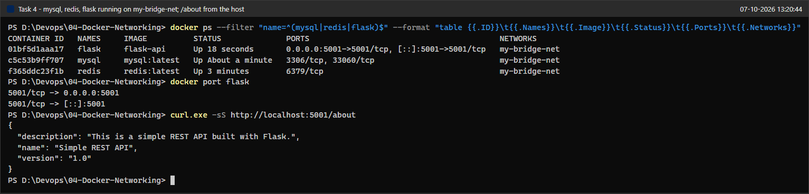

### Task 5: Test connectivity between the containers
The exercise uses `docker exec -it flask bash` and then types `ping mysql` interactively. The equivalent non-interactive form, `docker exec flask <command>`, runs the very same commands inside the same container and was used here so that each command and its output could be captured.

```powershell
docker exec flask bash -c "whoami; cat /etc/os-release | head -1"
docker exec flask ping -c 4 mysql
```
* **Status:** The slim Python image does not include `ping`, so the command fails with `executable file not found in $PATH`.

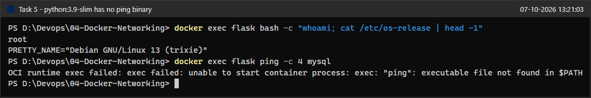

#### Fix 4: Install ping inside the running container
```powershell
cmd /c "docker exec -u root flask sh -c ""apt-get update && apt-get install -y iputils-ping"" 2>&1"
docker exec flask ping -V
```
* **Status:** `iputils-ping` was installed from the Debian repositories (the container already runs as root; `-u root` just makes that explicit). The underlying command is `docker exec -u root flask sh -c "apt-get update && apt-get install -y iputils-ping"`; it was wrapped in `cmd /c "... 2>&1"` for the same reason as the build and pull commands (Issue 7), so that anything apt writes to stderr is merged into the transcript instead of becoming PowerShell error records. The doubled quotes `""` are how `cmd` passes the inner quotes through. This change lives only in this container and disappears when it is removed.

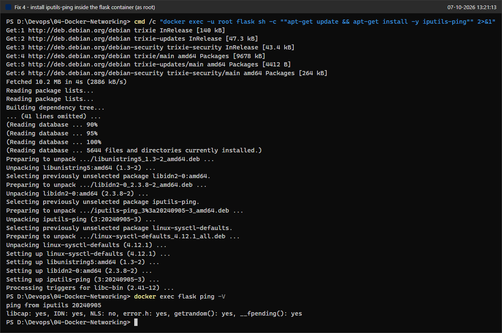

#### Ping MySQL and Redis by container name
```powershell
docker exec flask ping -c 4 mysql
docker exec flask ping -c 4 redis
```
* **Status:** `mysql` resolves to `172.18.0.2` and `redis` to `172.18.0.3`; both answer 4 out of 4 pings with 0% packet loss, which matches the expected output in the exercise.

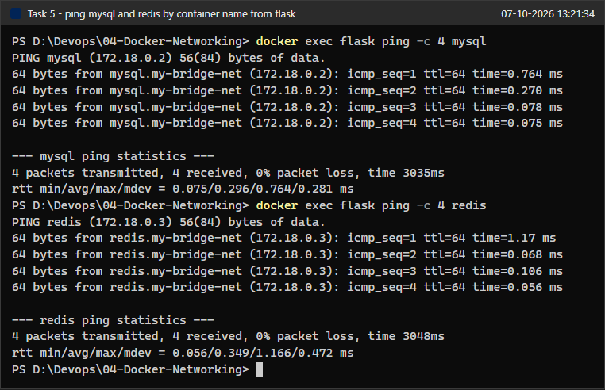

#### How the names are resolved: Docker's embedded DNS
```powershell
docker exec flask getent hosts mysql redis flask
docker exec flask cat /etc/resolv.conf
docker exec flask cat /etc/hosts
docker exec flask python -c "import socket; s=socket.create_connection(('redis',6379)); s.sendall(b'PING\r\n'); print('redis replied:', s.recv(64))"
```
* **Status:** `/etc/resolv.conf` points to `nameserver 127.0.0.11`, Docker's embedded DNS server, while `/etc/hosts` contains only the container's own entry. So the names `mysql` and `redis` are answered by Docker's DNS, not by a hosts file. The last command opens a real TCP connection to `redis:6379` and gets `+PONG`, showing application-level connectivity, not just ICMP.

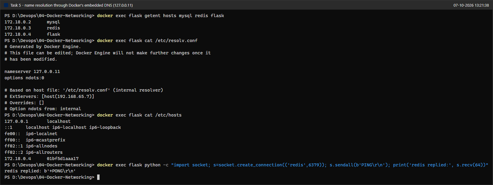

### Task 6: Clean up
```powershell
docker stop mysql redis flask && docker rm mysql redis flask
docker stop mysql redis flask; if ($?) { docker rm mysql redis flask }
docker network rm my-bridge-net
docker ps -a --filter "name=^(mysql|redis|flask)$"
docker network ls --filter name=my-bridge-net
```
* **Status:** The command from the exercise (`docker stop ... && docker rm ...`) is rejected by Windows PowerShell 5.1 because `&&` does not exist there; the equivalent `; if ($?) { ... }` form stopped and removed all three containers. The network was removed and both verification commands return empty lists.

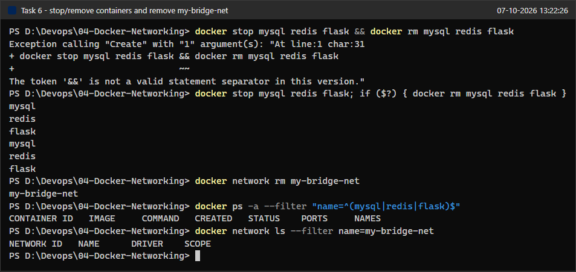

---

## Issues & Fixes
| # | Problem (as observed) | Cause | Fix |
|---|------------------------|-------|-----|
| 1 | `flask` exited with `ImportError: cannot import name 'url_quote' from 'werkzeug.urls'` (screenshot 08). | `Flask==2.0.1` only requires `Werkzeug>=2.0`, so pip installed Werkzeug 3.1.9. Werkzeug 3.0 removed `werkzeug.urls.url_quote`, which Flask 2.0.1 imports. | Pinned `Werkzeug==2.0.3` in `requirements.txt`, the last 2.0.x release that matches Flask 2.0.1. The rebuild in screenshot 12 installs Werkzeug 2.0.3 and Flask starts. |
| 2 | `mysql` exited immediately: "Database is uninitialized and password option is not specified" (screenshot 08). | The official MySQL image will not initialise a database unless the root password policy is given as an environment variable. The exercise's `docker run` has none. | Re-ran with `-e MYSQL_RANDOM_ROOT_PASSWORD=yes`. MySQL generates a random root password at first start, so no credential had to be chosen, typed or stored (screenshot 10). |
| 3 | `curl.exe http://localhost:5001/about` returned `(52) Empty reply from server` although the container was running (screenshot 11). | `app.run(debug=True, port=5001)` listens on `127.0.0.1` only. Published-port traffic enters the container on its network interface, not on loopback. | Changed to `app.run(host='0.0.0.0', debug=True, port=5001)` and rebuilt (screenshots 12 and 13). |
| 4 | `ping: executable file not found in $PATH` inside `flask` (screenshot 15). | `python:3.9-slim` is a minimal image without `iputils-ping`. | Installed it in the running container with `docker exec -u root flask sh -c "apt-get update && apt-get install -y iputils-ping"` (screenshot 16). It was deliberately not added to the Dockerfile, because the API does not need ping. |
| 5 | `docker exec -it flask bash` opens an interactive shell, which cannot be captured as a scripted screenshot. | Interactive TTY session. | Ran the same commands one by one with `docker exec flask <command>`, which executes them in the same container. |
| 6 | `docker stop mysql redis flask && docker rm mysql redis flask` fails with "The token '&&' is not a valid statement separator in this version" (screenshot 21). | Windows PowerShell 5.1 has no `&&` operator (it was added in PowerShell 7). | Used `docker stop mysql redis flask; if ($?) { docker rm mysql redis flask }`, which has the same "only remove if stop succeeded" meaning. |
| 7 | `docker build` and `docker pull` progress output shows up as error records in Windows PowerShell 5.1. | BuildKit and pull progress are written to stderr, and PowerShell 5.1 wraps native stderr lines as errors. | The builds, the pulls and the `docker exec ... apt-get` install were run through `cmd /c "... 2>&1"` (see screenshots 12 and 16), which merges the streams before PowerShell sees them. The Docker command itself is unchanged. |

**Security note:** the app still runs Flask's development server with `debug=True`, now on all interfaces. That is acceptable for this short local lab (the containers were removed at the end), but it should never be done on a shared or production host, because the Werkzeug debugger allows code execution if its PIN is known. For a real deployment use a WSGI server such as gunicorn, turn debug off, or publish the port only on loopback with `-p 127.0.0.1:5001:5001`.

---

## Verification Summary
| Check | Result |
|-------|--------|
| `my-bridge-net` created, driver `bridge`, subnet `172.18.0.0/16` | Pass (screenshots 01-03) |
| `flask-api` image builds and starts | Pass after pinning Werkzeug (screenshot 12) |
| `mysql`, `redis`, `flask` all `Up` on `my-bridge-net` | Pass (screenshot 13) |
| `GET /about` from the Windows host (`curl.exe`) | Pass, JSON returned (screenshot 13) |
| `flask` → `mysql` ping by name | Pass, 172.18.0.2, 0% loss (screenshot 17) |
| `flask` → `redis` ping by name and TCP PING/PONG | Pass, 172.18.0.3, 0% loss, `+PONG` (screenshots 17, 18) |
| Name resolution through Docker DNS `127.0.0.11` | Pass (screenshot 18) |
| Cleanup: containers and network removed | Pass (screenshot 21) |

---

## Q&A

**1. What is the purpose of the `--net` flag in `docker run`?**
`--net` (the older spelling of `--network`) chooses which network the new container is attached to when it is created. Without it, a container joins Docker's default `bridge` network. With `--net=my-bridge-net` the container gets an interface and an IP address from that network's subnet (here `172.18.0.0/16`) and is registered in that network's embedded DNS under its container name, so other containers on the same network can find it. The flag also accepts the special values `host` (share the host's network stack), `none` (only a loopback interface) and `container:<name>` (share another container's network namespace). A running container can be attached to additional networks later with `docker network connect`.

**2. How do containers communicate with each other on the same network?**
Every container on a user-defined bridge network has its own IP address on a virtual Linux bridge, so the containers can reach each other directly on any port the target process listens on; no `-p` port publishing is needed between containers. They normally do not use the IP addresses, which change when a container is recreated, but the container names: each container's `/etc/resolv.conf` points to Docker's embedded DNS server at `127.0.0.11`, which resolves `mysql`, `redis` or `flask` to the container's current IP (screenshot 18). In this lab, `flask` pinged `mysql` and `redis` by name (screenshot 17) and opened a TCP connection to `redis:6379` by name (screenshot 18). This automatic name resolution exists only on user-defined networks; on the default `bridge` network containers can only use raw IPs or the legacy `--link` option. Containers on different networks cannot talk to each other unless they share at least one network.

**3. What is the difference between a bridge network and a host network?**
On a **bridge** network each container gets its own network namespace: its own interfaces, IP address, routing table and port space. Containers are connected through a virtual bridge, reach the outside world through NAT, and are not reachable from outside unless a port is published with `-p`. This gives isolation, and several containers can use the same internal port (for example two containers both listening on 5001) without conflict.
On the **host** network the container does not get its own network namespace; it uses the host's interfaces and IP directly. A process listening on port 5001 in the container is immediately listening on port 5001 of the host, there is no NAT and no port mapping (`-p` is ignored), which gives slightly better network performance but no network isolation and a risk of port conflicts with the host or other containers. On Docker Desktop for Windows the "host" is the Linux VM that runs Docker, not Windows itself, so host networking does not expose ports on Windows the way it does on a native Linux server unless Docker Desktop's host networking feature is turned on.
The analogy from the exercise still fits: on a bridge network the containers are in a private room and talk to the outside only through a door (published ports); on the host network they are in the same room as the host and talk to everyone directly.

**4. How can you expose a container's port to the host machine?**
Publish it with `-p` (or `--publish`) when the container is created, using the form `-p <hostPort>:<containerPort>`. In this lab `-p 5001:5001` maps port 5001 on the host to port 5001 in the `flask` container, which is why `http://localhost:5001/about` works from Windows. Useful variations are:
* `-p 8080:5001` publishes the container's port 5001 on a different host port (8080).
* `-p 127.0.0.1:5001:5001` publishes only on the host's loopback interface, so other machines cannot connect.
* `-p 5001:5001/udp` publishes a UDP port instead of TCP.
* `-P` (capital P) publishes every port declared with `EXPOSE` in the image to a random free high port on the host.

`docker port flask` or `docker ps` shows the active mappings. Note that `EXPOSE 5001` in the Dockerfile only documents the port and does not publish it by itself, and that the application inside the container must listen on `0.0.0.0` (not `127.0.0.1`) for the published port to work, as Issue 3 showed.

---

## Cleanup / State Left Running
* Containers `mysql`, `redis` and `flask` were stopped and removed, and network `my-bridge-net` was removed (screenshot 21).
* Nothing is left running: no containers, port 5001 is free and no background processes were started.
* The images `flask-api:latest`, `mysql:latest` and `redis:latest` were kept so the lab can be re-run quickly. To remove them: `docker rmi flask-api mysql:latest redis:latest`.
