# Lab 05: Docker Security with AppArmor and Python

## Objective
Secure a containerised Python Flask application with an AppArmor profile. The profile should stop the container from reading sensitive files, writing to `/var`, running shells and other binaries, and using the `sys_admin` capability. The profile is applied twice: once with the Docker CLI (`--security-opt apparmor=...`) and once with the Docker SDK for Python. Two Python scripts then check that the profile is applied and that the restricted actions really fail inside the container.

> **Note:** this lab was done in **two sessions on 2026-10-09**. Session 1 (14:24 to 14:38, screenshots 02 to 14) covered the setup and Tasks 1 to 3 and was cut off by a usage limit. Session 2 (17:39 to 17:47, screenshots 19 to 25) picked up from the state left on disk, finished Tasks 4 and 5, and reverted the machine.

---

## Environment
* **OS:** Windows 11 Home Single Language (10.0.26200), Windows PowerShell 5.1
* **WSL2 kernel:** `6.18.33.2-microsoft-standard-WSL2`. AppArmor is built in (`CONFIG_SECURITY_APPARMOR=y`) but disabled by default.
* **Linux side:** WSL distro `Ubuntu-22.04` (run as root through `wsl -d Ubuntu-22.04 -u root`), AppArmor userspace `3.0.4-2ubuntu2.5` (`apparmor`, `apparmor-utils`), Python `3.10.12`
* **Docker engine used for the lab:** Docker Engine `29.9.0`, the official static binaries (`docker-29.9.0.tgz` from download.docker.com) in `/opt/docker-aa` inside Ubuntu-22.04. It runs as the transient systemd unit `docker-aa` with its own socket `/run/docker-aa.sock` and its own data root `/var/lib/docker-aa`. Storage driver overlayfs, cgroup v2 (systemd). Security options: `apparmor`, `seccomp`, `cgroupns`.
* **Docker Desktop:** `29.8.0`. It was **not** used for the lab containers (see Issue 1). It was only stopped and started for the AppArmor switch-over.
* **Image:** `python:3.8-slim` + Flask `3.0.3` (Werkzeug `3.0.6`), installed by `pip install flask` during the build
* **Docker SDK for Python:** `docker 7.2.0` in the virtual environment `/opt/aa-venv`. It negotiated API version `1.56` with the engine.

---

## Files in this folder
| File | Purpose |
|------|---------|
| `app.py` | Flask app from Task 1, exactly as given. |
| `Dockerfile` | Dockerfile from Task 2, exactly as given (`python:3.8-slim`, `pip install flask`, `EXPOSE 5000`). |
| `my-apparmor-profile.original` | The AppArmor profile from Task 3, character for character. It is kept as evidence; Docker cannot use it (Issues 3 to 5). |
| `my-apparmor-profile` | The corrected profile that was actually loaded as `/etc/apparmor.d/my-apparmor-profile` and used for every container in Tasks 3 to 5. It is a named profile, keeps Flask working, and enforces the exercise's restrictions in a form that works inside a container (see Issues & Fixes 3, 5 and 6). |
| `apply_apparmor.py` | Task 4 script, exactly as given. |
| `test_restricted_actions.py` | Task 5 script, exactly as given. |
| `screenshot/` | 16 PNG screenshots of the real commands and their output, in execution order. The numbering has gaps because redundant screenshots were removed. |

---

## Step-by-Step Execution
Commands in `bash` blocks ran as root inside Ubuntu-22.04 in `/mnt/d/Devops/05-Docker-Security-AppArmor` (this folder). Commands in `powershell` blocks ran in Windows PowerShell in `D:\Devops\05-Docker-Security-AppArmor`. Every `bash` block that talks to Docker starts with `export PATH=/opt/docker-aa:$PATH DOCKER_HOST=unix:///run/docker-aa.sock`. That line makes `docker` mean the AppArmor-capable engine instead of Ubuntu's `/usr/bin/docker`, which is only a symlink to Docker Desktop's CLI.

### Session 1

#### Step 0: Starting point, AppArmor is off
```powershell
docker version --format 'Docker Desktop engine {{.Server.Version}} ({{.Server.Os}}, kernel {{.Server.KernelVersion}})'
docker info --format 'SecurityOptions: {{json .SecurityOptions}}'
Test-Path $env:USERPROFILE\.wslconfig
$env:WSL_UTF8 = "1"; wsl -l -v
```
* **Status:** Docker Desktop's engine lists only `seccomp` and `cgroupns` under Security Options and no `apparmor`, so it cannot enforce AppArmor profiles. The WSL2 kernel has AppArmor compiled in, but its default command line does not switch it on (`enabled` is `N`; the same default state is visible again after the revert in screenshot 25). No `%USERPROFILE%\.wslconfig` existed before this lab.

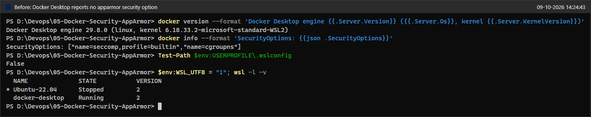

#### Step 1: Enable AppArmor in the WSL2 kernel (temporary, approved by the user)
```powershell
Set-Content -Path $env:USERPROFILE\.wslconfig -Encoding ascii -Value '[wsl2]','kernelCommandLine = apparmor=1 security=apparmor'
docker desktop stop
wsl --shutdown
```
`.wslconfig` was created with the extra kernel parameters, Docker Desktop was stopped, and the WSL2 VM was shut down so that it boots with the new kernel command line. The next screenshot shows that the parameters took effect.

```bash
grep -o 'apparmor=1 security=apparmor' /proc/cmdline
cat /sys/module/apparmor/parameters/enabled
systemctl status apparmor --no-pager | grep -E 'Active|Assert'
mount -t securityfs securityfs /sys/kernel/security && cat /sys/kernel/security/lsm; echo
systemctl restart apparmor && systemctl is-active apparmor
aa-status | head -4
```
* **Status:** After the restart AppArmor is enabled (`Y`). Ubuntu's `apparmor.service` had failed its start assertion because `securityfs` was not mounted under WSL. After mounting it manually, the LSM list includes `apparmor` and the service becomes `active` (Issue 2).

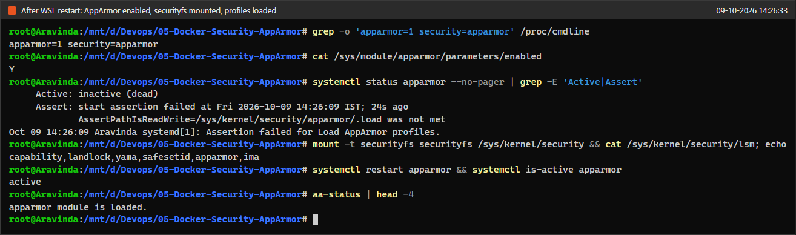

#### Prerequisite: install apparmor-utils
```bash
apt-get update -qq
DEBIAN_FRONTEND=noninteractive apt-get install -y apparmor-utils
apparmor_parser --version | head -1
aa-enabled
journalctl -u apparmor -n 2 --no-pager -o cat
```
* **Status:** `apparmor-utils 3.0.4` was installed (`apparmor_parser` itself comes with the `apparmor` package, which was already present). `aa-enabled` answers `Yes`.

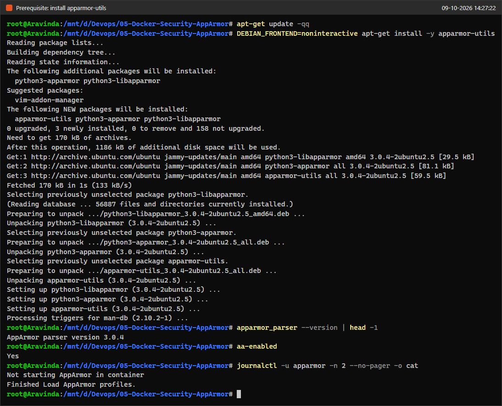

#### Step 2: A Docker engine that really supports AppArmor
```bash
mkdir -p /opt/docker-aa && curl -fsSL https://download.docker.com/linux/static/stable/x86_64/docker-29.9.0.tgz | tar -xz -C /opt/docker-aa --strip-components=1 && ls /opt/docker-aa
systemd-run --unit=docker-aa --setenv=PATH=/opt/docker-aa:/usr/sbin:/usr/bin:/sbin:/bin /opt/docker-aa/dockerd --host unix:///run/docker-aa.sock --data-root /var/lib/docker-aa --exec-root /run/docker-aa --pidfile /run/docker-aa.pid
sleep 5; systemctl is-active docker-aa
export PATH=/opt/docker-aa:$PATH DOCKER_HOST=unix:///run/docker-aa.sock
docker version --format 'Client {{.Client.Version}} / Server {{.Server.Version}}'
docker info --format 'SecurityOptions: {{json .SecurityOptions}}  Storage: {{.Driver}}  Cgroup: {{.CgroupDriver}} v{{.CgroupVersion}}'
```
* **Status:** The separate engine runs as systemd unit `docker-aa` and reports `name=apparmor,profile=default` under Security Options. This engine was used for every container in Tasks 2 to 5. Bridge networking and iptables worked without changes.

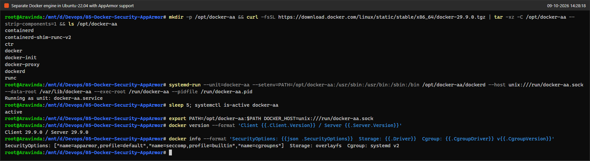

#### Task 1 and Task 2: Flask app, Dockerfile and image
`app.py` and `Dockerfile` in this folder are exactly as given in the exercise.

```bash
export PATH=/opt/docker-aa:$PATH DOCKER_HOST=unix:///run/docker-aa.sock
docker build -t flask-apparmor .
docker images flask-apparmor
```
* **Status:** The image `flask-apparmor:latest` (`d16fb1d19ee8`) was built. The static engine bundle has no buildx plugin, so Docker used the legacy builder. It prints a deprecation notice, and its `Step 1/6 ...` output looks like the exercise's expected output. There are 6 steps, not 5, because the exercise's sample output leaves out the `CMD` step.

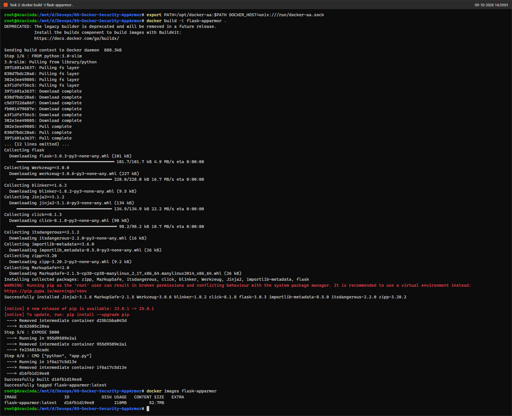

#### Task 3a/3b: The exercise's profile as written
```bash
cp my-apparmor-profile.original /etc/apparmor.d/my-apparmor-profile && cat -n /etc/apparmor.d/my-apparmor-profile
apparmor_parser -r /etc/apparmor.d/my-apparmor-profile
```
* **Status:** Fails. `apparmor_parser` rejects line 15: "in deny rules 'x' must not be preceded by exec qualifier 'i', 'p', or 'u'" (Issue 3).

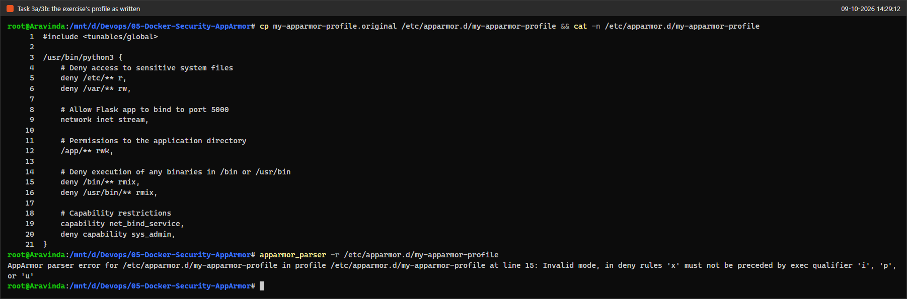

#### Task 3c: Trying to use the exercise's profile with Docker
```bash
sed -i 's/ rmix,/ rmx,/' /etc/apparmor.d/my-apparmor-profile && grep -n 'deny /' /etc/apparmor.d/my-apparmor-profile
apparmor_parser -r /etc/apparmor.d/my-apparmor-profile && grep -E 'python3|my-apparmor' /sys/kernel/security/apparmor/profiles
export PATH=/opt/docker-aa:$PATH DOCKER_HOST=unix:///run/docker-aa.sock
docker run --security-opt="apparmor=my-apparmor-profile" -p 5000:5000 flask-apparmor
docker run -d --name aa-python3 --security-opt apparmor=/usr/bin/python3 flask-apparmor; sleep 3; docker ps -a --filter name=aa-python3 --format '{{.Names}}: {{.Status}}'; docker logs aa-python3
dmesg | grep 'apparmor="DENIED"' | grep -o 'operation="[a-z_]*" .*name="[^"]*"' | sort | uniq -c | head -8
```
* **Status:** After the smallest possible syntax fix (`rmix` to `rmx`, only in the copy under `/etc`), the profile loads, but under the name `/usr/bin/python3`, not `my-apparmor-profile`.
  * The exercise's exact `docker run` fails with "unable to apply apparmor profile ... no such file or directory", because no profile called `my-apparmor-profile` exists (Issue 4).
  * Selecting the profile by its real name `/usr/bin/python3` gets past that, but the container exits with code 127: `python: error while loading shared libraries: libpython3.8.so.1.0`. The kernel log shows the reason: `operation="open" profile="/usr/bin/python3" name="/usr/local/lib/libpython3.8.so.1.0"` was denied. The profile allows nothing outside `/app/**`, so Python cannot even load its own library (Issue 5).
  * The other `label not found` lines in the log (`ubuntu_pro_apt_news`, `ubuntu_pro_esm_cache`) come from Ubuntu's apt hooks during the package install and have nothing to do with this lab.

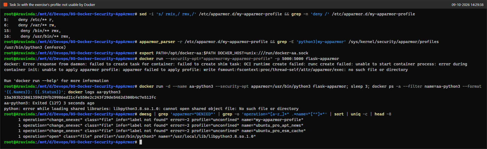

#### Task 3: The corrected profile
```bash
cat my-apparmor-profile
cp my-apparmor-profile /etc/apparmor.d/my-apparmor-profile
apparmor_parser -r /etc/apparmor.d/my-apparmor-profile && echo "profile loaded"
aa-status | grep -E 'profiles are|my-apparmor-profile|docker-default'
```
* **Status:** The corrected profile (file `my-apparmor-profile` in this folder) loads cleanly. `aa-status` lists `my-apparmor-profile` in enforce mode next to Docker's own `docker-default`. The changes compared with the exercise are explained in Issues 3 to 6.

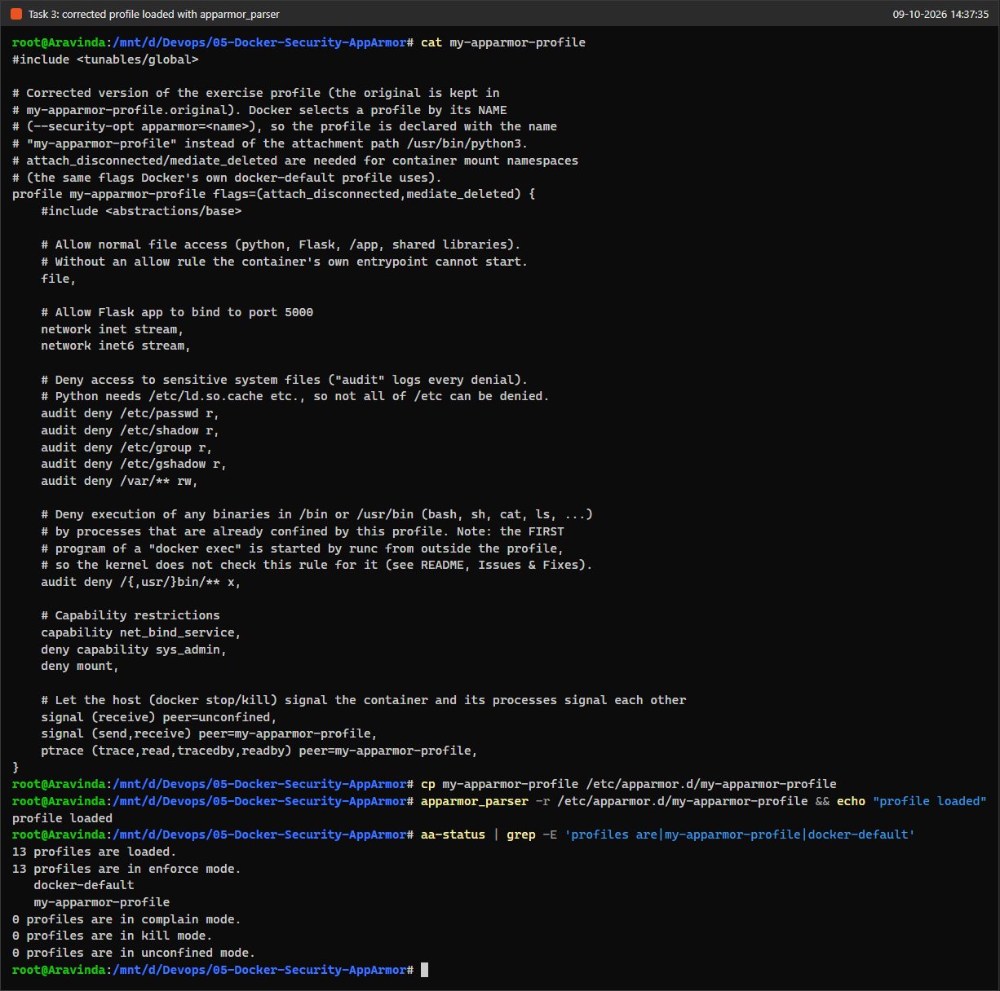

#### Task 3c: Run the container with the profile
```bash
export PATH=/opt/docker-aa:$PATH DOCKER_HOST=unix:///run/docker-aa.sock
docker run -d --name flask-apparmor --security-opt="apparmor=my-apparmor-profile" -p 5000:5000 flask-apparmor
sleep 3; docker ps --filter name=flask-apparmor --format 'table {{.Names}}\t{{.Image}}\t{{.Status}}\t{{.Ports}}'
docker logs flask-apparmor
curl -s http://localhost:5000; echo
docker inspect --format 'AppArmorProfile={{.AppArmorProfile}}  HostConfig.SecurityOpt={{.HostConfig.SecurityOpt}}' flask-apparmor
docker exec flask-apparmor cat /proc/1/attr/current
```
* **Status:** This is the exercise's command with `-d --name flask-apparmor` added so it runs in the background. Flask serves the page, and `docker inspect` shows `AppArmorProfile=my-apparmor-profile`. The kernel's own label for the container's PID 1 is `my-apparmor-profile (enforce)`.

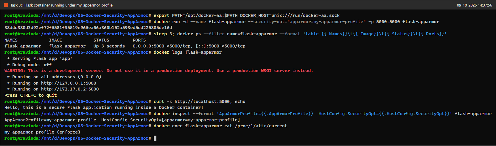

```bash
export PATH=/opt/docker-aa:$PATH DOCKER_HOST=unix:///run/docker-aa.sock
docker exec flask-apparmor cat /etc/passwd
docker exec flask-apparmor cat /etc/shadow
docker exec flask-apparmor cat /etc/hostname
docker exec flask-apparmor /bin/bash -c id
docker exec flask-apparmor python -c 'import subprocess; subprocess.run(["/bin/bash", "-c", "id"])'
docker exec flask-apparmor sh -c 'echo test > /var/tmp/x'
```
* **Status:** All restricted actions are blocked:
  * Reading `/etc/passwd` and `/etc/shadow` gives "Permission denied", while a harmless file such as `/etc/hostname` can still be read.
  * Bash may start, but it cannot run `/usr/bin/id`.
  * Python cannot start `/bin/bash` (`PermissionError: [Errno 13]`).
  * Writing under `/var` is denied.

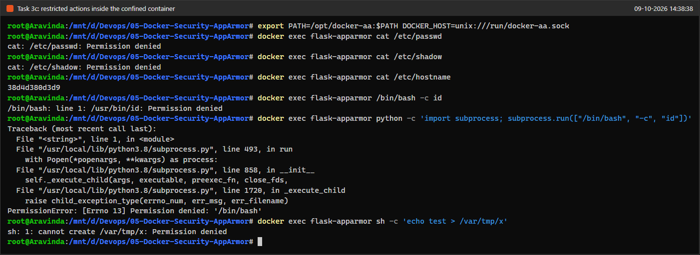

### Session 2

#### Resume after the break
`.wslconfig` from session 1 was still in place, so the kernel still booted with `apparmor=1`. The `securityfs` mount and the transient `docker-aa` unit do not survive a stop of the WSL VM, so they were set up again, and the profile was reloaded. The engine, the image `flask-apparmor` and the profile file were all still on disk.
```bash
mount -t securityfs securityfs /sys/kernel/security && systemctl restart apparmor
systemd-run --unit=docker-aa --setenv=PATH=/opt/docker-aa:/usr/sbin:/usr/bin:/sbin:/bin /opt/docker-aa/dockerd --host unix:///run/docker-aa.sock --data-root /var/lib/docker-aa --exec-root /run/docker-aa --pidfile /run/docker-aa.pid
apparmor_parser -r /etc/apparmor.d/my-apparmor-profile
```
Tasks 4 and 5 below show the profile applied and enforced again (screenshots 20 and 21).

#### Task 4: Docker SDK for Python
```bash
export PATH=/opt/docker-aa:$PATH DOCKER_HOST=unix:///run/docker-aa.sock
docker rm flask-apparmor
DEBIAN_FRONTEND=noninteractive apt-get install -y python3-pip python3-venv 2>&1 | tail -3
python3 -m venv /opt/aa-venv && /opt/aa-venv/bin/pip install --disable-pip-version-check docker 2>&1 | tail -2
/opt/aa-venv/bin/python -c 'import docker; c = docker.from_env(); print("docker SDK", docker.__version__, "-> engine", c.version()["Version"], "API", c.api.api_version)'
```
* **Status:** The stopped Task 3c container was removed first. The scripts publish port 5000 too, and a leftover container should not be mistaken for theirs. `pip install docker` installed the Docker SDK `7.2.0` into a virtual environment (Issue 9). `docker.from_env()` reads `DOCKER_HOST` and reaches engine `29.9.0`.

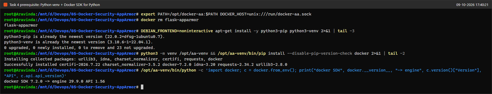

```bash
export PATH=/opt/docker-aa:$PATH DOCKER_HOST=unix:///run/docker-aa.sock
source /opt/aa-venv/bin/activate
python apply_apparmor.py; echo "script exit code: $?"
docker ps -a --filter ancestor=flask-apparmor --format 'table {{.ID}}\t{{.Image}}\t{{.Status}}\t{{.CreatedAt}}'
docker inspect --format 'id={{printf "%.12s" .Id}}  AppArmorProfile={{.AppArmorProfile}}  HostConfig.SecurityOpt={{.HostConfig.SecurityOpt}}' $(docker ps -lq)
```
* **Status:** The script builds the image, starts container `24d5b72b5a65` with `security_opt=["apparmor=my-apparmor-profile"]`, prints `AppArmor profile applied: ['apparmor=my-apparmor-profile']`, stops the container, and exits with code 0. `docker inspect` confirms the profile Docker actually applied (`AppArmorProfile=my-apparmor-profile`). The output is shorter than the exercise's "expected output", and the container ends with `Exited (137)`; Issue 7 explains both.

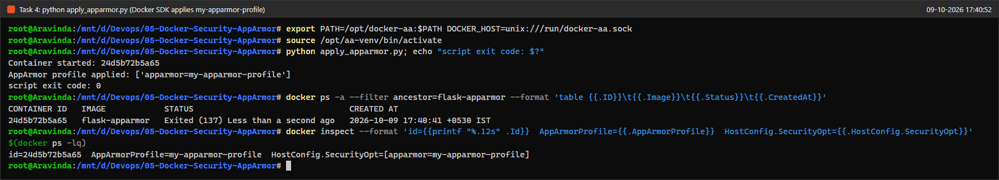

#### Task 5: Test restricted actions
```bash
export PATH=/opt/docker-aa:$PATH DOCKER_HOST=unix:///run/docker-aa.sock
source /opt/aa-venv/bin/activate
python test_restricted_actions.py; echo "script exit code: $?"
docker inspect --format 'id={{printf "%.12s" .Id}}  AppArmorProfile={{.AppArmorProfile}}  Status={{.State.Status}} ({{.State.ExitCode}})' $(docker ps -lq)
dmesg | grep 'apparmor="DENIED"' | grep 'profile="my-apparmor-profile"' | grep -E 'comm="(cat|bash)"' | tail -2 | grep -o 'operation=.*requested_mask="[a-z]*"'
```
* **Status:**
  * `cat /etc/passwd` returns **exit code 1** with `cat: /etc/passwd: Permission denied`, as the exercise expects.
  * `/bin/bash` returns **exit code 0** with empty output instead of the expected 126. Bash does start, but it runs confined. The kernel log shows that this `bash` (pid 2870) was itself denied `open /etc/passwd`. With no stdin it reads end-of-file and exits normally.
  * See Issue 8 and the next screenshot for why `docker exec` of `/bin/bash` cannot be blocked by the profile's exec rule.
  * (The script was run twice; this capture is the second run. The first run printed exactly the same two lines.)

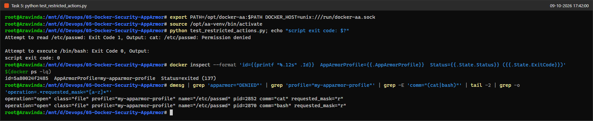

Follow-up: where the expected exit code 126 really comes from.
```bash
export PATH=/opt/docker-aa:$PATH DOCKER_HOST=unix:///run/docker-aa.sock
docker run -d --name aa-demo --security-opt apparmor=my-apparmor-profile flask-apparmor >/dev/null; sleep 2; docker exec aa-demo cat /proc/1/attr/current
docker exec aa-demo /bin/bash; echo "exit code: $?   <- /bin/bash started directly by runc (same as exec_run in Task 5)"
docker exec aa-demo sh -c /bin/bash; echo "exit code: $?   <- /bin/bash started by a process already confined by my-apparmor-profile"
docker exec aa-demo sh -c 'read label < /proc/self/attr/current; echo "sh (started by runc) runs under: $label"'
docker rm -f aa-demo
```
* **Status:** When runc starts `/bin/bash` directly the exit code is 0. When `/bin/bash` is started by a process that is already confined (here `sh`), the kernel refuses the exec: `sh: 1: /bin/bash: Permission denied`, **exit code 126**. That is exactly the value the exercise expects. The last command proves that the first process of a `docker exec` does run under `my-apparmor-profile (enforce)`.

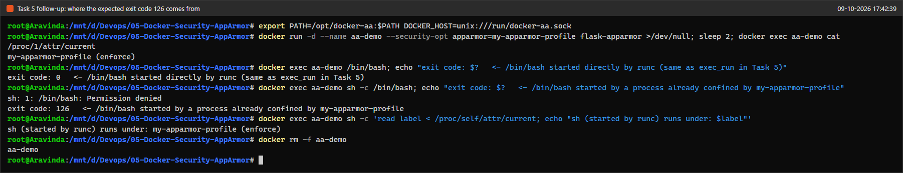

#### Revert (mandatory)
```bash
export PATH=/opt/docker-aa:$PATH DOCKER_HOST=unix:///run/docker-aa.sock
docker ps -a --format 'table {{.ID}}\t{{.Image}}\t{{.Status}}'
docker rm $(docker ps -aq) && docker ps -a
systemctl stop docker-aa; systemctl is-active docker-aa
apparmor_parser -R /etc/apparmor.d/my-apparmor-profile && rm /etc/apparmor.d/my-apparmor-profile && aa-status | grep -E 'profiles are loaded|my-apparmor-profile|docker-default'
du -sh /opt/docker-aa /var/lib/docker-aa /opt/aa-venv
```
* **Status:** All containers of the lab engine were removed. Besides the three stopped containers of Tasks 4 and 5, the list held three leftover intermediate build containers (Issue 10). The `docker-aa` engine was stopped (`inactive`; `systemctl is-active` exits with 3 for an inactive unit). `my-apparmor-profile` was unloaded from the kernel and its copy in `/etc/apparmor.d` was deleted; the source stays in this folder. `docker` (`/usr/bin/docker`) in Ubuntu-22.04 again talks to Docker Desktop, because the `export` only lived in that one shell. `docker-default` stays loaded only until the VM restart in the next step.

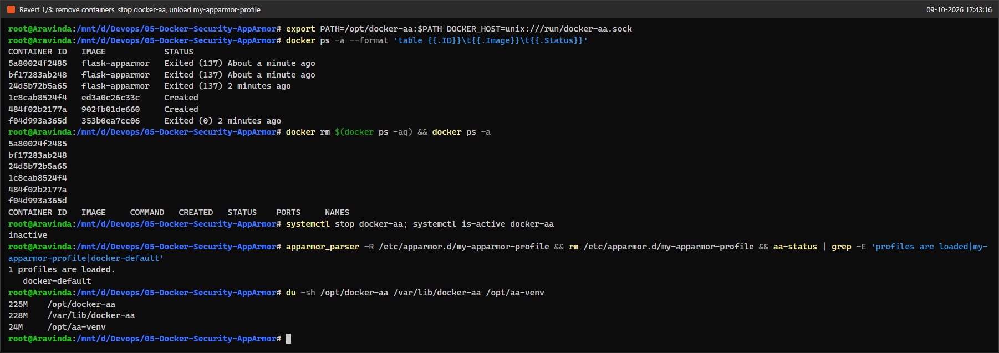

There was no `.wslconfig` before this lab (screenshot 02), so the revert simply deletes it. Docker Desktop was stopped and WSL was shut down so the next boot uses the default kernel command line again. Docker Desktop was then started again (`Start-Process "C:\Program Files\Docker\Docker\Docker Desktop.exe"`), and the script waited until `docker info` answered. It came up normally; the stale-socket workaround was not needed.
```powershell
docker desktop stop
Remove-Item $env:USERPROFILE\.wslconfig
wsl --shutdown
docker info --format 'Docker Desktop {{.ServerVersion}}  SecurityOptions: {{json .SecurityOptions}}'
wsl -d Ubuntu-22.04 -u root -- cat /proc/cmdline /sys/module/apparmor/parameters/enabled
docker start jenkins delivery_metrics prometheus grafana
docker ps --filter name=jenkins --filter name=delivery_metrics --filter name=prometheus --filter name=grafana --format 'table {{.Names}}\t{{.Status}}\t{{.Ports}}'
```
* **Status:** Back to the original state: Docker Desktop lists no `apparmor`, the kernel command line has no `apparmor=1`, and `enabled` is `N` again. The containers of the Jenkins and monitoring labs (`jenkins`, `delivery_metrics`, `prometheus`, `grafana`) were started again.

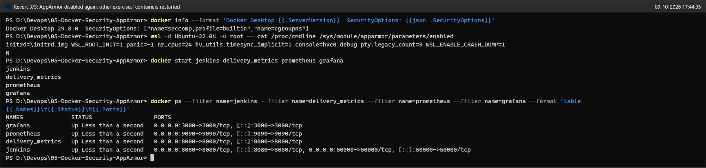

---

## Issues & Fixes
| # | Problem (as observed) | Cause | Fix |
|---|------------------------|-------|-----|
| 1 | Docker Desktop could not enforce AppArmor at all: no `apparmor` in its Security Options (screenshot 02), and the WSL2 kernel boots with AppArmor disabled (`enabled = N`, the default state shown again in screenshot 25). | Docker Desktop's WSL2 kernel has AppArmor compiled in but does not enable it on its command line. Docker only applies AppArmor profiles when the host kernel has AppArmor enabled. | With the user's approval, `.wslconfig` temporarily set `kernelCommandLine = apparmor=1 security=apparmor` (screenshot 04 shows it in effect). Docker Desktop manages its own VM and engine, so profiles were tested on a separate, standard Docker Engine 29.9.0 (static binaries) inside Ubuntu-22.04, where `apparmor_parser` and the engine share one view of the kernel (screenshot 06). Ubuntu's `docker` symlink to Docker Desktop's CLI was left untouched. Everything was reverted at the end (screenshots 23 and 25). |
| 2 | `apparmor.service` failed its start assertion and `aa-status` said "apparmor filesystem is not mounted", even with AppArmor enabled (screenshot 04). | WSL's init does not mount `securityfs` at `/sys/kernel/security`, and AppArmor's control files live there. | `mount -t securityfs securityfs /sys/kernel/security`, then `systemctl restart apparmor`. This had to be repeated after every WSL restart (Issue 11). Ubuntu's `apparmor.service` also treats WSL as a container (its journal in screenshot 05 says "Not starting AppArmor in container") and does not load the distro's own profiles, so the lab profile was always loaded by hand with `apparmor_parser`. |
| 3 | `apparmor_parser -r` rejected the exercise's profile: "in deny rules 'x' must not be preceded by exec qualifier 'i'" (screenshot 09). | `rmix` contains `ix` ("inherit execute"). An exec qualifier says *how* to run a program, which makes no sense in a `deny` rule, so AppArmor 3 refuses it. | The corrected profile uses `deny ... x`, so it blocks only *executing* programs in `/bin` and `/usr/bin`. Denying read and mmap (`r`, `m`) was dropped on purpose: reading a binary's bytes is harmless, and running it is what the exercise wants to stop. For the experiment in screenshot 10, only the copy in `/etc` was changed from `rmix` to `rmx`. |
| 4 | `docker run --security-opt apparmor=my-apparmor-profile` failed: "unable to apply apparmor profile ... no such file or directory" (screenshot 10). | Docker selects a profile by its **name**. The exercise's profile has no name; it is declared as `/usr/bin/python3 { ... }`, so the kernel knows it only as `/usr/bin/python3`. The file name `my-apparmor-profile` does not matter to AppArmor. Also, the container's Python is `/usr/local/bin/python`, so the path would not match anyway. | The corrected profile is declared as `profile my-apparmor-profile flags=(attach_disconnected,mediate_deleted) { ... }`. The two flags are the same ones Docker's `docker-default` uses; they are needed because container processes see paths through their own mount namespace. |
| 5 | Even when selected by its real name, the exercise's profile killed the container at start: `libpython3.8.so.1.0: cannot open shared object file`, exit 127 (screenshot 10). | AppArmor denies everything that is not explicitly allowed. The profile allows files only under `/app/**`, so Python cannot load its own libraries from `/usr/local/lib`, the C library, and so on. | The corrected profile includes `#include <abstractions/base>` and a general `file,` allow rule, and then puts the restrictions on top as `deny` rules. In AppArmor a `deny` rule always wins over an allow rule. |
| 6 | The exercise's `deny /etc/** r` would also block files Python and glibc need (`/etc/ld.so.cache`, `/etc/localtime`, and so on). | `/etc` holds both secrets and ordinary runtime configuration. | The corrected profile denies the sensitive files themselves: `/etc/passwd`, `/etc/shadow`, `/etc/group`, `/etc/gshadow`. It keeps `deny /var/** rw`, denies exec of everything in `/bin` and `/usr/bin`, and keeps `deny capability sys_admin`. It adds `deny mount` and `network inet6 stream`, plus `signal`/`ptrace` rules so that `docker stop` can still signal the container. All file deny rules are prefixed with `audit` (the `deny capability sys_admin` and `deny mount` rules are not), because AppArmor does not log `deny` rules by default; this is what fills the kernel log in screenshot 21. |
| 7 | `apply_apparmor.py` printed only two lines, not the long "expected output" (screenshot 20). The stopped containers show `Exited (137)`. | The given script has no `print` calls for the build or stop steps, and `client.images.build()` returns quietly, so the "Building image... / Stopping the container..." lines in the exercise cannot appear. Exit code 137 means SIGKILL: Flask's Python runs as PID 1, and PID 1 of a container ignores SIGTERM unless it installs a handler. So `container.stop()` waits its 10-second timeout and then kills the process. | No fix needed; the script was run exactly as given. Its two real output lines match the exercise (`Container started: ...`, `AppArmor profile applied: ['apparmor=my-apparmor-profile']`). |
| 8 | `test_restricted_actions.py` reported exit code **0** for `/bin/bash`, not 126, and it prints no "Container started/stopped" lines (screenshot 21). | The script has no such `print` calls. For bash: AppArmor checks an exec against the profile of the process **doing** the exec. For `exec_run`/`docker exec`, that process is runc, which is unconfined; runc asks the kernel to switch to `my-apparmor-profile` at the moment of the exec. So the `deny /usr/bin/** x` rule is never consulted for that first program, which starts already confined (`my-apparmor-profile (enforce)`, screenshot 22). Bash then gets no input and exits with 0. Everything bash tries afterwards is restricted: its `/etc/passwd` read (screenshot 21) and running `id` (screenshot 14) are denied. | The script was kept as given. Screenshot 22 shows the 126 the exercise expects: the same `/bin/bash` started from a process inside the container (`sh -c /bin/bash`) is refused with "Permission denied", exit 126. To stop `docker exec ... bash` completely, the shell has to be left out of the image (for example a distroless image); AppArmor alone cannot do it. |
| 9 | `pip install docker` as root into the system Python is discouraged on Ubuntu (it mixes pip and apt packages). | Ubuntu manages the system Python with apt. | Used a virtual environment, `/opt/aa-venv`. `python3-pip` and `python3-venv` were already installed (screenshot 19). |
| 10 | After Task 4 the lab engine held three extra containers (`Created` and `Exited (0)`) that nobody started (screenshot 23). | The Docker SDK's `images.build()` defaults to `rm=False`. The legacy builder therefore keeps the intermediate container of each build step. Task 4 rebuilt the image because the build context had changed: `COPY . /app` also copies the `screenshot/` folder, and new screenshots had been added since Task 2. | Removed during the revert. Passing `rm=True` to `images.build()`, or adding a `.dockerignore` for `screenshot/`, would avoid this; both were left out to keep the exercise's files unchanged. |
| 11 | Session 1 was interrupted by a usage limit; when session 2 began, the transient `docker-aa` unit and the `securityfs` mount were gone. | Both live only as long as the WSL VM, which had been stopped between the sessions. | Re-did the mount, the engine start and the profile load (see "Resume after the break"); everything on disk (engine, image, profile) was intact, and Tasks 4 and 5 then ran normally (screenshots 20, 21). |

---

## Verification Summary
- **AppArmor on during the lab:** `enabled = Y`, kernel command line `apparmor=1 security=apparmor`, engine `docker-aa` lists `name=apparmor` (screenshots 04, 06).
- **Image:** `flask-apparmor:latest` built from the exercise's Dockerfile (screenshot 08).
- **Exercise profile as written:** does not parse; after a syntax fix it cannot be selected by name and blocks the app's own start (screenshots 09, 10).
- **Corrected profile:** loaded in enforce mode (screenshot 11).
- **Profile applied with the CLI:** `AppArmorProfile=my-apparmor-profile`, `HostConfig.SecurityOpt=[apparmor=my-apparmor-profile]`, kernel label `my-apparmor-profile (enforce)`, and Flask answers `curl http://localhost:5000` (screenshot 12).
- **Restrictions enforced:** `/etc/passwd`, `/etc/shadow`, writes to `/var`, and exec of `/bin/bash` and `/usr/bin/*` from inside the container are all denied (screenshot 14). The kernel logs each denial as an `apparmor="DENIED"` record for `my-apparmor-profile` (screenshot 21).
- **Task 4 (Docker SDK):** `apply_apparmor.py` printed `AppArmor profile applied: ['apparmor=my-apparmor-profile']` and `docker inspect` confirmed it (screenshot 20).
- **Task 5:** `cat /etc/passwd` exit code 1 with "Permission denied". `/bin/bash` via `exec_run` exit code 0, explained in Issue 8; exec of `/bin/bash` from inside the confined container gives exit code 126 (screenshots 21, 22).
- **Revert:** profile unloaded, engine stopped, `.wslconfig` deleted, AppArmor `N` again, Docker Desktop without `apparmor`, other labs' containers running again (screenshots 23, 25).

---

## Q&A

**1. What is the purpose of using AppArmor with Docker containers?**
Containers share the host's kernel, so namespaces and cgroups alone do not stop a compromised process from doing harmful things with the files and kernel features it can reach. AppArmor is a Linux Security Module that adds mandatory access control on top of that. The kernel checks every file access, program start, capability use, mount, signal and socket of the confined process against a profile, and the process cannot switch the profile off, even as root inside the container. Docker gives every container the `docker-default` profile automatically, and `--security-opt apparmor=<name>` lets you use a stricter profile written for one specific application.

**2. How do AppArmor profiles help secure a Docker container?**
A profile is an allow/deny list attached to the container's processes. It says which paths may be read, written or executed, which capabilities may be used, and whether mounting, raw sockets, ptrace and so on are allowed. If an attacker gets code execution in the Flask app, the profile limits the damage. In this lab the attacker could not read the user database (`/etc/passwd`, `/etc/shadow`), could not write under `/var`, and could not start a shell or any other binary from the app process (screenshot 14). Each attempt is also logged in the kernel audit log (screenshot 21 shows such records), which helps with detection. Because the profile is enforced by the kernel, it holds even when the process runs as root inside the container, as the Flask container here does.

**3. Why is it important to restrict access to sensitive directories such as /etc/ and /var/?**
`/etc` holds account data (`passwd`, `shadow`, `group`) and the configuration of services; reading it helps an attacker plan the next step, and changing it can create back doors. `/var` holds logs, caches, spool files and often application data and databases. Writing there can hide traces by editing logs, plant files, or fill the disk. If a host directory is mounted into the container, these protections also protect the host itself. A practical point from this lab: an application also needs some files in `/etc` (for example `/etc/ld.so.cache`), so it is better to deny the sensitive files themselves than all of `/etc` (Issue 6).

**4. What other capabilities can you restrict using AppArmor profiles?**
* **Linux capabilities:** for example `sys_admin`, `net_admin`, `net_raw`, `sys_ptrace`, `sys_module`, `dac_override` and `setuid` (`deny capability <name>,`).
* **Networking by address family and socket type:** for example `deny network raw,` or `deny network packet,`. In AppArmor 3.0, which this lab used, network rules cannot match port numbers. So the exercise's comment "allow Flask app to bind to port 5000" really means "allow TCP sockets"; ports are controlled by Docker's port publishing and the firewall.
* **Mounting:** `mount`, `umount`, `pivot_root`.
* **Processes:** `ptrace` and `signal` between processes, which process may send which signal to which profile.
* **Programs:** exec rules (`ix`, `px`, `cx`, `ux`) that decide which binaries may run and under which profile. In this lab, `deny /{,usr/}bin/** x` blocked bash and `id`.
* **Other resources:** Unix-domain sockets, D-Bus messages, `change_profile`, and resource limits (`set rlimit`).
* **Fine-grained file permissions:** read, write, append, lock, link and mmap-exec, per path or glob.

**5. How can you verify if an AppArmor profile is successfully applied to a Docker container?**
* **`docker inspect`:** `docker inspect --format '{{.AppArmorProfile}} {{.HostConfig.SecurityOpt}}' <container>` (or `client.api.inspect_container()` with the SDK, as in Task 4). `HostConfig.SecurityOpt` only repeats what was requested; `AppArmorProfile` is what Docker actually applied.
* **The kernel's own label:** the strongest evidence. `docker exec <container> cat /proc/1/attr/current` printed `my-apparmor-profile (enforce)` (screenshot 12).
* **`aa-status` on the host:** shows the profile in enforce mode and the processes that use it.
* **Kernel audit log:** `dmesg | grep 'apparmor="DENIED"'` (or `journalctl -k`) shows each denial with `profile="my-apparmor-profile"` (screenshot 21).
* **A functional test:** a forbidden action must fail inside the confined container (screenshot 14). Running the same action in a container without the profile, as a control, shows that the denial comes from the profile and not from the image.

The engine must also list `name=apparmor` under `docker info` Security Options. Without that, the profile cannot be enforced (screenshot 02).

---

## Cleanup / State Left Running
* **Reverted:** `%USERPROFILE%\.wslconfig` deleted (it did not exist before), the WSL2 kernel boots without `apparmor=1` again (`enabled = N`), and Docker Desktop is running and reports no `apparmor` Security Option, as before the lab.
* **Unloaded:** `my-apparmor-profile` was removed from the kernel and from `/etc/apparmor.d`. All containers of the lab engine were removed and the `docker-aa` engine is stopped. The `aa-python3` test container from Task 3c was removed after that experiment (its ID `15a303b22061` is not in the container list in screenshot 23). No background processes from this lab are left running; the `wsl -d Ubuntu-22.04 -u root -- sleep infinity` keep-alive (a background process started from Windows so the distro, and with it the docker-aa engine, kept running between commands) ended with `wsl --shutdown`.
* **Restored for the other labs:** containers `jenkins`, `delivery_metrics`, `prometheus` and `grafana` are running again (screenshot 25).
* **Intentionally left inside Ubuntu-22.04 (inactive):**
  * `/opt/docker-aa`, about 225 MB: the static Docker 29.9.0 binaries.
  * `/var/lib/docker-aa`, about 228 MB: the lab engine's data with the images `flask-apparmor` and `python:3.8-slim`.
  * `/opt/aa-venv`, about 24 MB: the Python venv with the Docker SDK.
  * The `apparmor-utils` package (the exercise's prerequisite).

  None of them run or do anything while the `docker-aa` engine is stopped. To remove them:
  ```powershell
  wsl -d Ubuntu-22.04 -u root -- rm -rf /opt/docker-aa /var/lib/docker-aa /opt/aa-venv
  wsl -d Ubuntu-22.04 -u root -- apt-get remove -y apparmor-utils
  ```
