# Lab 06: Real-Time Operations Monitoring and Alerting (Python, Prometheus, Grafana, Jenkins)

## Objective
ZAPPTTO runs a fast-paced quick-commerce delivery service and needs real-time insight into its delivery performance. In this lab a small Python application simulates delivery metrics and exposes them on a Prometheus `/metrics` endpoint. **Prometheus** scrapes the metrics and evaluates two alert rules, **Grafana** visualises the metrics on a "Delivery Monitoring" dashboard, and a **Jenkins** pipeline builds the application as a Docker image and starts the whole monitoring stack (application, Prometheus and Grafana) automatically. Finally, the pending-deliveries range is raised so that the alert fires clearly, and the firing alert is verified on the Prometheus Alerts page and in Grafana (Alerting -> Alert rules, where Grafana lists the Prometheus rules as data source-managed rules).

---

## Environment
* **Host:** Windows 11 Home Single Language (10.0.26200), Windows PowerShell 5.1, Docker Desktop with Docker Engine **29.8.0** (WSL2 backend, 24 CPUs, 7.6 GiB for the Docker VM)
* **Python on the host:** Python **3.11.9**, `prometheus-client` **0.26.0** (installed in Step 1)
* **Prometheus:** image `prom/prometheus:latest` = Prometheus **3.15.0** (pulled 2026-10-09)
* **Grafana:** image `grafana/grafana:latest` = Grafana **13.2.3**
* **Jenkins:** the container `jenkins` from Lab 07 (`jenkins/jenkins:lts` = Jenkins **2.580.1**, Debian 13 "trixie", OpenJDK 21), <http://localhost:8080>, user `admin`, with the plugins Pipeline, Pipeline Graph View and Pipeline: Stage View 2.41. Installed in this lab inside the container: Debian packages `docker-cli` **26.1.5+dfsg1** and `docker-buildx` **0.13.1**.
* **Application image built by the pipeline:** `delivery_metrics:latest` based on `python:3.12-slim` (Python **3.12.15**, `prometheus-client` 0.26.0)
* **Browser automation for the screenshots:** Python 3.11.9 + Playwright 1.63.0 driving Microsoft Edge (headless)

### Files in this folder
| File | Purpose |
|---|---|
| `README.md` | This lab report. |
| `delivery_monitoring/delivery_metrics.py` | The metrics simulator from the exercise. It is in its **final (Step 6) state**, with `pending = random.randint(50, 100)`. The original line `random.randint(10, 20)` that Steps 1 to 5 used is visible in screenshot 45. |
| `delivery_monitoring/prometheus.yml` | Prometheus scrape configuration (target changed to `host.docker.internal:8000` for Windows, see Issues & Fixes). |
| `delivery_monitoring/alert_rules.yml` | The two alert rules `HighPendingDeliveries` and `HighAverageDeliveryTime`, exactly as in the exercise. |
| `delivery_monitoring/Dockerfile` | Not part of the exercise text, but the pipeline's "Build Docker Image" stage needs it (see Issues & Fixes). |
| `delivery_monitoring/Jenkinsfile` | The pipeline that was pasted into the Jenkins job and ran successfully. The changes are marked with `Lab 06:` comments. |
| `delivery_monitoring/Jenkinsfile.original` | The Jenkinsfile exactly as given in the exercise, kept for comparison. |
| `grafana-dashboard-delivery-monitoring.json` | The "Delivery Monitoring" dashboard (4 panels, last 15 minutes, 10 s refresh). |
| `grafana_api.py` | Small Grafana HTTP API helper: creates the Prometheus data source and imports the dashboard JSON. It reads the Grafana password from the `GF_PASSWORD` environment variable, so no credential is stored in the file. |
| `grafana_ui.py`, `prom_ui.py`, `jenkins_ui.py` | Playwright scripts that performed the Grafana, Prometheus and Jenkins web UI actions of this lab and took the browser screenshots. |
| `screenshot/` | PNG evidence, numbered in execution order. Only the screenshots needed as evidence are kept, so the numbering has gaps. |

---

## Step-by-Step Execution

### Step 0: Create the code directory
The exercise's directory structure was created as `delivery_monitoring/` inside this lab folder, and the files were written with exactly the content given in the exercise (LF line endings). The only deliberate differences are the Windows target address in `prometheus.yml`, the additional `Dockerfile`, and the adapted `Jenkinsfile` (all explained below).
```powershell
mkdir delivery_monitoring
cd delivery_monitoring
```

### Step 1 (2a): Install the package and run the Python application
```powershell
python --version
docker --version
Get-ChildItem -Name
python -m pip install prometheus-client
python -c "import importlib.metadata as m; print('prometheus-client', m.version('prometheus-client'))"
```
* **Status:** `prometheus-client 0.26.0` was installed into the host Python 3.11.9 (the exercise's `pip3` is called `python -m pip` on Windows).

The simulator `delivery_metrics.py` was used exactly as given in the exercise (pending deliveries between 10 and 20). The script was started in the background with its output redirected to a log file, so that it keeps serving `/metrics` while the next steps run. `-u` (unbuffered output) was added because Python buffers `print()` output when it is redirected to a file, and the log would otherwise stay empty for a long time.
```powershell
Start-Process python -ArgumentList "-u","delivery_metrics.py" -RedirectStandardOutput metrics.log -RedirectStandardError metrics.err -PassThru
```
* **Status:** The server started on port 8000 (PID 34156) and prints one block of `[DEBUG]` lines per second, just like the sample output in the exercise (the same output from the containerised version is visible in screenshot 49).

The endpoint was then queried with curl (output filtered to the `python_*` lines and to the four delivery metrics) and opened in a browser:
```powershell
Get-NetTCPConnection -LocalPort 8000 -State Listen | Select-Object LocalAddress,LocalPort,State,OwningProcess
curl.exe -s http://localhost:8000/metrics | Select-String "^python_|^process_resident"
curl.exe -s http://localhost:8000/metrics | Select-String "deliver"
```
* **Status:** Port 8000 listens on `0.0.0.0`, owned by the Python process. The endpoint returns the three gauges `total_deliveries`, `pending_deliveries` and `on_the_way_deliveries`, and the summary `average_delivery_time` as `_count` and `_sum` (plus `_created`). The `process_*` metrics shown in the exercise's sample are missing on Windows, because `prometheus_client` collects them from Linux `/proc`; they do appear later when the same script runs in the Linux container.

The endpoint in the browser (**Expected Output 1: Metrics Endpoint**):

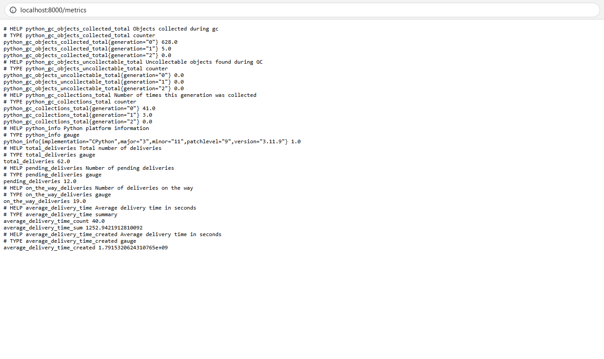

### Step 2a: Configure and run Prometheus
First the exercise's command was run exactly as written, with `--network=host`:
```powershell
docker run -d --name prometheus --network=host -v ./prometheus.yml:/etc/prometheus/prometheus.yml -v ./alert_rules.yml:/etc/prometheus/alert_rules.yml  prom/prometheus
Start-Sleep 5; docker ps -a --filter name=^prometheus$ --format "table {{.Names}}\t{{.Image}}\t{{.Status}}\t{{.Ports}}"
curl.exe -s -m 5 -o NUL -w "HTTP %{http_code}\n" http://localhost:9090/-/ready
docker rm -f prometheus
```
* **Status:** The container starts, but with Docker Desktop on Windows the "host" network is the network of Docker's Linux VM, not of Windows. No port is published, and `http://localhost:9090` is not reachable from Windows: curl gets no HTTP response at all (`HTTP 000`). The container was removed again (see Issues & Fixes #1).

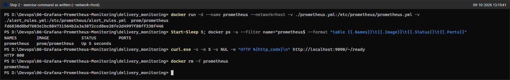

The configuration files. `alert_rules.yml` is exactly the exercise's file. In `prometheus.yml` only the `delivery_service` target was changed from the Linux bridge address `172.17.0.1:8000` to `host.docker.internal:8000`, which is the hostname that the exercise's own note recommends for Windows:
```powershell
Get-Content prometheus.yml
Get-Content alert_rules.yml
```

Prometheus was then started with the port published instead of `--network=host`:
```powershell
docker run -d --name prometheus -p 9090:9090 -v ./prometheus.yml:/etc/prometheus/prometheus.yml -v ./alert_rules.yml:/etc/prometheus/alert_rules.yml  prom/prometheus
Start-Sleep 5; docker ps -a --filter name=^prometheus$ --format "table {{.ID}}\t{{.Image}}\t{{.Command}}\t{{.Status}}\t{{.Ports}}\t{{.Names}}"
curl.exe -s http://localhost:9090/-/ready
docker exec prometheus prometheus --version
docker logs prometheus 2>&1 | Select-String "Loading configuration file|Completed loading|Server is ready"
```
* **Status:** Prometheus 3.15.0 is up on `0.0.0.0:9090`, answers "Prometheus Server is Ready.", and loaded the configuration file including the rule file without errors. Its web UI is reachable at <http://localhost:9090>.

**Status -> Target health:** both scrape jobs are **UP**. `delivery_service` scrapes `http://host.docker.internal:8000/metrics`, which is the Python script on the Windows host:

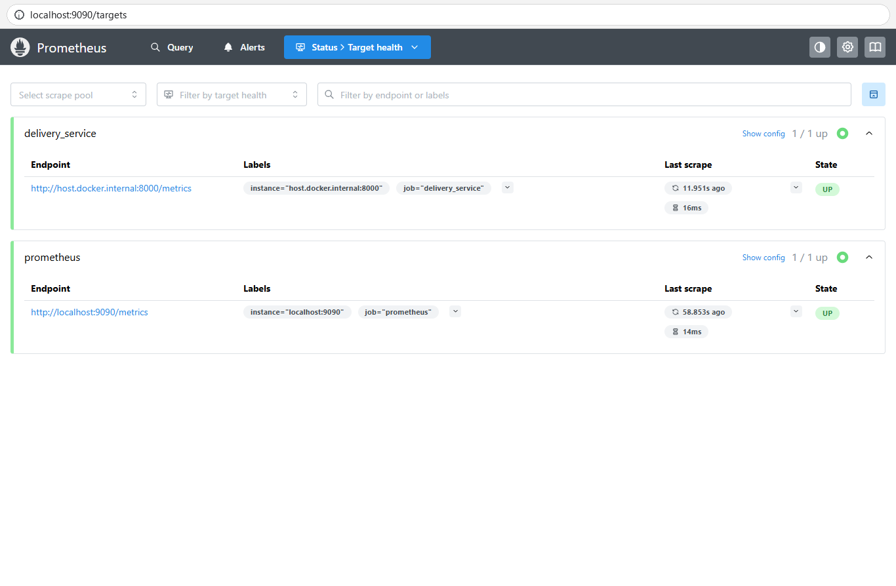

**Alerts** about one minute later: `HighPendingDeliveries` is **PENDING** (value 16 > 10; it must stay true for `for: 15s` before it fires) and `HighAverageDeliveryTime` is already **FIRING** (30.75 s > 30 s; this rule has no `for` clause):

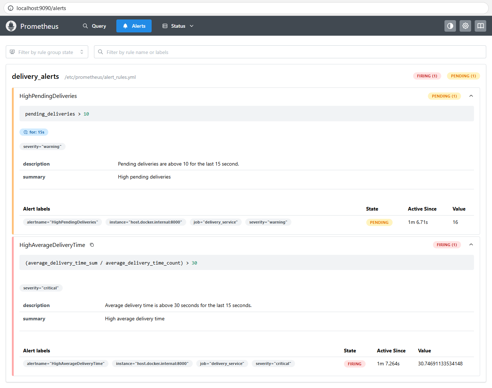

### Step 3: Set up Grafana
```powershell
docker run -d --name grafana -p 3000:3000 grafana/grafana
Start-Sleep 15; docker ps -a --filter name=^grafana$ --format "table {{.ID}}\t{{.Image}}\t{{.Status}}\t{{.Ports}}\t{{.Names}}"
curl.exe -s http://localhost:3000/api/health
docker exec grafana grafana server -v
docker exec grafana sh -c "getent hosts host.docker.internal || nslookup host.docker.internal"
docker exec grafana wget -qO- http://host.docker.internal:9090/-/ready
```
* **Status:** Grafana 13.2.3 is up on port 3000 and its database is "ok". The exercise's `ip addr show docker0` does not exist on Windows (there is no `docker0` bridge on the host), so instead it was checked that the Grafana container can resolve `host.docker.internal` and reach Prometheus through it. This is the address used for the data source below, and the successful **Save & test** (screenshot 19) confirms that it works.

#### Step 3a and 3b: Access Grafana, log in with the default credentials and skip the password update
The documented default user `admin` with the default password was entered on the login page (`python grafana_ui.py login 13`, password supplied through the `GF_PASSWORD` environment variable). After the login ("Logged in" message) Grafana asks to update the password; **Skip** was clicked, as the exercise says:

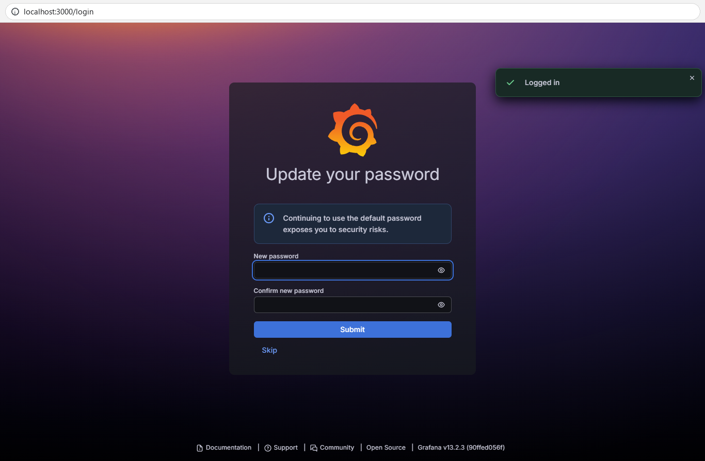

#### Step 3c: Add Prometheus as a data source
**Home -> Connections -> Data sources -> Add data source -> Prometheus** (`python grafana_ui.py datasource 16`). The **Prometheus server URL** was set to `http://host.docker.internal:9090` (instead of the exercise's `http://172.17.0.1:9090`, see Issues & Fixes #2); all other fields were left at their defaults.

**Save & test** succeeded with "Successfully queried the Prometheus API." (re-run once with `python grafana_ui.py retest 19` to get the message and the button in one screenshot):

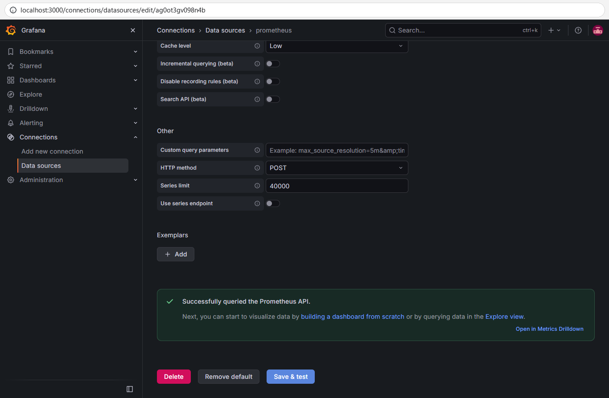

#### Step 3d: Create the dashboard
The dashboard **Delivery Monitoring** with the four panels the exercise asks for was written as JSON (`grafana-dashboard-delivery-monitoring.json`, time range "last 15 minutes", refresh every 10 s) and created through Grafana's HTTP API, so that it can be re-created identically after the pipeline replaces the Grafana container in Steps 5 and 6:
```powershell
Get-Content grafana-dashboard-delivery-monitoring.json | Select-String '"title"|"expr"|"from"|"refresh"'
python grafana_api.py dashboard
```
| Panel | PromQL query |
|---|---|
| Panel 1: Total Deliveries | `total_deliveries` |
| Panel 2: Pending Deliveries | `pending_deliveries` |
| Panel 3: On-the-Way Deliveries | `on_the_way_deliveries` |
| Panel 4: Average Delivery Time | `average_delivery_time_sum / average_delivery_time_count` |

* **Status:** `success`, dashboard uid `delivery-monitoring`, version 1, with the four panels and queries above.

The dashboard with live data (**Expected Output 3: Grafana Dashboard**). Pending deliveries move between 10 and 20 and the running average delivery time settles around 30 s:

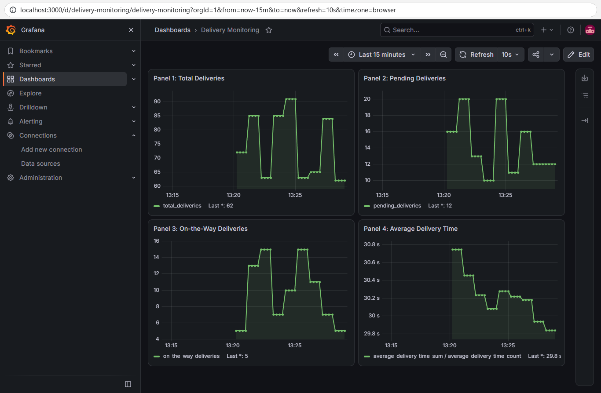

#### Prometheus queries (Expected Output 2)
Graphs for the last 15 minutes on the Prometheus Query page (`python prom_ui.py 22 ...`):

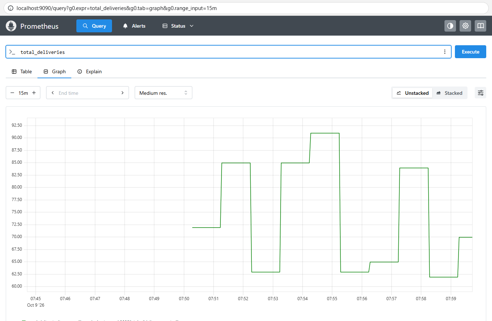

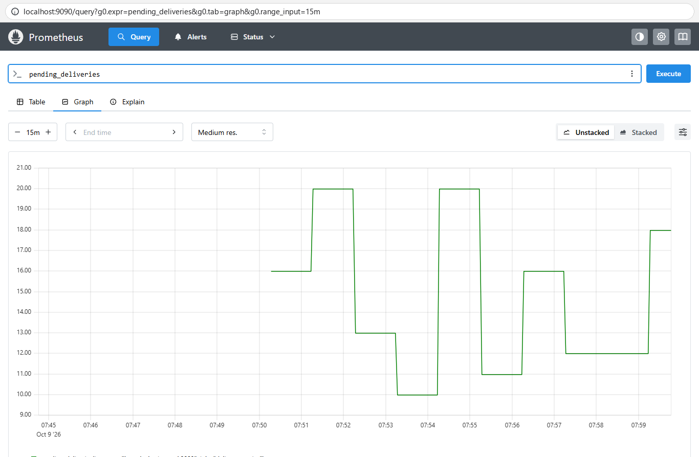

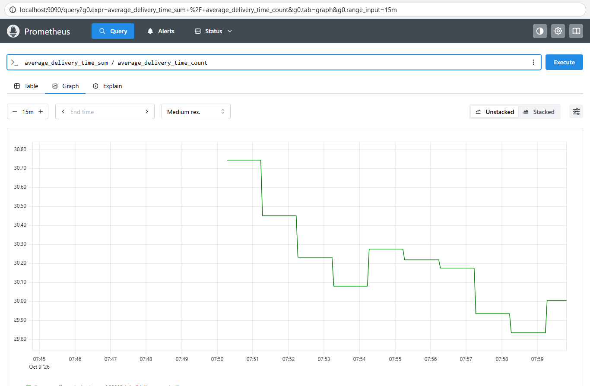

The graphs change in one-minute steps. **Status -> Configuration** shows why: because `prometheus.yml` has no `global:` section, Prometheus uses its built-in defaults `scrape_interval: 1m` and `evaluation_interval: 1m`, not the 15 s that the exercise's note claims (see Issues & Fixes #5):

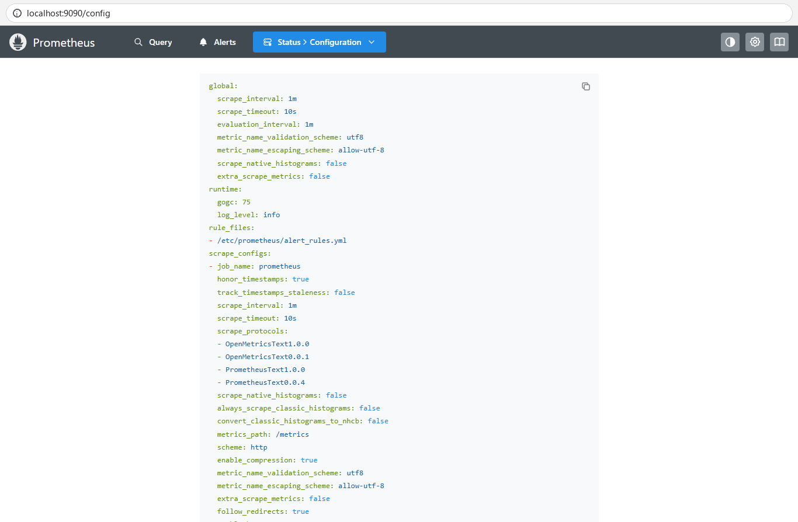

### Step 5: Create the Jenkins pipeline
#### Step 5a: Check the Jenkins container
Jenkins was set up in Lab 07 and was already running, so the exercise's "remove and re-create Jenkins" steps were not needed. The Lab 07 container was started with `-v /var/run/docker.sock:/var/run/docker.sock`, which the exercise's `docker run` command lacks but which a pipeline that runs `docker` commands needs.
```powershell
docker ps -a --filter name=^jenkins$ --format "table {{.ID}}\t{{.Image}}\t{{.Status}}\t{{.Ports}}\t{{.Names}}"
docker exec jenkins sh -c "command -v docker || echo docker-CLI-not-installed"
docker exec jenkins ls -l /var/run/docker.sock
docker exec jenkins id
```
* **Status:** Jenkins is up with ports 8080 and 50000. The image has **no docker CLI**, and the mounted Docker socket is `srw-rw---- root root`, while Jenkins runs as `jenkins` (uid 1000) without the root group. The missing CLI makes build #1 fail (screenshot 32); the socket permissions are shown and fixed in screenshot 35.

#### Step 5b: Provide the files and create the Jenkinsfile
The exercise's `Setup Workspace` stage copies the files from a `localSourcePath` into the workspace. Jenkins runs in a container, so the files were copied into the Jenkins home volume, and `localSourcePath` was set to that path:
```powershell
docker cp delivery_monitoring jenkins:/var/jenkins_home/delivery_monitoring
docker exec -u root jenkins chown -R jenkins:jenkins /var/jenkins_home/delivery_monitoring
docker exec jenkins ls -l /var/jenkins_home/delivery_monitoring
```

The pipeline in `delivery_monitoring/Jenkinsfile` keeps the exercise's five stages and the pre-check logic unchanged. The adaptations (all marked `Lab 06:`) are:
* `localSourcePath = '/var/jenkins_home/delivery_monitoring'`, and `Setup Workspace` also copies the `Dockerfile`.
* `Run Application` first runs `docker rm -f delivery_metrics || true`, so the pipeline can be re-run.
* `Run Prometheus & Grafana` uses `docker create` + `docker cp` + `docker start` for Prometheus instead of `-v $WORKSPACE/...` bind mounts, and removes old `prometheus`/`grafana` containers first:
```groovy
sh '''
docker rm -f prometheus grafana || true
docker create --name prometheus -p 9090:9090 prom/prometheus
docker cp $WORKSPACE/prometheus.yml prometheus:/etc/prometheus/prometheus.yml
docker cp $WORKSPACE/alert_rules.yml prometheus:/etc/prometheus/alert_rules.yml
docker start prometheus
docker run -d --name grafana -p 3000:3000 grafana/grafana
'''
```

#### Create the pipeline job using "Pipeline script"
**New Item -> name `delivery-monitoring-pipeline` -> Pipeline -> OK**, then Definition **Pipeline script** (the default); the content of `delivery_monitoring/Jenkinsfile` was pasted into the Script editor and the job was saved (`python jenkins_ui.py create 29`):

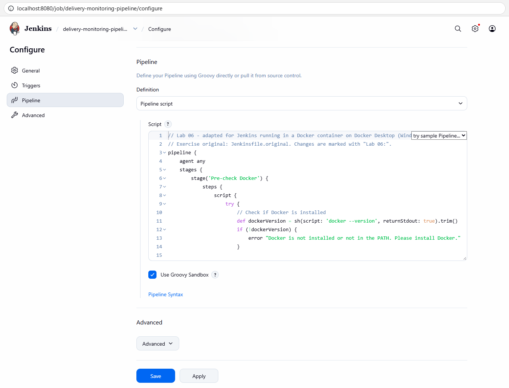

#### Build #1: FAILURE (no docker CLI in the Jenkins container)
**Build Now** (`python jenkins_ui.py build 1 32`). The exercise's own pre-check stage caught the problem: `docker: not found`, "Pre-check failed: script returned exit code 127", and the remaining stages were skipped.

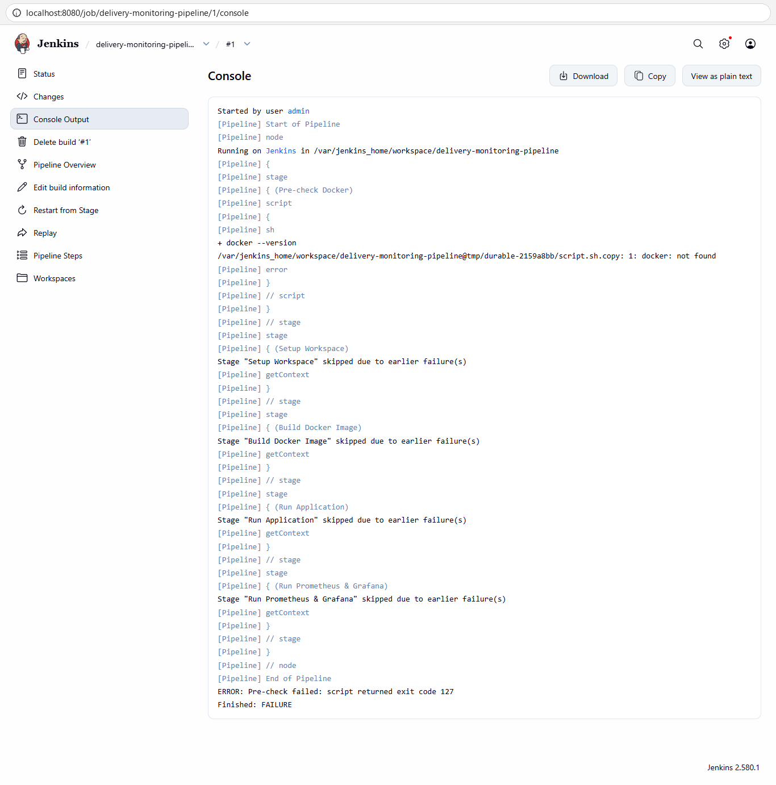

#### Fix: install the docker CLI and give Jenkins access to the Docker socket
The Jenkins image is Debian 13 "trixie", which packages the Docker client separately as `docker-cli` (the daemon is not needed, because the pipeline talks to Docker Desktop's engine through the mounted socket):
```powershell
docker exec -u root jenkins sh -c "apt-get -q update 2>&1 | tail -n 3"
docker exec -u root jenkins sh -c "DEBIAN_FRONTEND=noninteractive apt-get install -y -q docker-cli 2>&1 | grep -E 'NEW packages|^  |Setting up|newly installed'"
docker exec jenkins docker --version
docker exec jenkins docker ps
```
* **Status:** `docker-cli 26.1.5+dfsg1` and its recommended plugin `docker-buildx 0.13.1` were installed. The client works, but `docker ps` as user `jenkins` still failed with `permission denied` on `/var/run/docker.sock`.

The socket belongs to group `root` (gid 0) with mode 660, so the `jenkins` user was added to that group and the container was restarted, because a running process only picks up new group memberships when it starts:
```powershell
docker exec jenkins stat -c "%A %U:%G gid=%g %n" /var/run/docker.sock
docker exec -u root jenkins usermod -aG root jenkins
docker restart jenkins
Start-Sleep 30; docker exec jenkins id
docker exec jenkins docker ps --filter name=jenkins --format "table {{.Names}}\t{{.Image}}\t{{.Status}}"
docker exec jenkins docker version --format "client {{.Client.Version}} (API {{.Client.APIVersion}}) / server {{.Server.Version}} (API {{.Server.APIVersion}})"
```
* **Status:** `jenkins` is now in `groups=1000(jenkins),0(root)`, `docker ps` works from inside the container, and the 26.1 client (API 1.45) talks to the Docker Desktop 29.8.0 engine (API 1.56). The Jenkins Java process also runs with the supplementary group 0 after the restart.

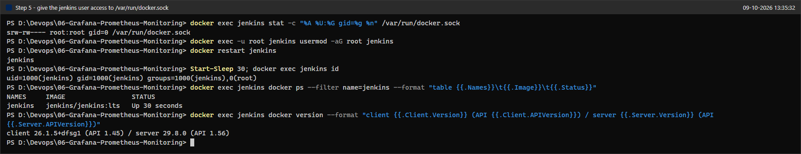

#### Free the ports before the pipeline run
The pipeline publishes ports 8000, 9090 and 3000, which the manual setup from Steps 1 to 3 was still using. The host Python script was stopped and the manual containers were removed:
```powershell
Get-Process -Id 34156 | Select-Object Id,ProcessName,StartTime
Stop-Process -Id 34156; Start-Sleep 2; Get-NetTCPConnection -LocalPort 8000 -State Listen -ErrorAction SilentlyContinue | Measure-Object | Select-Object @{n='listeners_on_8000';e={$_.Count}}
docker rm -f prometheus grafana
docker ps -a --filter name=^delivery_metrics$ --filter name=^prometheus$ --filter name=^grafana$ --format "table {{.Names}}\t{{.Status}}"
```

#### Build #2: SUCCESS
**Build Now** again (`python jenkins_ui.py build 2 37`). All five stages passed; build #2 is the middle row of the Stage View in screenshot 51 (Step 6). The console log of the same pipeline is shown for build #3 in Step 6 (screenshot 46), which ran the same stages after the code change.

The containers started by the pipeline were checked in the same way as after build #3 (screenshot 49):
```powershell
docker ps --filter name=^delivery_metrics$ --filter name=^prometheus$ --filter name=^grafana$ --format "table {{.ID}}\t{{.Image}}\t{{.Status}}\t{{.Ports}}\t{{.Names}}"
docker images delivery_metrics --format "table {{.Repository}}\t{{.Tag}}\t{{.ID}}\t{{.CreatedSince}}"
docker logs --tail 10 delivery_metrics
curl.exe -s http://localhost:8000/metrics | Select-String "^(total|pending|on_the_way|average)_deliver"
curl.exe -s http://localhost:9090/-/ready
curl.exe -s http://localhost:3000/api/health
```
* **Status:** `delivery_metrics`, `prometheus` and `grafana` are up on ports 8000, 9090 and 3000; the containerised simulator prints the same `[DEBUG]` lines and serves the metrics.

Prometheus (now started by the pipeline with the configuration copied in by `docker cp`) scrapes the containerised application through `host.docker.internal:8000`, which maps to the published port 8000. The alerts in screenshot 54 come from exactly this target (`instance="host.docker.internal:8000"`).

The pipeline replaced the Grafana container, and a new Grafana container starts with an empty database. The Prometheus data source and the dashboard were therefore added again through the HTTP API (the same commands and their output after build #3 are in screenshot 49):
```powershell
python grafana_api.py datasource
python grafana_api.py dashboard
```

### Step 6: Simulate alerts
The pending range in `delivery_metrics.py` was increased as the exercise says, and the changed file was copied to the pipeline's source folder in the Jenkins container:
```powershell
Select-String -Path delivery_metrics.py -Pattern "pending = random"
(Get-Content -Raw delivery_metrics.py).Replace("pending = random.randint(10, 20)  # Ensure values exceed the threshold", "pending = random.randint(50, 100)  # Increase range to exceed alert threshold") | Set-Content -NoNewline -Encoding ascii delivery_metrics.py
Select-String -Path delivery_metrics.py -Pattern "pending = random"
docker cp delivery_metrics.py jenkins:/var/jenkins_home/delivery_monitoring/delivery_metrics.py
docker exec jenkins grep -n "pending = random" /var/jenkins_home/delivery_monitoring/delivery_metrics.py
```
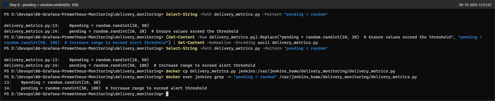

"Restart the Python script and Prometheus" was done by running the pipeline again (**build #3**, `python jenkins_ui.py build 3 46`). It rebuilt the image (only the `COPY delivery_metrics.py` layer changed; the pip layer came from the cache) and re-created the `delivery_metrics`, `prometheus` and `grafana` containers.

**Expected Output 4: Jenkins Logs.** The console of build #3 shows the output of `docker --version` and `docker info` (Docker Desktop 29.8.0 server), the four `cp` commands of `Setup Workspace`, the BuildKit build of `delivery_metrics` (base `python:3.12-slim`, the `pip install prometheus-client` layer from the cache, `COPY delivery_metrics.py`), and the `docker rm -f` / `docker run` / `docker create` / `docker cp` / `docker start` commands of the last two stages, ending with `Finished: SUCCESS`. This time the clean-up commands print the names of the build #2 containers they removed:

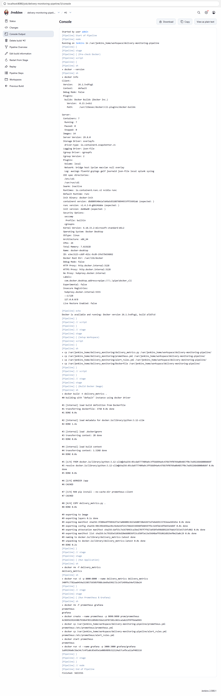

The new stack serves pending values between 50 and 100, and the data source and dashboard were added to the new Grafana container again:
```powershell
docker ps --filter name=^delivery_metrics$ --filter name=^prometheus$ --filter name=^grafana$ --format "table {{.ID}}\t{{.Image}}\t{{.Status}}\t{{.Ports}}\t{{.Names}}"
docker logs --tail 10 delivery_metrics
curl.exe -s http://localhost:8000/metrics | Select-String "^pending_deliveries"
python grafana_api.py datasource
python grafana_api.py dashboard
```
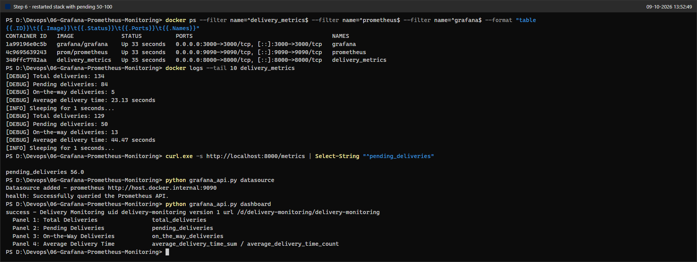

The Jenkins job page now shows all three builds: #1 failed in the pre-check, #2 and #3 passed all five stages:

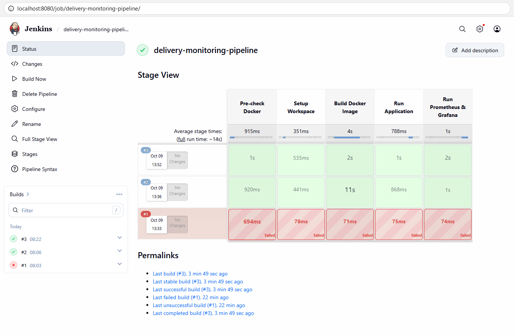

**Expected Output 5: Prometheus Alerts.** On the Prometheus Alerts page of the new stack, `HighPendingDeliveries` (warning) is **FIRING** with the value 76, active for more than 6 minutes. The running average delivery time was above 30 s at that moment as well, so `HighAverageDeliveryTime` (critical, value 30.09) was firing at the same time:

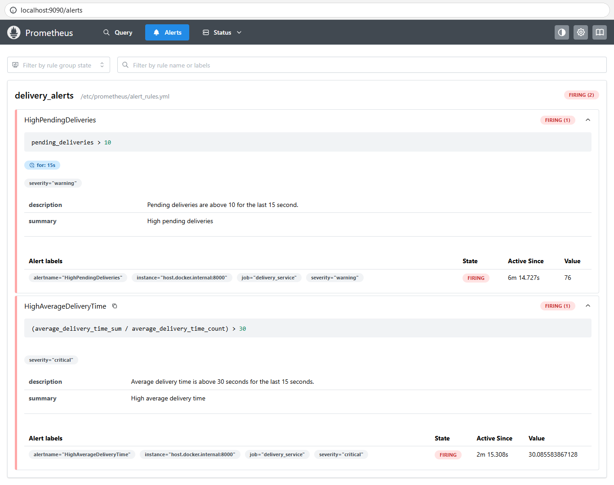

**Verify the alert in Grafana.** Grafana reads the alert rules and their states from the Prometheus data source and lists them under **Alerting -> Alert rules** as data source-managed rules (namespace `/etc/prometheus/alert_rules.yml`, group `delivery_alerts`). This screenshot was taken later, during the review pass, with the build #3 stack still running:
```powershell
python grafana_ui.py alerts 56
```
* **Status:** Grafana shows `HighPendingDeliveries` (from `/etc/prometheus/alert_rules.yml > delivery_alerts`) as **Firing**, which matches the Prometheus Alerts page.

The rule page in Grafana shows the **Firing** badge, the label `severity=warning`, the query `pending_deliveries > 10`, the pending period of 15 s and a graph of `pending_deliveries` between about 55 and 96:

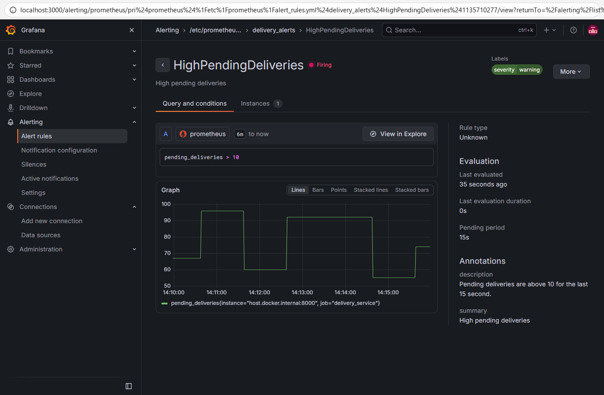

---

## Issues & Fixes
1. **`--network=host` does not work on Docker Desktop for Windows.** With Docker Desktop the "host" network is the network of Docker's Linux VM, so Prometheus started with the exercise's command was not reachable at `localhost:9090` from Windows (screenshot 06). Fix: publish the port with `-p 9090:9090`; Prometheus is then reachable at `localhost:9090` (screenshot 10). The Jenkins pipeline in the exercise already uses `-p 9090:9090`.
2. **`172.17.0.1` is not the host on Windows.** The exercise uses the Linux `docker0` address for the Prometheus target and the Grafana data source, and `ip addr show docker0` does not exist on Windows. Fix, as the exercise's own note suggests for Windows: `host.docker.internal:8000` as the `delivery_service` target and `http://host.docker.internal:9090` as the Grafana data source URL. Instead of `ip addr show docker0`, it was checked that `host.docker.internal` resolves inside the Grafana container and reaches Prometheus; the scrape target (screenshot 10) and the Grafana data source test (screenshot 19) both work with this address. The same `prometheus.yml` also works for the pipeline, because the `delivery_metrics` container publishes port 8000 on the host.
3. **File name inconsistencies in the exercise.** The directory structure lists `alerts_rules.yml` and the text says to create `prometheus.ym`, while `prometheus.yml`, the `docker run -v` command and the Jenkinsfile use `alert_rules.yml` and `prometheus.yml`. The files were named `prometheus.yml` and `alert_rules.yml` so that all references match.
4. **Windows command names and output buffering.** `pip3` and `python3` are `python -m pip` and `python` on this machine. When the script runs in the background with its output redirected to a file, Python buffers `print()`, so it was started with `python -u`. For the same reason the `Dockerfile` uses `python -u`, so that `docker logs` shows the lines immediately.
5. **The default scrape interval is 1 minute, not 15 seconds.** The exercise's note says that Prometheus scrapes "at default interval (15s)". The given `prometheus.yml` has no `global:` section, and Prometheus' built-in defaults are `scrape_interval: 1m` and `evaluation_interval: 1m` (screenshot 25). The exercise's configuration was kept unchanged; the effects are that the graphs change in one-minute steps and that `HighPendingDeliveries` (with `for: 15s`) fires at the second rule evaluation, about one minute after it becomes pending. Adding `global: {scrape_interval: 15s, evaluation_interval: 15s}` would give the behaviour that the exercise describes.
6. **No `process_*` metrics on Windows.** The exercise's sample output contains `process_virtual_memory_bytes` and similar metrics. `prometheus_client` reads them from Linux `/proc`, so they are missing when the script runs on Windows (screenshot 05). They are present when the same script runs in the Linux container built by the pipeline.
7. **The exercise forgot the `Dockerfile`.** The pipeline's "Build Docker Image" stage runs `docker build -t delivery_metrics .`, but the exercise never creates a `Dockerfile`. A minimal one was added (`python:3.12-slim`, `pip install prometheus-client`, `COPY delivery_metrics.py`, `EXPOSE 8000`, `CMD ["python", "-u", "delivery_metrics.py"]`), and `Setup Workspace` copies it into the workspace as well.
8. **No docker CLI in the Jenkins container (build #1 FAILURE).** The `jenkins/jenkins:lts` image does not contain Docker, so the pre-check failed with `docker: not found` (screenshot 32). Fix: `apt-get install -y docker-cli` as root inside the container (the working 26.1.5 client is visible in screenshot 35). Only the client is needed, because the pipeline uses Docker Desktop's engine through the mounted `/var/run/docker.sock`.
9. **The `jenkins` user could not use the Docker socket.** The socket is `root:root` with mode 660 inside the container (first line of screenshot 35), so `docker ps` as user `jenkins` failed with `permission denied`. Fix: `usermod -aG root jenkins` (the socket's group is gid 0) and `docker restart jenkins`; afterwards `docker ps` works from inside Jenkins (screenshot 35). This is a lab shortcut: membership in the socket's group gives root-equivalent access to the Docker engine. The commonly used alternative `chmod 666 /var/run/docker.sock` was not used, because it is reset whenever Docker Desktop restarts. Note that the docker CLI and the group change live in the container's writable layer: they survive `docker restart`, but are lost if the `jenkins` container is ever removed and re-created.
10. **`localSourcePath` placeholder.** The exercise's `'/path/to/your/local/files'` was replaced by `/var/jenkins_home/delivery_monitoring`, and the files were copied there with `docker cp`, because the Jenkins container cannot see the Windows folder.
11. **`-v $WORKSPACE/...` bind mounts cannot work in this setup.** `$WORKSPACE` (`/var/jenkins_home/workspace/...`) exists only inside the Jenkins container, but the bind mount is resolved by the Docker Desktop engine, which looks for that path on its own file system, where it does not exist. This was confirmed after the lab (screenshot 55, below): the file exists in the Jenkins container, yet the same mount from inside Jenkins fails with "error mounting ... not a directory: Are you trying to mount a directory onto a file". Fix: `docker create` the Prometheus container, copy the two configuration files into it with `docker cp`, then `docker start` it.

    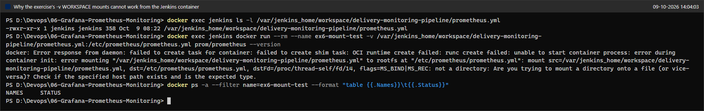
12. **The pipeline as written cannot be run twice (preventive change).** A second `docker run --name delivery_metrics ...` always fails with a name conflict while a container of that name exists. This failure was not observed as a build failure in this lab, because the adapted Jenkinsfile with the clean-up commands was already pasted before build #1. Fix: `docker rm -f delivery_metrics || true` and `docker rm -f prometheus grafana || true` before the containers are started, so builds #2 and #3 both succeed and build #3 replaces the containers of build #2 (in screenshot 46, `docker rm -f` prints the names of the removed containers).
13. **Port conflicts with the manual setup.** The host Python script and the manual Prometheus and Grafana containers from Steps 1 to 3 held ports 8000, 9090 and 3000. They were stopped and removed before build #2.
14. **Grafana loses its data source and dashboard when the pipeline re-creates it.** The `grafana/grafana` container has no volume, so every pipeline run starts with an empty Grafana. The data source and the dashboard were added again with `grafana_api.py` (screenshot 49). The first time, the data source was added through the web UI as the exercise describes (screenshot 19). The dashboard was created from JSON through the API instead of clicking through the panel editor four times, which also makes this re-creation repeatable.
15. **Jenkins setup steps of the exercise.** Step 5 of the exercise re-creates Jenkins with `docker run ... jenkins/jenkins:lts` and reads the password from `/var/lib/jenkins/secrets/initialAdminPassword`. The Jenkins container from Lab 07 was reused instead; its image keeps the password file under `/var/jenkins_home/secrets/`, and the exercise's `docker run` command does not mount the Docker socket, which this pipeline needs.
16. **Severity of the pending alert.** Expected Output 5 asks for "critical alerts for high pending deliveries", but in the exercise's own `alert_rules.yml` the rule `HighPendingDeliveries` has `severity: warning`; only `HighAverageDeliveryTime` is `critical`. The rules file was kept unchanged, so the pending alert fires with `severity="warning"` (screenshots 54 and 57).

---

## Verification Summary
| Expected output | Result | Evidence |
|---|---|---|
| 1. Metrics endpoint <http://localhost:8000/metrics> | The four delivery metrics and the Python runtime metrics are served, first by the host script and later by the `delivery_metrics` container. | Screenshots 05, 49 |
| 2. Prometheus graphs for `total_deliveries`, `pending_deliveries` and `average_delivery_time` | Graphs over 15 minutes for all three; both scrape targets UP. | Screenshots 10, 22, 23, 24 |
| 3. Grafana dashboard | Prometheus data source working; "Delivery Monitoring" with the 4 required panels and live data. | Screenshots 19, 21 |
| 4. Jenkins logs: successful pipeline with Docker commands | Build #1 failed in the pre-check (no docker CLI); after the fix, builds #2 and #3 are SUCCESS with all five stages, and the build #3 console shows the full docker command output. | Screenshots 32, 46, 51 |
| 5. Prometheus alerts for high pending deliveries | `HighPendingDeliveries` FIRING in Prometheus (value 76) after Step 6, and `HighAverageDeliveryTime` (critical) FIRING at times as well. Grafana's alert rule page shows `HighPendingDeliveries` as Firing. Note: in the given rules the pending alert has severity `warning`, not `critical` (Issues & Fixes #16). | Screenshots 11, 54, 57 |

---

## Q&A
**Where does the `/metrics` endpoint come from?**
It is created by the `prometheus_client` library. `start_http_server(8000, addr="0.0.0.0")` starts a small HTTP server in a background thread that answers every request with the current values of all registered metrics in the Prometheus text format. The script itself never handles HTTP; it only updates the metric objects.

**Which metric types does the lab use, and why?**
`total_deliveries`, `pending_deliveries` and `on_the_way_deliveries` are **Gauges**, because these numbers go up and down. `average_delivery_time` is a **Summary**: every `observe()` call adds one delivery time, and the Python client exports the running count (`_count`) and the running total (`_sum`). A **Counter** would only be right for something that only increases (for example the total number of completed deliveries since start), and a **Histogram** would add bucket counts for latency distributions. Dividing `_sum` by `_count` gives the average over all observations since the process started.

**Why does Prometheus scrape `host.docker.internal:8000` instead of `localhost:8000`?**
Inside the Prometheus container, `localhost` is the container itself. `host.docker.internal` is a hostname that Docker Desktop provides to reach the host machine; it reaches the Python script on Windows in Steps 1 to 3 and the published port 8000 of the `delivery_metrics` container in Steps 5 and 6. On a Linux host without Docker Desktop, the bridge address `172.17.0.1` used by the exercise plays this role.

**What does `for: 15s` do in `HighPendingDeliveries`?**
The condition must be true continuously for at least 15 seconds before the alert changes from PENDING to FIRING. With the default evaluation interval of 1 minute, that means it has to be true at two consecutive evaluations (screenshot 11 shows the pending state, screenshot 54 the firing state). `HighAverageDeliveryTime` has no `for` clause, so it fires at the first evaluation where the condition is true.

**Why was `HighPendingDeliveries` already active before Step 6, and why does `HighAverageDeliveryTime` switch on and off?**
With `random.randint(10, 20)` every value except 10 is above the threshold of 10, so the alert is pending or firing most of the time (screenshot 11 shows it pending with the value 16); it only resets when a scrape happens to see exactly 10. After Step 6 (50 to 100) the condition is always true. The average delivery time is drawn uniformly between 15 and 45 seconds, so the running average `_sum / _count` converges to about 30 seconds and moves slightly above and below the threshold, which is why that alert alternates between inactive and firing.

**Why use a Jenkins pipeline for this at all?**
The pipeline turns the manual steps (build the application image, start the application, start Prometheus with its configuration, start Grafana) into a repeatable, logged process. After a code change, such as the new pending range in Step 6, one click on "Build Now" rebuilds and redeploys the whole monitoring stack, and the console log documents every Docker command that was run.

---

## Cleanup / state left running
Left running **on purpose** (for review and for the remaining exercises):
* Containers **`delivery_metrics`** (port 8000, image `delivery_metrics:latest`, pending range 50 to 100), **`prometheus`** (port 9090) and **`grafana`** (port 3000, with the Prometheus data source and the "Delivery Monitoring" dashboard), all three started by Jenkins build #3. `HighPendingDeliveries` fires continuously (every value from 50 to 100 is above 10), while `HighAverageDeliveryTime` switches on and off as the running average moves around 30 s.
* Container **`jenkins`** (ports 8080 and 50000, volume `jenkins_home`) with the new job **`delivery-monitoring-pipeline`** (builds #1 FAILURE, #2 and #3 SUCCESS) and the files in `/var/jenkins_home/delivery_monitoring`. In its writable layer it now also has the `docker-cli` and `docker-buildx` packages, and the `jenkins` user is a member of group `root` (gid 0) for socket access.

Stopped or removed:
* The host Python script (PID 34156) was stopped before the pipeline run, and the manually started `prometheus` and `grafana` containers from Steps 2 and 3 were removed.
* No other background processes, port-forwards or browsers were left running.

To remove the monitoring stack later: `docker rm -f delivery_metrics prometheus grafana` and `docker rmi delivery_metrics`.
