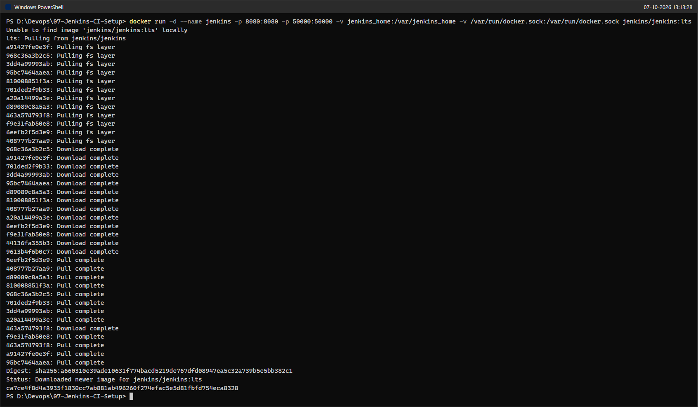
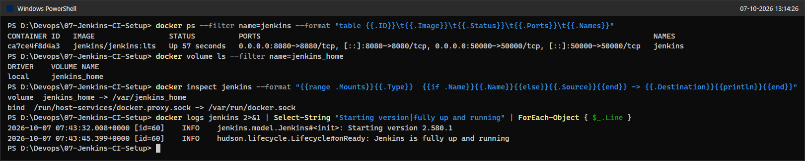
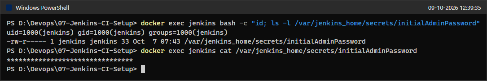
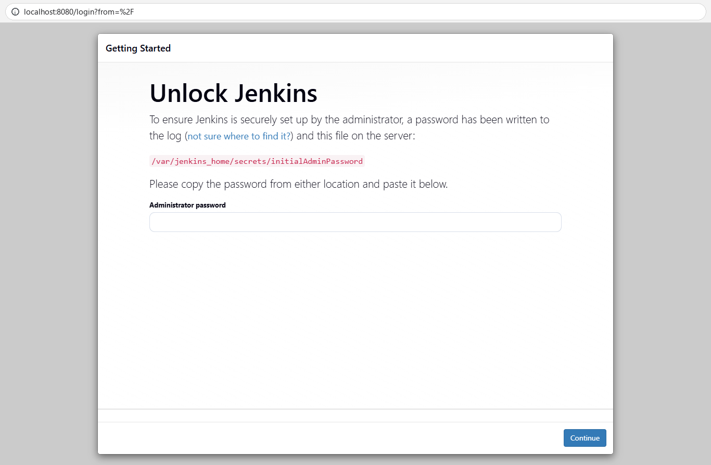
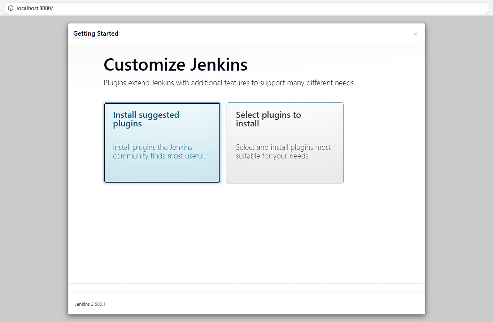
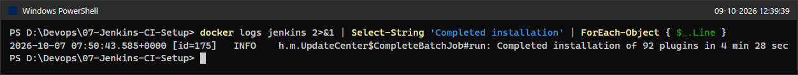
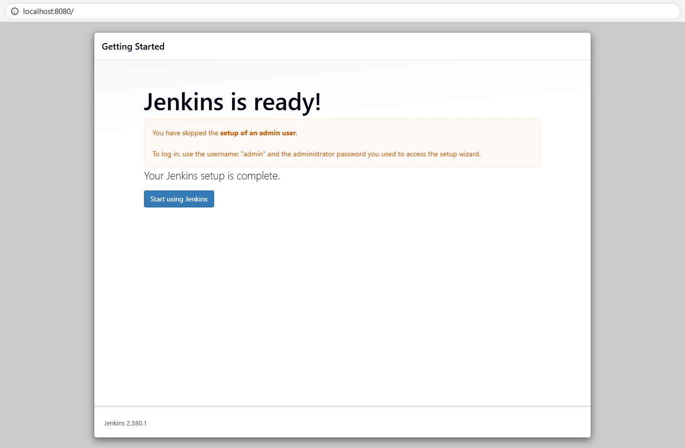
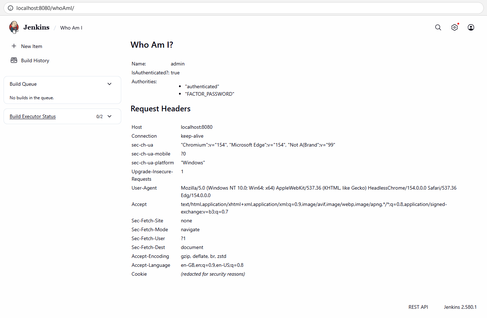
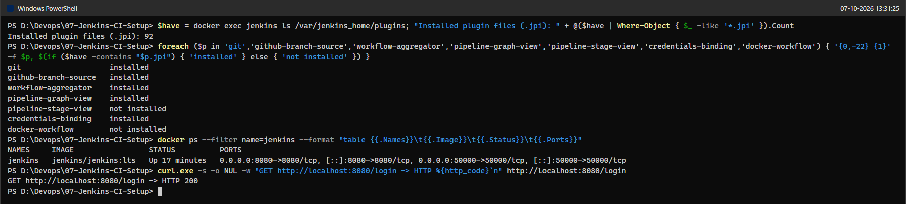

# Lab 07: Introduction to Continuous Integration (CI) and Jenkins Installation

## Objective
Understand what Continuous Integration is, why teams use it and which tools provide it, then install Jenkins as a Docker container on Windows 11, unlock it with the generated initial admin password, complete the setup wizard with the suggested plugins, and reach the Jenkins dashboard. The Jenkins instance built here is reused by the later Jenkins exercises (8, 9 and 6), so it is left running.

---

## Environment
* **OS:** Windows 11 Home Single Language (10.0.26200), Windows PowerShell 5.1
* **Container runtime:** Docker Desktop, Docker Engine `29.8.0` (WSL2 backend, linux/amd64)
* **Jenkins image:** `jenkins/jenkins:lts` (digest `sha256:a660310e39ad...`), which resolved to **Jenkins `2.580.1`**
* **Inside the container:** OpenJDK `21.0.12.1`, Debian GNU/Linux 13 (trixie), Jenkins runs as `uid=1000(jenkins)`
* **Browser automation for the setup wizard screenshots:** Python `3.11.9` + Playwright driving Microsoft Edge 154 (headless)

### Files in this folder
| File | Purpose |
|---|---|
| `README.md` | This lab report. |
| `setup_wizard.py` | Playwright script that clicked through the Jenkins setup wizard in Edge and took the wizard and dashboard screenshots (05, 06, 10 and 11). It reads the initial admin password from the container at runtime and never prints it. |
| `login.py` | Playwright script that signed in as `admin` from a fresh browser session and took screenshot 14 (step 8). It also reads the password at runtime and never prints or stores it. |
| `screenshot/` | PNG evidence, numbered in execution order (16 was added later, see step 5). Gaps in the numbering are screenshots that were removed because other screenshots already show the same result. |

Both scripts import `launch` and `urlbar` from the lab's screenshot helper `shot.py`, which lives in the session scratch folder and is **not included** in this folder, so they will not run elsewhere without it. The terminal screenshots were also rendered by that helper from the real command output.

---

## Background: Continuous Integration in Brief

### What CI is
Continuous Integration is the practice of merging every developer's changes into a shared repository many times a day, and having an automated system build and test each of those changes straight away. The goal is to find integration mistakes while they are still small, cheap and fresh in the author's mind, rather than in a painful "merge week" at the end of a release.

### Key features
| Feature | What it means in practice |
|---|---|
| Frequent code integration | Developers push small commits to the shared branch several times a day instead of keeping long-lived private branches. |
| Automated builds | Every push triggers a build (compile, resolve dependencies, package) without anyone running it by hand. |
| Automated testing | Unit, integration and other automated tests run as part of every build so regressions are caught immediately. |
| Immediate feedback | The author learns within minutes whether the change broke something, while the context is still in their head. |

### Benefits
- **Early bug detection:** integration problems surface on the commit that introduced them, which makes them far cheaper to fix.
- **Better collaboration:** everybody works against the same, continuously verified code base, so "it works on my machine" conflicts shrink.
- **Faster development cycles:** builds and tests run automatically, so people spend time writing code instead of babysitting releases.
- **Higher code quality:** every change is tested, which prevents regressions from silently accumulating.

### How CI works (end to end)
1. **Developer workflow:** a developer writes code and pushes it to version control (for example Git).
2. **CI server workflow:** the CI server (Jenkins, GitLab CI, ...) notices the change through a webhook or by polling and starts a build.
3. **Automated build:** the code is checked out, dependencies are resolved and the application is compiled/packaged.
4. **Automated testing:** the test suites run against the fresh build.
5. **Feedback:** the result (pass or fail, with logs and reports) is sent back to the developers, who fix the problem or move on.

### Ten example CI/CD tools
| # | Tool | Hosting model | What stands out | Good fit for |
|---|---|---|---|---|
| 1 | GitLab CI/CD | Built into GitLab (SaaS or self-hosted) | Pipelines in `.gitlab-ci.yml`, Auto DevOps templates | Teams already using GitLab |
| 2 | CircleCI | Cloud (self-hosted runners optional) | Container-based jobs, parallelism and caching, native Docker support | Container-heavy workflows on GitHub/Bitbucket |
| 3 | Travis CI | Cloud | Simple `.travis.yml`, many languages out of the box, easy GitHub hookup | Open-source projects and small teams |
| 4 | Bamboo | Self-hosted (Atlassian) | Build and deployment projects, tight JIRA/Bitbucket/Confluence integration | Organisations on the Atlassian stack |
| 5 | TeamCity | Self-hosted or cloud (JetBrains) | Rich build history and reports, many pre-built runners, Docker/Kubernetes plugins | Complex enterprise setups |
| 6 | Azure DevOps Pipelines | Cloud (Microsoft) | YAML or classic editor, Windows/macOS/Linux agents, Azure integration | Teams on Azure and Visual Studio |
| 7 | GitHub Actions | Cloud (GitHub), self-hosted runners optional | Workflows in `.github/workflows/*.yml`, huge marketplace of reusable actions | Teams hosting code on GitHub |
| 8 | Spinnaker | Self-hosted, open source | Continuous *delivery* across clouds, canary and blue/green deployments | Complex multi-cloud, cloud-native deployments |
| 9 | Buildkite | Hybrid: SaaS control plane, your own agents | Code and secrets never leave your infrastructure, scales with parallel agents | Security-conscious teams |
| 10 | Drone | Self-hosted, open source | Every pipeline step runs in its own Docker container | Teams that want container-native pipelines |

### A minimal CI loop
Code change pushed to Git -> CI server detects the push and triggers a build -> automated tests validate it -> developers get the result.

### Jenkins and its core concepts
Jenkins is a free, open-source automation server written in Java. It automates building, testing and deploying software, which makes it a classic engine for both CI and Continuous Delivery. People choose it because it automates repetitive work, integrates changes continuously, has well over a thousand plugins (Git, Docker, Kubernetes, ...) and can spread work across many machines.

| Concept | Meaning |
|---|---|
| Job / Project | A configured task that Jenkins runs, such as "build and test this repository". |
| Build | One execution of a job, with its own number, console log, result and artifacts. |
| Pipeline | A job whose stages (build, test, deploy, ...) are described as code, usually in a `Jenkinsfile`. |
| Plugins | Add-ons that extend Jenkins with new integrations and features (Git, Pipeline, Docker, ...). |
| Nodes | Machines that execute builds: the built-in controller (formerly "master") plus any connected agents. Port 50000 is the inbound agent port. |

---

## Step-by-Step Execution

All terminal commands were run in Windows PowerShell from `D:\Devops\07-Jenkins-CI-Setup`.

### 1. Install and start Jenkins with Docker
The exercise command is `docker run -d --name jenkins -p 8080:8080 -p 50000:50000 jenkins/jenkins:lts`. It was run with two extra volume flags (explained under Issues & Fixes):
```powershell
docker run -d --name jenkins -p 8080:8080 -p 50000:50000 -v jenkins_home:/var/jenkins_home -v /var/run/docker.sock:/var/run/docker.sock jenkins/jenkins:lts
```
* `-d` runs the container in the background, `--name jenkins` gives it a fixed name.
* `-p 8080:8080` publishes the web UI; `-p 50000:50000` publishes the port that inbound build agents connect to.
* `-v jenkins_home:/var/jenkins_home` keeps all Jenkins data (configuration, plugins, jobs, build history) in a named Docker volume, so it survives container restarts and re-creation.
* `-v /var/run/docker.sock:/var/run/docker.sock` gives the container access to the host's Docker engine, which the later Docker-based pipelines (exercise 6) need.
* **Status:** The image was not present locally, so Docker pulled `jenkins/jenkins:lts` and then started container `ca7ce4f8d4a3...`, the same output pattern as shown in the exercise.



### 2. Verify the container, volume and start-up log
```powershell
docker ps --filter name=jenkins --format "table {{.ID}}\t{{.Image}}\t{{.Status}}\t{{.Ports}}\t{{.Names}}"
docker volume ls --filter name=jenkins_home
docker inspect jenkins --format "{{range .Mounts}}{{.Type}}  {{if .Name}}{{.Name}}{{else}}{{.Source}}{{end}} -> {{.Destination}}{{println}}{{end}}"
docker logs jenkins 2>&1 | Select-String "Starting version|fully up and running" | ForEach-Object { $_.Line }
```
* **Status:** Container `jenkins` is `Up` with 8080 and 50000 published, the `jenkins_home` volume and the Docker socket are mounted, and the log shows `Starting version 2.580.1` followed by `Jenkins is fully up and running` about 13 seconds later.



### 3. Get the Jenkins initial admin password
The exercise opens an interactive shell (`docker exec -it <id> bash`) and runs `cat` inside it. The same file was read non-interactively:
```powershell
docker exec jenkins bash -c "id; ls -l /var/jenkins_home/secrets/initialAdminPassword"
docker exec jenkins cat /var/jenkins_home/secrets/initialAdminPassword
```
* **Status:** The 32-character hexadecimal password exists in `/var/jenkins_home/secrets/initialAdminPassword` (mode 640, `-rw-r-----`, owner `jenkins:jenkins`, so readable only by the `jenkins` user and group). It is fully masked in the screenshot and is not written anywhere in this report. This screenshot was recaptured on 9 October 2026 with the same two read-only commands, because the first capture left the first four characters of the password visible.



### 4. Access Jenkins on port 8080: "Unlock Jenkins"
```powershell
python setup_wizard.py    # opens http://localhost:8080 in headless Edge and drives steps 4-7
```
Opening `http://localhost:8080/` redirects to the **Unlock Jenkins** page, which asks for the administrator password from step 3. The script pasted the password (read from the container at runtime) and clicked **Continue**.
* **Status:** Unlock page shown with the empty "Administrator password" field.



### 5. Customize Jenkins: install suggested plugins
On the **Customize Jenkins** screen, **Install suggested plugins** was chosen.
* **Status:** Jenkins downloaded and installed the community-recommended plugin set. The wizard's progress screen was not captured when the installation finished; the completion is shown by the container log instead (screenshot 16 below), and step 9 lists the main plugins that ended up installed.



The Jenkins log line that marks the end of the installation was printed later with a read-only command (on 9 October 2026; the container had only been restarted since, not re-created, so its log still contains the first-run messages):
```powershell
docker logs jenkins 2>&1 | Select-String 'Completed installation' | ForEach-Object { $_.Line }
```
* **Status:** `2026-10-07 07:50:43 ... Completed installation of 92 plugins in 4 min 28 sec`.



### 6. Finish the wizard: skip the admin user, keep the instance URL
After the plugins were installed, the **Create First Admin User** form appeared. **Skip and continue as admin** was clicked, so no new account was created; the built-in `admin` account keeps the initial admin password. On the next screen, **Instance Configuration**, the proposed Jenkins URL `http://localhost:8080/` was kept and **Save and Finish** was clicked.
* **Status:** "Jenkins is ready! Your Jenkins setup is complete." The page confirms that the admin-user setup was skipped and that the login is user `admin` with the setup-wizard password. **Start using Jenkins** was clicked.



### 7. Jenkins landing page (dashboard)
* **Status:** The dashboard shows "Welcome to Jenkins!", an empty build queue, the built-in node with 2 idle executors (0/2) and the version `Jenkins 2.580.1` in the footer.


### 8. Log in again from a fresh browser session
```powershell
python login.py screenshot\14-login-as-admin-whoami.png
```
`login.py` opens a new headless Edge session, signs in on `http://localhost:8080/login` with user `admin` and the initial admin password (read from the container at runtime), checks `/whoAmI/api/json`, then opens `/whoAmI/` and takes the screenshot.
* **Status:** `Name: admin`, `IsAuthenticated?: true`. This proves the skipped-admin login path works after the wizard.



### 9. Final check: plugins of note and container status
```powershell
$have = docker exec jenkins ls /var/jenkins_home/plugins; "Installed plugin files (.jpi): " + @($have | Where-Object { $_ -like '*.jpi' }).Count
foreach ($p in 'git','github-branch-source','workflow-aggregator','pipeline-graph-view','pipeline-stage-view','credentials-binding','docker-workflow') { '{0,-22} {1}' -f $p, $(if ($have -contains "$p.jpi") { 'installed' } else { 'not installed' }) }
docker ps --filter name=jenkins --format "table {{.Names}}\t{{.Image}}\t{{.Status}}\t{{.Ports}}"
curl.exe -s -o NUL -w "GET http://localhost:8080/login -> HTTP %{http_code}`n" http://localhost:8080/login
```
* **Status:** 92 plugin files are present, including Git, Pipeline (`workflow-aggregator`), Pipeline Graph View, GitHub Branch Source and Credentials Binding. `pipeline-stage-view` and `docker-workflow` are not part of this release's suggested set. Jenkins is still up and `/login` answers HTTP 200.



---

## Issues & Fixes

| # | What happened / differed from the instructions | What was done and why |
|---|---|---|
| 1 | The exercise's `docker run` has no volume, so all Jenkins data would live in the container's writable layer and be lost if the container is ever re-created. Later exercises (6, 8, 9) reuse this Jenkins. | Added `-v jenkins_home:/var/jenkins_home` (the official image declares this path as its data directory). Restarts and re-creation keep the configuration, plugins and jobs. |
| 2 | Exercise 6 builds Docker images from Jenkins pipelines, which needs access to a Docker engine. | Added `-v /var/run/docker.sock:/var/run/docker.sock` now, because mounts cannot be added to an existing container later without re-creating it. In PowerShell the single-slash path works; the `//var/run/...` form is only needed in Git Bash to stop MSYS path conversion. Note: the image contains no `docker` CLI and the socket is owned by `root:root` (mode 660), so the `jenkins` user cannot use it yet; installing the CLI and granting access is left to exercise 6, where it is actually needed. |
| 3 | `docker run` returned exit code 1 in the PowerShell harness although it succeeded. | Windows PowerShell 5.1 turns anything a native program writes to stderr (here the image pull progress) into error records. The printed container ID, `docker ps` (step 2) and the HTTP 200 check (step 9) confirm the container started correctly. |
| 4 | The exercise uses an interactive shell (`docker exec -it <id> bash`, then `cat ...`). | Used the equivalent non-interactive `docker exec jenkins cat /var/jenkins_home/secrets/initialAdminPassword`, which reads the same file and can be scripted and captured. The value is masked in the screenshot. |
| 5 | The first run of the wizard automation stopped making progress after the plugin installation. The plugins had installed successfully (92 plugins in 4 min 28 s), but the script waited for the text "Create First Admin User", which Jenkins renders inside an `<iframe>` that a top-level text search does not see. | Stopped the script and rewrote `setup_wizard.py` to recognise each wizard screen by its footer button (which is in the main page) and to resume from whatever screen is shown. In the new browser session Jenkins asked to be unlocked again (the wizard is tied to the browser session), and after unlocking it resumed directly at "Create First Admin User" without reinstalling anything. Screenshot 05 is from this second run (it is the same Unlock page); screenshot 06 is from the first run. |
| 6 | The exercise's installation screenshots show an older Jenkins UI. | Current LTS 2.580.1 has a redesigned dashboard and its suggested-plugin set includes "Pipeline Graph View" instead of the older "Pipeline: Stage View". The flow (Unlock -> Customize -> plugins -> admin user -> instance URL -> ready) is otherwise identical. |
| 7 | `docker ps` truncates the COMMAND column with an ellipsis character that rendered as a replacement glyph in the captured terminal. | Used `docker ps --format "table ..."` with the relevant columns instead (cosmetic only). |

---

## Verification Summary
| Check | Result |
|---|---|
| Container | `jenkins` (`jenkins/jenkins:lts`) is `Up`, ports `8080->8080` and `50000->50000` published |
| Persistence | Named volume `jenkins_home` mounted at `/var/jenkins_home`; Docker socket mounted at `/var/run/docker.sock` |
| Jenkins version | 2.580.1 (start-up log, wizard footer and dashboard footer) |
| Unlock | Initial admin password read from `/var/jenkins_home/secrets/initialAdminPassword` and accepted |
| Plugins | "Install suggested plugins" completed: 92 plugins, including Git, Pipeline and Credentials Binding (screenshots 15 and 16) |
| Admin user | Creation skipped; built-in `admin` logs in with the initial password (`/whoAmI/`: authenticated) |
| Web UI | `http://localhost:8080/` shows "Welcome to Jenkins!"; `/login` answers HTTP 200 |

---

## Q&A

**1. What is Continuous Integration and what problem does it solve?**
CI means that every developer merges small changes into the shared repository frequently, and every merge is automatically built and tested. It solves "integration hell": when people work separately for weeks, their changes conflict and break each other in ways that are expensive to untangle. With CI the breakage is found on the commit that caused it, within minutes.

**2. How does a CI server fit into the workflow?**
The developer pushes to Git, the CI server notices the push (webhook or polling), checks out the code, builds it, runs the automated tests and reports pass/fail back to the team. Jenkins plays the role of that CI server in this lab.

**3. What is Jenkins and why is it so widely used?**
Jenkins is an open-source automation server written in Java. It is popular because it is free and self-hosted, it automates any repetitive build/test/deploy task, it has a very large plugin ecosystem (Git, Pipeline, Docker, Kubernetes, ...), it lets you describe pipelines as code in a `Jenkinsfile`, and it can scale out by distributing builds to agent nodes.

**4. Why does the `docker run` command publish two ports?**
Port 8080 is the Jenkins web UI and REST API. Port 50000 is the TCP port that inbound build agents (the classic "JNLP" agent protocol) use to connect to the controller. It only matters once agents are added, but publishing it now avoids re-creating the container later. Agents can alternatively connect over WebSocket through port 8080.

**5. Where does the initial admin password come from and why is it needed?**
On the very first start, Jenkins generates a random 32-character password, prints it in the container log and writes it to `/var/jenkins_home/secrets/initialAdminPassword`. Only someone with access to the server (or container) can read it, which prevents a stranger who reaches the web page first from taking over an unconfigured Jenkins.

**6. What is the difference between "Install suggested plugins" and "Select plugins to install"?**
"Install suggested plugins" installs a curated set that most users need (folders, Pipeline, Git, credentials, timestamps, workspace cleanup, mail, LDAP and so on, plus their dependencies). "Select plugins to install" shows the same list with checkboxes so you can add or remove plugins before installing.

**7. What happens when "Create First Admin User" is skipped?**
No new user is created. The pre-created `admin` account stays active with the initial admin password as its password, as the "Jenkins is ready!" page states. That is fine for a local lab; on a shared server you would create a named admin user with a strong password instead.

**8. Why use a named volume for `/var/jenkins_home`?**
Everything Jenkins knows (configuration, credentials, plugins, jobs and build history) is stored under `/var/jenkins_home`. A named volume keeps that data outside the container's lifecycle, so you can stop, remove or upgrade the container image and start a new one with the same data.

**9. What are jobs, builds, pipelines, plugins and nodes in Jenkins?**
A job (project) is the configured task; a build is one numbered run of a job with its own log and result; a pipeline is a job whose stages are written as code; plugins add features and integrations; nodes are the machines that execute builds (the built-in controller plus optional agents). See the table in the Background section.

---

## Cleanup / State Left Running
Intentionally left running for exercises 8, 9 and 6 (same Jenkins lane):
* Container **`jenkins`** (image `jenkins/jenkins:lts`, Jenkins 2.580.1) on ports **8080** and **50000**.
* Named volume **`jenkins_home`** with the completed setup and 92 plugins.

No other containers, port-forwards or background processes were started; the headless Edge sessions used for screenshots were closed. To stop or remove Jenkins later (only after the dependent exercises are finished):
```powershell
docker stop jenkins            # stop, keep everything
docker rm jenkins              # remove the container, the jenkins_home volume keeps the data
docker volume rm jenkins_home  # only if the Jenkins data is no longer needed
```
