# Lab 08: Creating a "Hello World" Jenkins Job

## Objective
Put a tiny shell script (`hello-world.sh`) into a new public GitHub repository, then create a Jenkins **Freestyle project** called `HelloWorld` that clones that repository and runs the script with an "Execute shell" build step. The lab is complete when build #1 of the job shows `Hello, Jenkins!` and `Finished: SUCCESS` in its Console Output.

---

## Environment
* **OS:** Windows 11 Home Single Language (10.0.26200), Windows PowerShell 5.1
* **Git:** Git for Windows `2.55.0.windows.3` (system config: `core.autocrlf=true`, `init.defaultBranch=master`)
* **GitHub CLI:** `gh 2.102.0`, logged in as `Assassin29092005` (OAuth token kept in the Windows keyring)
* **GitHub repository:** <https://github.com/Assassin29092005/devops-sample-code> (public, branch `main`)
* **Jenkins:** `2.580.1` in the Docker container `jenkins` built in Lab 07 (`jenkins/jenkins:lts`, <http://localhost:8080>, user `admin`), Git plugin `5.10.1`, git `2.47.3` inside the container
* **Local test shell:** WSL Ubuntu-22.04, GNU bash `5.1.16`
* **Browser automation for the Jenkins and GitHub screenshots:** Python `3.11.9` + Playwright `1.63.0` driving Microsoft Edge `154` (headless)

### Files in this folder
| File | Purpose |
|---|---|
| `README.md` | This lab report. |
| `devops-sample-code/hello-world.sh` | Copy of the script exactly as it was committed and pushed (LF line endings, executable). The working git repository itself lives outside `D:\Devops` so that no nested `.git` folder ends up in this lab repository. |
| `create_hello_world_job.py` | Playwright script that clicked through the Jenkins UI (New Item, configure, Save, Build Now, Console Output) and took screenshots 11-20. It depends on the session's `shot.py` helper and the Jenkins login state saved in Lab 07, both in the temporary session scratch folder and not included here, so it is a record of the run rather than a standalone script. |
| `HelloWorld-config.xml` | The job definition Jenkins saved (`/var/jenkins_home/jobs/HelloWorld/config.xml`), exported after the run as a record of the final configuration. |
| `screenshot/` | PNG evidence, numbered in execution order. |

---

## Step-by-Step Execution

### Part A: Put `hello-world.sh` on GitHub

#### Step 1a: Create a new public GitHub repository
Instead of clicking through github.com, the repository was created with the already-authenticated GitHub CLI, using the name, description and visibility the exercise asks for:
```powershell
gh auth status
gh repo create devops-sample-code --public --description "A demo repository for Jenkins scripting."
gh repo view Assassin29092005/devops-sample-code --json nameWithOwner,description,visibility,url,createdAt,defaultBranchRef,isEmpty
```
* **Status:** Repository `Assassin29092005/devops-sample-code` created as `PUBLIC` with the description "A demo repository for Jenkins scripting." (still empty at this point). The terminal output of `gh repo create` itself was lost because of a screenshot-tool crash, so the screenshot shows the verification commands instead (see Issues & Fixes #1).

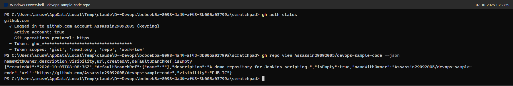

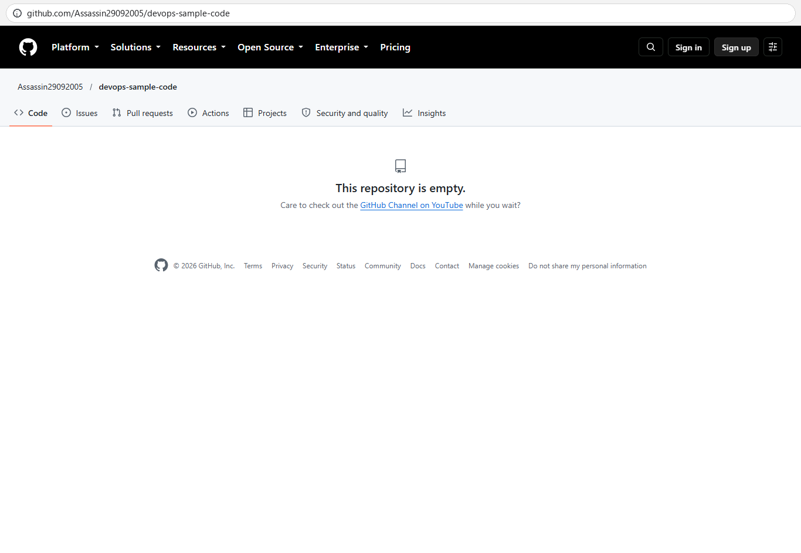

#### Step 1b: Personal access token (PAT)
```powershell
# Not executed on purpose: no PAT was created.
# Pushes use the GitHub CLI's credential helper, which hands git the existing gh OAuth token:
git -c credential.helper= -c "credential.helper=!gh auth git-credential" push ...
```
* **Status:** Skipped by design. The GitHub CLI was already logged in with OAuth (`repo` scope, see screenshot 01), so creating and pasting a fine-grained PAT was unnecessary. See Issues & Fixes #2.

#### Step 2: Create the script locally
The repository folder was created outside `D:\Devops` (in the session scratch folder). `touch` does not exist in Windows PowerShell, so `New-Item -ItemType File` was used, and the content was written with LF line endings so that it is a proper Linux shell script. The script was then tested in WSL.
```powershell
New-Item -ItemType File hello-world.sh | Format-Table Mode, Length, Name -AutoSize
[IO.File]::WriteAllText("$PWD\hello-world.sh", "#!/bin/bash`necho ""Hello, Jenkins!""`n")
Get-Content hello-world.sh
wsl -d Ubuntu-22.04 -- file hello-world.sh
wsl -d Ubuntu-22.04 -- bash hello-world.sh
```
The `| Format-Table Mode, Length, Name -AutoSize` pipe only shortens the output of `New-Item` to the new file's mode, size (0 bytes) and name; it does not change what is created.
* **Status:** `hello-world.sh` contains exactly `#!/bin/bash` and `echo "Hello, Jenkins!"`; `file` reports a Bourne-Again shell script (no "CRLF line terminators"), and running it prints `Hello, Jenkins!`. The `chmod +x` part of this step is done at git level in Step 4, because Windows (NTFS) has no executable bit.

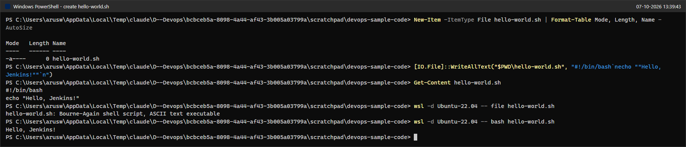

#### Step 3: Initialise the local Git repository
The global Git identity was already configured on this machine, so it was only displayed, not changed. The repository was initialised directly on branch `main`.
```powershell
git config --global --get user.name
git config --global --get user.email
git config --show-origin --get init.defaultBranch
git init -b main
```
* **Status:** Identity `Assassin29092005 <aru.swamy29@gmail.com>`; empty repository initialised on `main` (Git's default on this machine would have been `master`, see Issues & Fixes #4).

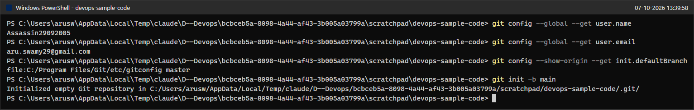

#### Step 4: Add the script, make it executable, check the status and commit
```powershell
git add hello-world.sh
git update-index --chmod=+x hello-world.sh      # Windows equivalent of "chmod +x"
git ls-files --stage
git ls-files --eol
git status
```
* **Status:** The file is staged with mode `100755` (executable) and LF endings in both the index and the working tree (`i/lf w/lf`); `git status` shows `new file: hello-world.sh` under "Changes to be committed" on branch `main`.

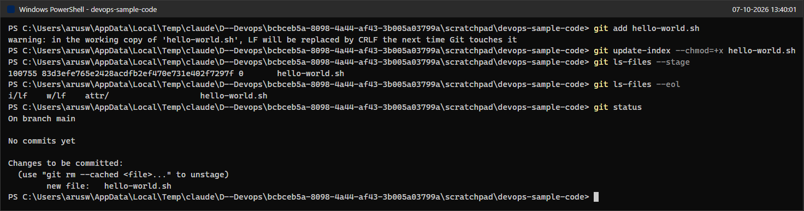

```powershell
git commit -m "Add hello-world.sh" -m "Co-Authored-By: Claude Opus 5.5 <noreply@anthropic.com>"
git log --stat
```
* **Status:** Root commit `d4c5988` "Add hello-world.sh", `1 file changed, 2 insertions(+)`, `create mode 100755 hello-world.sh`. The author is `Assassin29092005`; the second `-m` adds a `Co-Authored-By` trailer that the exercise's command does not have (see Issues & Fixes #9).

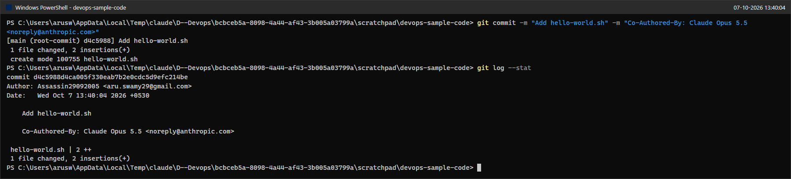

#### Step 5: Link the local repository to GitHub
```powershell
git remote add origin https://github.com/Assassin29092005/devops-sample-code.git
git remote -v
```
* **Status:** Remote `origin` points to the new repository for fetch and push.

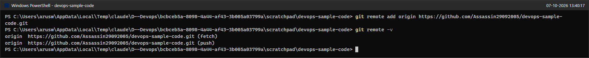

#### Step 6: Push the script to GitHub
```powershell
git -c credential.helper= -c "credential.helper=!gh auth git-credential" push -u origin main
git status -sb
git ls-remote origin
```
* **Status:** `* [new branch] main -> main`, `branch 'main' set up to track 'origin/main'`; the remote `HEAD` and `refs/heads/main` both point at commit `d4c5988`. No username or password prompt appeared because the gh credential helper supplied the token.

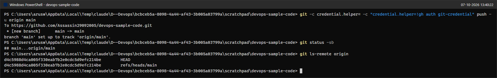

#### Step 7: Verify the script on GitHub
Opened <https://github.com/Assassin29092005/devops-sample-code> and then the `hello-world.sh` file page.
* **Status:** The public repository shows one commit and the file `hello-world.sh`. The commit is credited to "Assassin29092005 and claude", and the Contributors box shows 2 (`claude` and `Assassin29092005`) because of the co-author trailer (see Issues & Fixes #9). The file page labels it "Executable File, 2 lines, 35 Bytes" with the expected two lines.

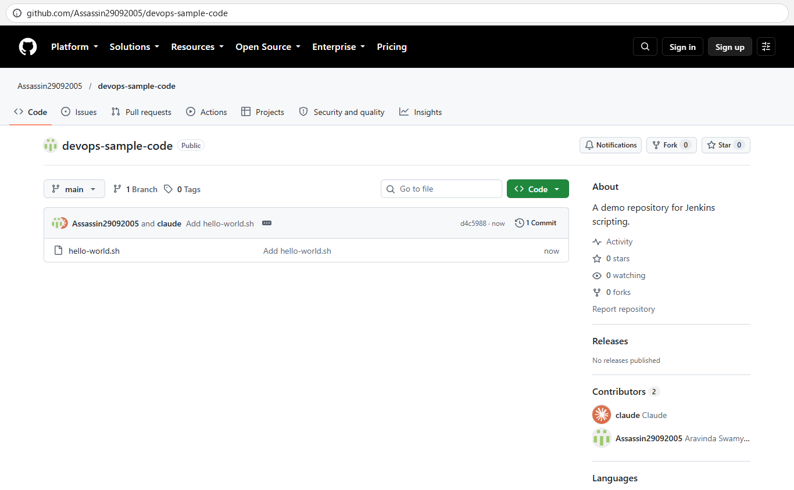

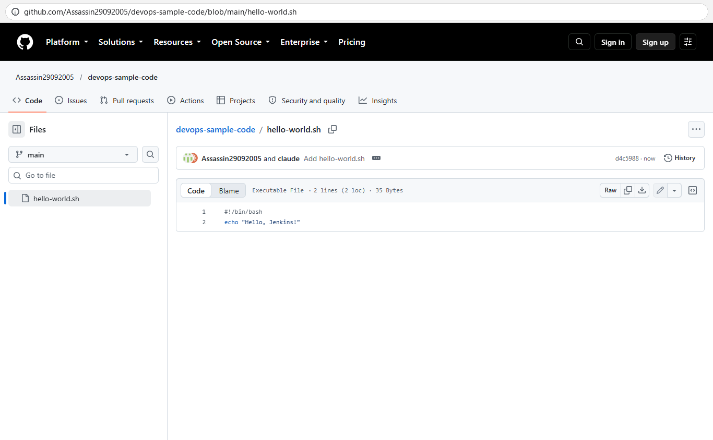

### Part B: Create and run the Jenkins job
All of Part B was performed in the Jenkins web UI by `create_hello_world_job.py` (Playwright + Edge), which clicks exactly the controls the exercise names. The script is kept here as a record of what was clicked, but it cannot be re-run from this folder as is: it imports the screenshot helper `shot.py` and loads the saved Jenkins login (`state.json`) from the temporary session scratch folder, whose path is hard-coded in the script, and neither file is included here. It also expects that no job called `HelloWorld` exists yet.

#### Step 1: Access Jenkins
Opened <http://localhost:8080> with the `admin` session saved in Lab 07 (the script first checks `/whoAmI/api/json` to confirm the user is `admin`).
* **Status:** Dashboard "Welcome to Jenkins!" with no jobs yet, Jenkins 2.580.1, 0 of 2 executors busy.

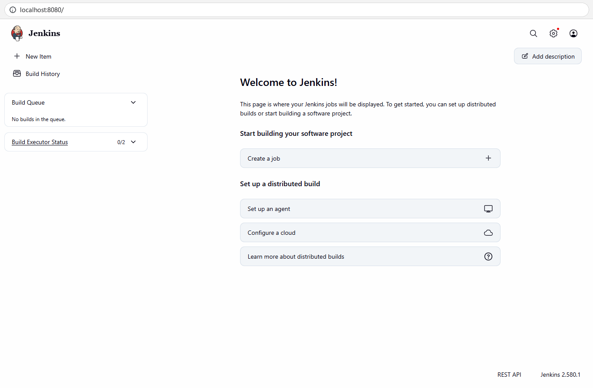

#### Step 2: Create a new job
**New Item** -> item name `HelloWorld` -> **Freestyle project** -> **OK**.
* **Status:** Name entered and "Freestyle project" selected; OK opened `job/HelloWorld/configure`.

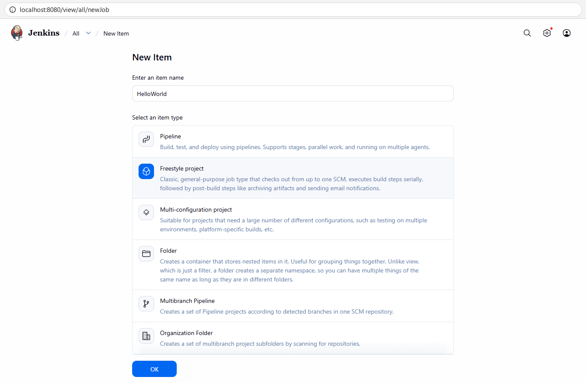

#### Step 3: Configure the job
**General -> Description:** `Hello World! Jenkins job.`

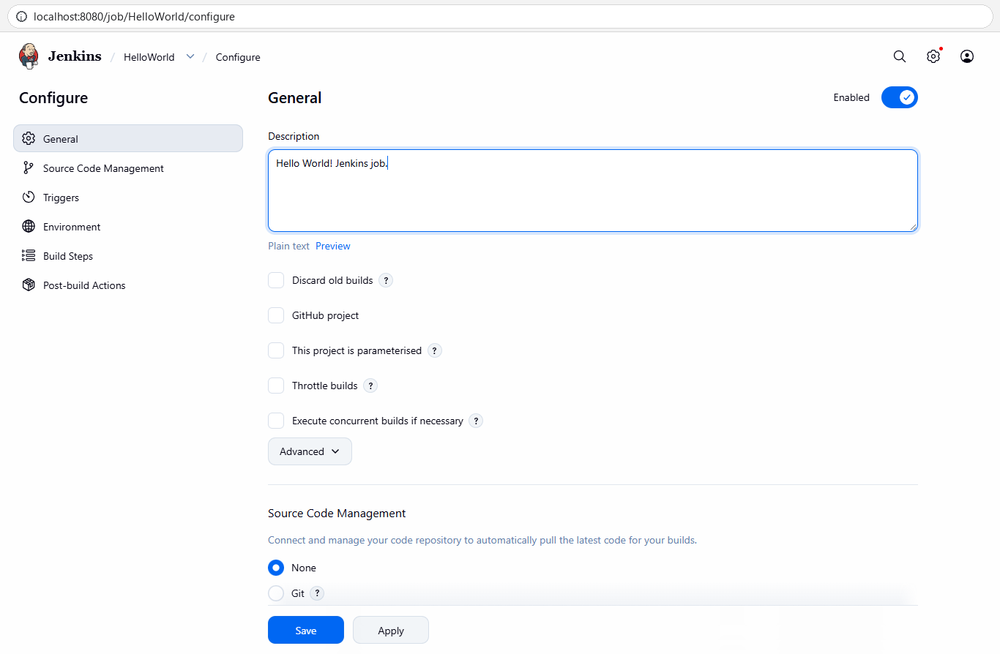

**Source Code Management -> Git -> Repository URL:** `https://github.com/Assassin29092005/devops-sample-code.git` (no credentials needed because the repository is public). Jenkins pre-fills **Branch Specifier** with `*/master`, a branch that does not exist in this repository:

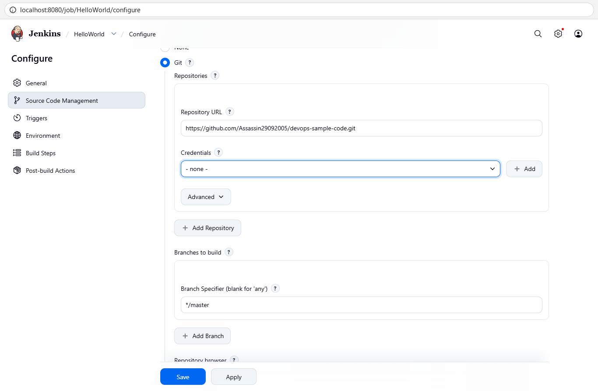

The Branch Specifier was therefore changed to `*/main` (see Issues & Fixes #5):

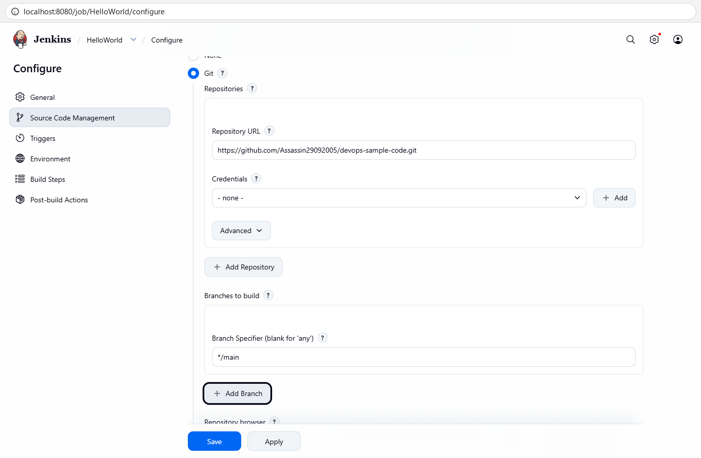

**Build Steps -> Add build step -> Execute shell -> Command:**
```sh
sh hello-world.sh
```

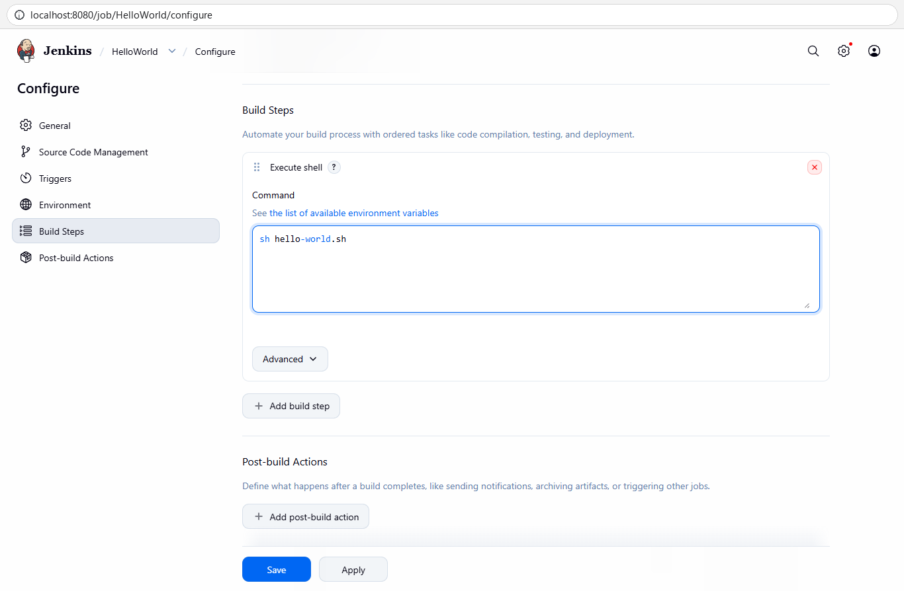

#### Step 4: Save and run the job
Clicked **Save**, which opened the job page, then **Build Now** (Dashboard -> HelloWorld -> Build Now).
* **Status:** Job page shows the description and "No builds" right after saving; after Build Now, build `#1` appears in the Builds panel with a green tick and all permalinks (last build, last stable, last successful, last completed) point to `#1`.

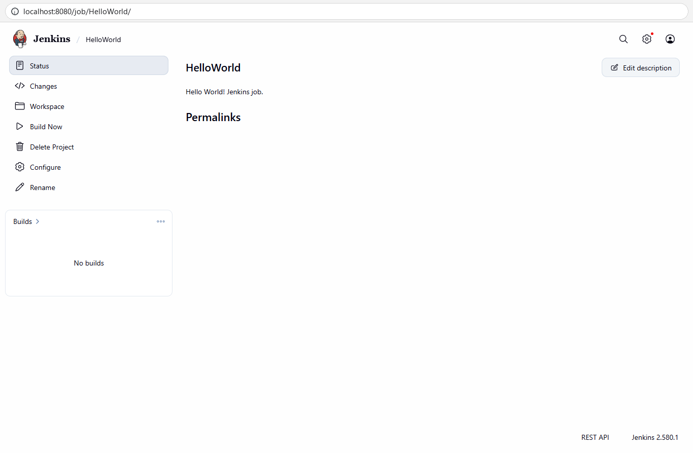

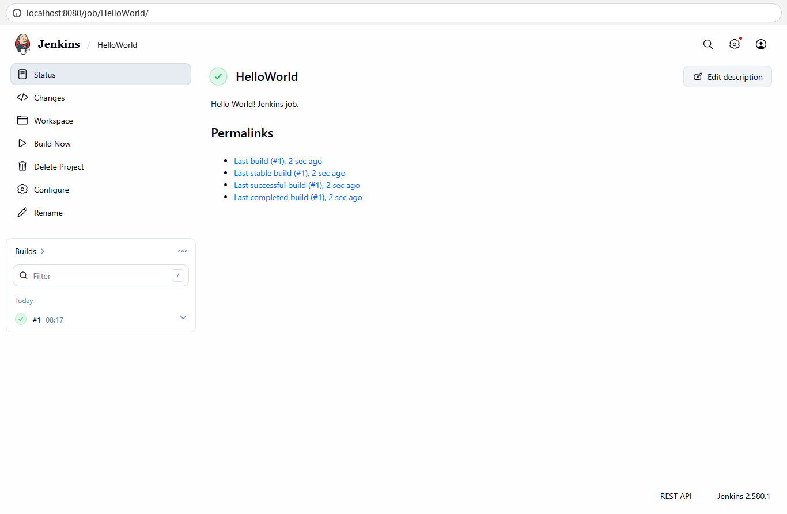

#### Step 5: View the build output
Builds panel -> **#1** -> **Console Output**.
* **Status:** Build #1 was "Started by user admin", checked out revision `d4c5988...` from `refs/remotes/origin/main`, and the console ends with:
```text
[HelloWorld] $ /bin/sh -xe /tmp/jenkins11746974477927299721.sh
+ sh hello-world.sh
Hello, Jenkins!
Finished: SUCCESS
```

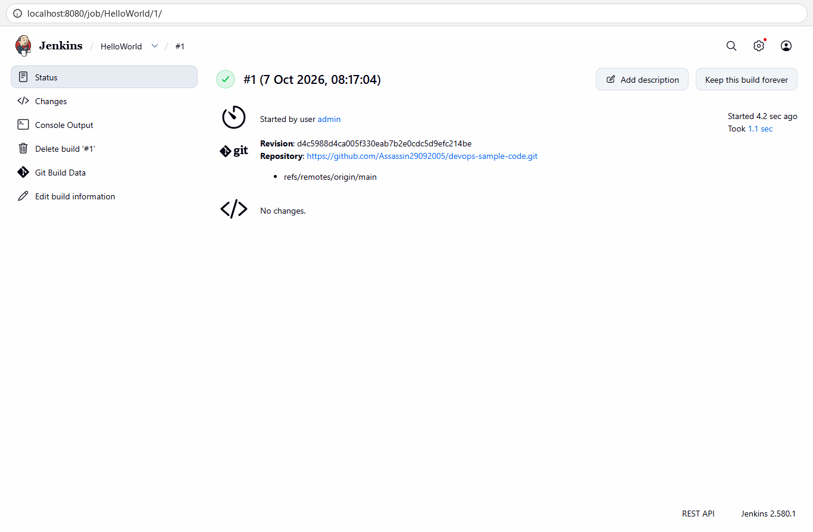

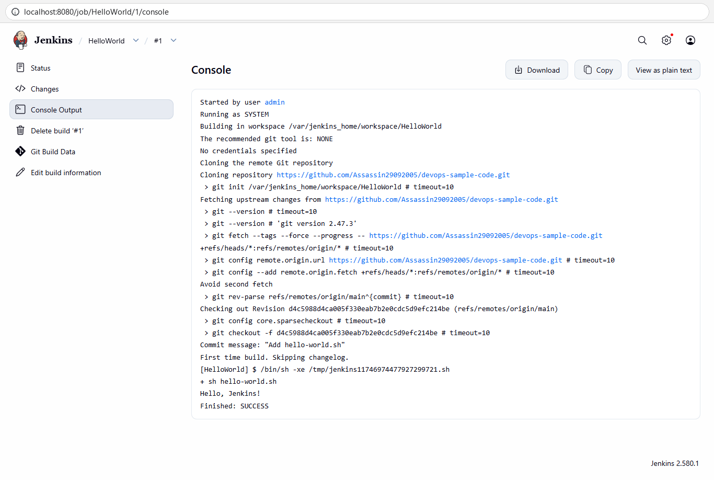

#### Extra verification from inside the Jenkins container
```powershell
docker exec jenkins git ls-remote --heads https://github.com/Assassin29092005/devops-sample-code.git
docker exec jenkins ls -l /var/jenkins_home/workspace/HelloWorld
docker exec jenkins cat /var/jenkins_home/jobs/HelloWorld/config.xml
```
* **Status:** The repository has only one branch, `refs/heads/main` (so `*/master` really could not have matched anything); the checked-out `hello-world.sh` in the Jenkins workspace is `-rwxr-xr-x`, so the executable bit set in Step 4 survived the round trip; the saved `config.xml` contains the description, the repository URL, `*/main` and the `sh hello-world.sh` shell builder. The same XML is saved as `HelloWorld-config.xml` in this folder.

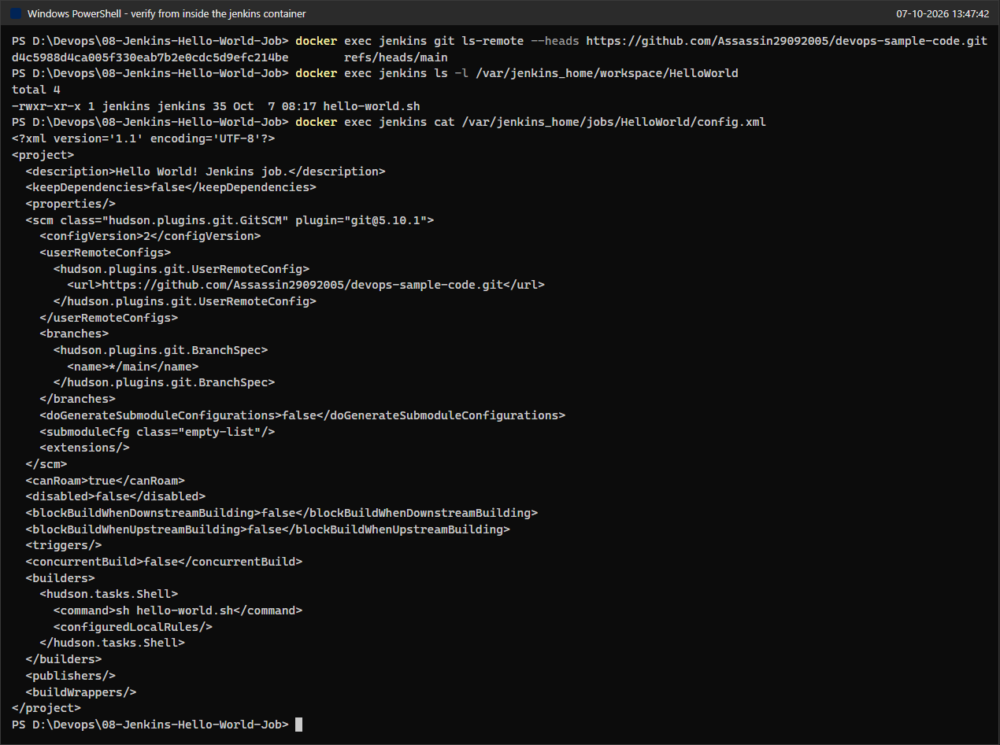

---

## Issues & Fixes

1. **Screenshot tool crashed after `gh repo create` had already run.** The first capture ran `gh auth status`, `gh repo create ...` and `gh repo view ...` for real, but when the helper printed the transcript to the Windows console, Python's default `cp1252` encoding could not print the check mark (U+2713) in the `gh auth status` output. The helper crashed before rendering the PNG, so the creation output was lost even though the repository had been created (GitHub reports `createdAt 2026-10-07T08:08:36Z` with the requested description and `PUBLIC` visibility). Deleting and re-creating the repository just to re-take the picture was not worth it, so screenshot 01 shows `gh auth status` plus `gh repo view` of the freshly created, still empty repository, and screenshot 02 shows the empty repository on github.com. Every later capture was run with `PYTHONIOENCODING=utf-8`, which fixed the crash.
2. **Step 1b (fine-grained PAT) was not performed.** The GitHub CLI on this machine is already logged in with an OAuth token that has the `repo` scope. Creating another long-lived token and pasting it into a password prompt would only add a secret that has to be stored and revoked later. Pushes used `git -c credential.helper= -c "credential.helper=!gh auth git-credential" push ...`: the first `-c` clears the machine's default helper (Git Credential Manager) for this command only, and the second makes git ask `gh` for the credentials, so no password prompt appears and nothing is written to the global configuration.
3. **`touch` and `chmod +x` do not work on Windows.** Windows PowerShell has no `touch`, so `New-Item -ItemType File` created the empty file. NTFS has no Unix executable bit and Git for Windows runs with `core.filemode=false`, so `chmod +x` would have had no effect on the commit. The executable bit was recorded in Git instead with `git update-index --chmod=+x hello-world.sh`, which gave `create mode 100755` in the commit, "Executable File" on GitHub and `-rwxr-xr-x` in the Jenkins workspace.
4. **Branch name mismatch inside the exercise, and line endings.** The exercise runs plain `git init` (its sample output shows `On branch master`) but later pushes with `git push -u origin main`. On this machine `init.defaultBranch` is `master`, so following the text literally would have produced a `master` branch and the push of `main` would have failed with "src refspec main does not match any". Using `git init -b main` keeps the push command exactly as written. Separately, Git for Windows is configured with `core.autocrlf=true`, which printed the warning "LF will be replaced by CRLF the next time Git touches it" during `git add`. The warning only concerns future checkouts on Windows: the committed blob is LF (`i/lf` in screenshot 05), which is what Jenkins checks out on Linux.
5. **Jenkins defaults the Branch Specifier to `*/master`.** The exercise only says to enter the repository URL, but the Git plugin pre-fills "Branches to build" with `*/master` (screenshot 14), and this repository only has `main` (screenshot 21). With the default value the build would have stopped with Jenkins' "Couldn't find any revision to build" error. The specifier was set to `*/main` before saving (screenshot 15), and build #1 checked out `refs/remotes/origin/main`.
6. **Placeholder URLs in the exercise.** Step 7 of the GitHub part points to `https://github.com/<your-GitHub-username>/DevOps` and the Jenkins part to `https://github.com/<your-username>/repo.git`. Both are placeholders; the real repository `https://github.com/Assassin29092005/devops-sample-code(.git)` was used in both places.
7. **The UI automation needed three attempts before the final clean run.** The first run of `create_hello_world_job.py` stopped because the configure-page sections in Jenkins 2.580.1 have hex-encoded element ids, so the selector `#source-code-management` did not exist. The second run stopped because the first `_.name` input on the page is a hidden field (the repository "Name" under Advanced), not the Branch Specifier. In the third run every step succeeded, but the Source Code Management screenshot cut the Branch Specifier field off behind Jenkins' sticky Save bar. Each time, the half-made `HelloWorld` job was deleted, the selectors or scrolling were fixed, and the script was run again from New Item. Before the last run the leftover workspace folder `/var/jenkins_home/workspace/HelloWorld` was also removed, because deleting a job in Jenkins does not delete its workspace and the build would otherwise have fetched into the old clone instead of cloning. Screenshots 11-20 therefore all come from one complete run, and build #1 in them is a genuine first-time clone.
8. **Console output differs slightly from the exercise's sample.** The sample shows only `+ echo 'Hello, Jenkins!'`. The real log also has the Git checkout lines (the job now has Source Code Management configured), and the trace line is `+ sh hello-world.sh`: Jenkins runs the build step with `/bin/sh -xe`, which traces the step's own command, while the script itself runs in a child `sh` without `-x`, so only its output `Hello, Jenkins!` appears. The user name is shown as `admin`, the account used in this Jenkins. Times in Jenkins screenshots are in UTC (08:17), while the terminal screenshots show local IST (13:47).
9. **The commit carries a co-author trailer, so GitHub lists a second contributor.** The exercise commits with `git commit -m "Add hello-world.sh"`. This lab was carried out with the AI coding assistant Claude Code, which by convention marks commits it creates with a co-author line, so the command had a second `-m "Co-Authored-By: Claude Opus 5.5 <noreply@anthropic.com>"` (screenshot 06). The second `-m` only adds a paragraph to the commit message: the author is still `Assassin29092005`, and the committed file is unchanged. GitHub, however, reads `Co-Authored-By` trailers and links the email address in this one to the GitHub account `claude`, so the repository page credits the commit to "Assassin29092005 and claude" and shows "Contributors 2" (screenshot 09). This does not affect the Jenkins job. Removing the trailer now would need a rewritten commit and a force-push, and Jenkins build #1 was made from commit `d4c5988`, so it was left as is.

---

## Verification Summary
| Check | Result |
|---|---|
| GitHub repository | `Assassin29092005/devops-sample-code`, public, description "A demo repository for Jenkins scripting." |
| Committed script | `hello-world.sh`, mode `100755`, LF endings, commit `d4c5988` on `main` |
| Push | `main -> main` (new branch), local `main` tracks `origin/main` |
| Script visible on GitHub | Yes, shown as "Executable File", 2 lines |
| Jenkins job | Freestyle project `HelloWorld`, description "Hello World! Jenkins job.", Git SCM with `*/main`, Execute shell `sh hello-world.sh` |
| Build #1 | Started by `admin`, cloned revision `d4c5988`, printed `Hello, Jenkins!`, `Finished: SUCCESS` |

---

## Q&A
The exercise does not ask explicit questions, so this section answers the questions that naturally come up while doing it.

**Q: Why does the exercise ask for a personal access token at all?**
A: GitHub no longer accepts account passwords for Git over HTTPS. When `git push` prompts for a password, it needs a token instead. A fine-grained PAT can be limited to a single repository and to the "Contents: read and write" permission, which makes it much safer than a classic token. Here the GitHub CLI's OAuth login played the same role through a credential helper.

**Q: Why is the Branch Specifier important?**
A: It tells the Git plugin which remote branch to build. Jenkins pre-fills `*/master`, but repositories created today (and this one) use `main`. If the pattern matches no branch, the build fails before any build step runs.

**Q: Is the executable bit needed when the job runs `sh hello-world.sh`?**
A: Not strictly. `sh hello-world.sh` passes the file to the shell as an argument, so it runs even without execute permission. The bit matters when the script is started directly as `./hello-world.sh`, which is why the exercise sets it with `chmod +x`. Here it was recorded in Git, and Jenkins checked the file out as `-rwxr-xr-x`.

**Q: What does a Freestyle project do in this lab?**
A: It is Jenkins' classic job type, configured entirely through web forms. On every build it checks out the configured repository into the job's workspace (`/var/jenkins_home/workspace/HelloWorld`), runs the build steps one after another (here a single shell command), and records the console log and the result.

**Q: Where does the line `[HelloWorld] $ /bin/sh -xe /tmp/jenkins....sh` come from?**
A: The "Execute shell" step writes the command text into a temporary script and runs it with `/bin/sh -xe`. `-x` echoes each command (hence `+ sh hello-world.sh`) and `-e` stops the step at the first failing command, so a non-zero exit code marks the build as failed.

---

## Cleanup / State Left Running
* **Jenkins container `jenkins`** (ports 8080 and 50000, volume `jenkins_home`) is still running on purpose for exercises 9 and 6. The job `HelloWorld` and its successful build #1 were kept as evidence.
* **GitHub repository** `https://github.com/Assassin29092005/devops-sample-code` (public, branch `main`, one commit) was kept; the next exercise can reuse it.
* **Local working clone** is in the session scratch folder (outside `D:\Devops`); this folder only holds a copy of `hello-world.sh`. Nothing was committed or pushed inside `D:\Devops`.
* No GitHub tokens were created, no global Git settings were changed, and no background processes, port-forwards or browsers were left running.
