# Lab 09: Jenkins Multi-Stage Pipeline (Deploying a Python Application)

## Objective
Automate the CI/CD flow of a small Python Flask application with a declarative **Jenkins Pipeline** that is stored in Git as a `Jenkinsfile`. The pipeline has the stages **Build**, **Test**, **Deploy**, **Run Application** and **Test Application**. The lab also walks through the build error that the exercise predicts (no Python inside the Jenkins container), fixes it, and finishes with a green pipeline. As the suggested enhancement, a **Code Quality** stage that runs `flake8` was added.

---

## Environment
* **Host:** Windows 11 Home Single Language (10.0.26200), Windows PowerShell 5.1, Docker Desktop 29.8.0 (WSL2 backend)
* **Jenkins:** `2.580.1` in the Docker container `jenkins` from Lab 07 (`jenkins/jenkins:lts`, Debian GNU/Linux 13.7 "trixie", OpenJDK 21.0.12.1, git 2.47.3), <http://localhost:8080>, user `admin`, built-in node with 2 executors
* **Jenkins plugins used:** Pipeline (`workflow-aggregator`) 608.v67378e9d3db_1, Git 5.10.1, Pipeline Graph View 1053.v9df19e6ceed2 (shipped with this Jenkins), and **Pipeline: Stage View 2.41** (installed during this lab, together with its dependencies Pipeline: REST API 2.41 and Pipeline Graph Analysis 254.v0f63a_a_447dca_)
* **Python inside the Jenkins container (installed during this lab with apt):** Python 3.13.5, pip 25.1.1, python3-venv 3.13.5, Flask 3.1.1 (`python3-flask`), flake8 7.1.1
* **Git / GitHub:** Git for Windows 2.55.0.windows.3 (`core.autocrlf=true`), GitHub CLI 2.102.0 logged in as `Assassin29092005`; repository <https://github.com/Assassin29092005/devops-sample-code> (public, branch `main`), the same repository that Lab 08 created
* **Browser automation for the Jenkins and GitHub screenshots:** Python 3.11.9 + Playwright 1.63.0 driving Microsoft Edge (headless)

### Files in this folder
| File | Purpose |
|---|---|
| `README.md` | This lab report. |
| `python-flask-app/app.py`, `requirements.txt`, `test_app.py`, `Jenkinsfile`, `.flake8` | The application and pipeline files exactly as they are on GitHub after the last commit (`29fa2fa`). `app.py` and `test_app.py` contain the blank-line and line-length fixes from the Code Quality enhancement; the versions exactly as given by the exercise are shown in screenshots 03 and 09 and are in commits `a513f1a` and `693b258`. The working Git clone itself lives outside `D:\Devops` (in the session scratch folder), so no nested `.git` folder ends up in this lab repository. |
| `jenkins_ui.py` | Playwright script that performed every Jenkins web UI action of this lab (plugin check, New Item, job configuration, Build Now, console and graph pages, Stage View plugin installation) and took the Jenkins screenshots. |
| `Python-MultiStage-Pipeline-config.xml` | The job definition Jenkins saved (`/var/jenkins_home/jobs/Python-MultiStage-Pipeline/config.xml`), exported at the end as a record of the final configuration. |
| `screenshot/` | PNG evidence, numbered in execution order. Only the screenshots that prove a result are kept, so the numbering has gaps. |

---

## Step-by-Step Execution

### Step 1: Set up Jenkins and check the Pipeline plugin
Jenkins was installed and configured in Lab 07. After today's machine reboot the container had been restarted, so it was checked first:
```powershell
docker ps --filter "name=^jenkins$" --format "table {{.Names}}\t{{.Image}}\t{{.Status}}\t{{.Ports}}"
curl.exe -s -I http://localhost:8080/login | Select-String "HTTP/|X-Jenkins:"
docker exec jenkins cat /etc/debian_version
docker exec jenkins sh -c "command -v python3 || echo 'python3: not installed'"
```
* **Status:** The container is up with ports 8080 and 50000, Jenkins answers with `X-Jenkins: 2.580.1`, the image is Debian 13.7, and there is no `python3` in it yet (this is the cause of the build error in Step 7). The running container and the missing `python3` are shown in the `docker ps -a` screenshot in Step 8.

The **Pipeline** plugin was already installed by the setup wizard's "Install suggested plugins" in Lab 07. Checked under **Manage Jenkins -> Plugins -> Installed plugins**, filtered by "Pipeline" (`python jenkins_ui.py plugins`):

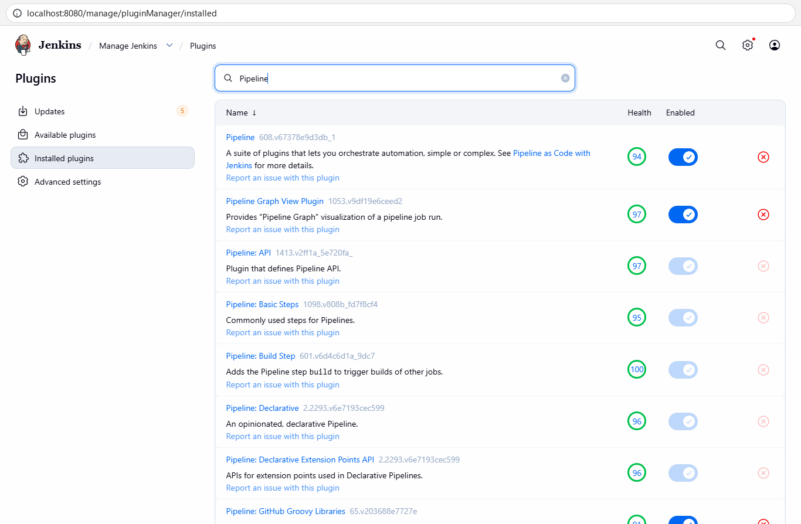

### Step 2: Create the sample Python application
The exercise creates a new folder `python-flask-app` and runs `git init` inside it, so that folder is the root of the repository. Here the repository `devops-sample-code` already existed from Lab 08, so its root plays the role of `python-flask-app` (see Issues & Fixes #1). The three files were created with exactly the content given in the exercise, with LF line endings:

`app.py`
```python
from flask import Flask

app = Flask(__name__)

@app.route("/")
def home():
    return "Hello, Jenkins Multi-Stage Pipeline!"

if __name__ == "__main__":
    app.run(debug=True)
```
`requirements.txt`
```text
flask==2.1.2
```
`test_app.py`
```python
import unittest
from app import app

class TestApp(unittest.TestCase):
    def test_home(self):
        tester = app.test_client()
        response = tester.get("/")
        print(response.data.decode("utf-8"))
        self.assertEqual(response.status_code, 200)
        self.assertEqual(response.data.decode("utf-8"), "Hello, Jenkins Multi-Stage Pipeline!")

if __name__ == "__main__":
    unittest.main()
```
```powershell
git status -sb
Get-ChildItem -Name
Get-Content app.py
Get-Content requirements.txt
Get-Content test_app.py
```
* **Status:** The three new files sit next to `hello-world.sh` from Lab 08 and are untracked.

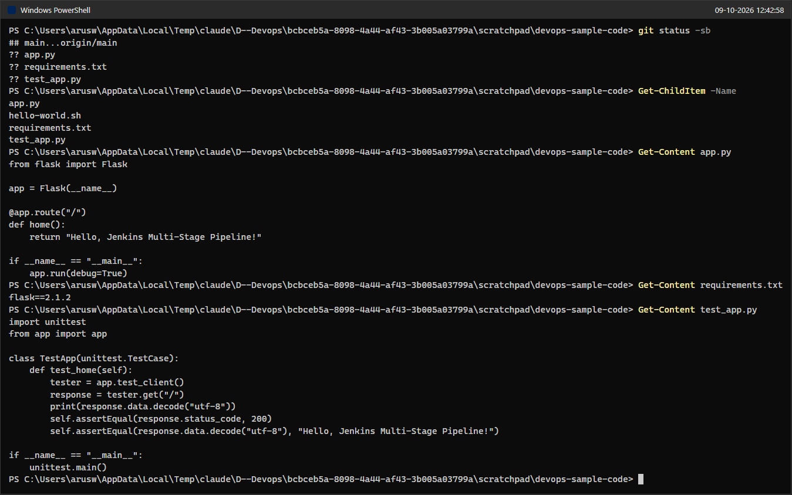

### Step 3: Push the application to GitHub
The repository and its remote `origin` already existed, so `git init` and `git remote add` were not needed (see Issues & Fixes #1). The push uses the GitHub CLI as credential helper, so no password or token is typed.
```powershell
git add app.py requirements.txt test_app.py
git ls-files --eol
git status
git commit -m "Add Python Flask app and tests" -m "Co-Authored-By: Claude Opus 5.5 <noreply@anthropic.com>"
```
* **Status:** Commit `a513f1a` "Add Python Flask app and tests", 3 files, 24 insertions. All files are stored with LF endings (`i/lf w/lf`).

```powershell
git -c credential.helper= -c "credential.helper=!gh auth git-credential" push
git log --oneline
git status -sb
git ls-remote origin
```
* **Status:** `d4c5988..a513f1a  main -> main`; the remote `main` now points to `a513f1a`. The pushed files on GitHub are shown in the last screenshot of Step 5.

### Step 4: Create the multi-stage Jenkins Pipeline job
Jenkins dashboard -> **New Item** -> name `Python-MultiStage-Pipeline` -> **Pipeline** -> **OK**, then **Save** with the default (empty) settings (`python jenkins_ui.py create`). The job page and its configuration form appear in the screenshots of Step 6.
* **Status:** The Pipeline item type is selected; after OK and Save the new, still empty job `Python-MultiStage-Pipeline` exists.

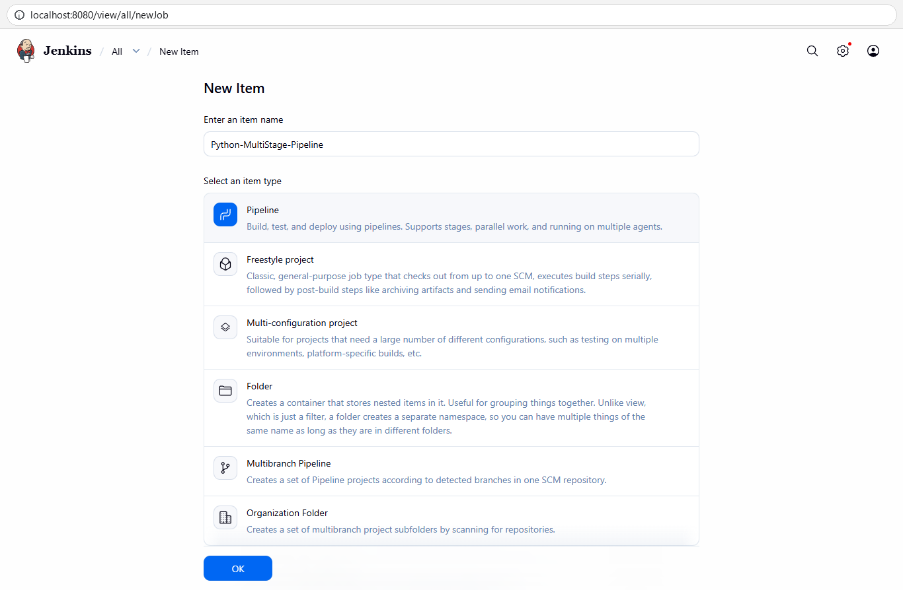

### Step 5: Define the Jenkinsfile and push it
`Jenkinsfile` was created in the repository root with exactly the content given in the exercise (LF endings):
```groovy
pipeline {
    agent any

    stages {
        stage('Build') {
            steps {
                echo 'Creating virtual environment and installing dependencies...'
            }
        }
        stage('Test') {
            steps {
                echo 'Running tests...'
                sh 'python3 -m unittest discover -s .'
            }
        }
        stage('Deploy') {
            steps {
                echo 'Deploying application...'
                sh '''
                mkdir -p ${WORKSPACE}/python-app-deploy
                cp ${WORKSPACE}/app.py ${WORKSPACE}/python-app-deploy/
                '''
            }
        }
        stage('Run Application') {
            steps {
                echo 'Running application...'
                sh '''
                nohup python3 ${WORKSPACE}/python-app-deploy/app.py > ${WORKSPACE}/python-app-deploy/app.log 2>&1 &
                echo $! > ${WORKSPACE}/python-app-deploy/app.pid
                '''
            }
        }
        stage('Test Application') {
            steps {
                echo 'Testing application...'
                sh '''
                python3 ${WORKSPACE}/test_app.py
                '''
            }
        }
    }

    post {
        success {
            echo 'Pipeline completed successfully!'
        }
        failure {
            echo 'Pipeline failed. Check the logs for more details.'
        }
    }
}
```
```powershell
Get-Content Jenkinsfile
git add Jenkinsfile
git ls-files --eol Jenkinsfile
git commit -m "Added Jenkinsfile" -m "Co-Authored-By: Claude Opus 5.5 <noreply@anthropic.com>"
```
* **Status:** Commit `693b258` "Added Jenkinsfile", 52 lines, stored with LF endings.

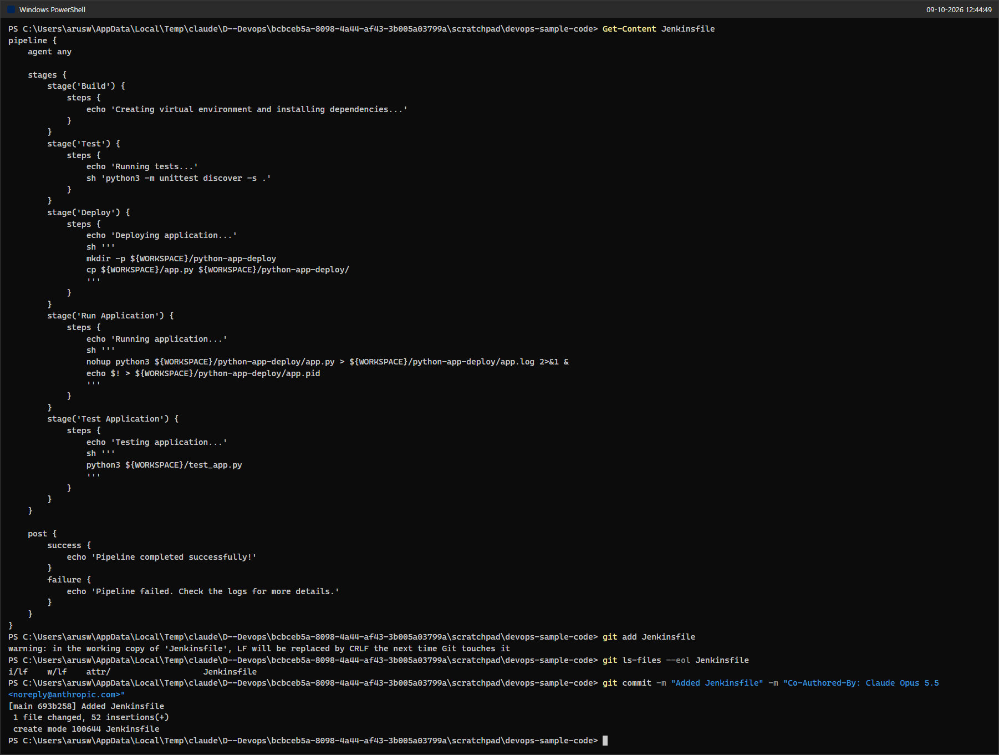

```powershell
git -c credential.helper= -c "credential.helper=!gh auth git-credential" push
git log --oneline
git ls-remote origin
```
* **Status:** `a513f1a..693b258  main -> main`.

Opened <https://github.com/Assassin29092005/devops-sample-code>:
* **Status:** The public repository shows `Jenkinsfile`, `app.py`, `hello-world.sh`, `requirements.txt` and `test_app.py` on branch `main`, 3 commits, latest commit `693b258` "Added Jenkinsfile".

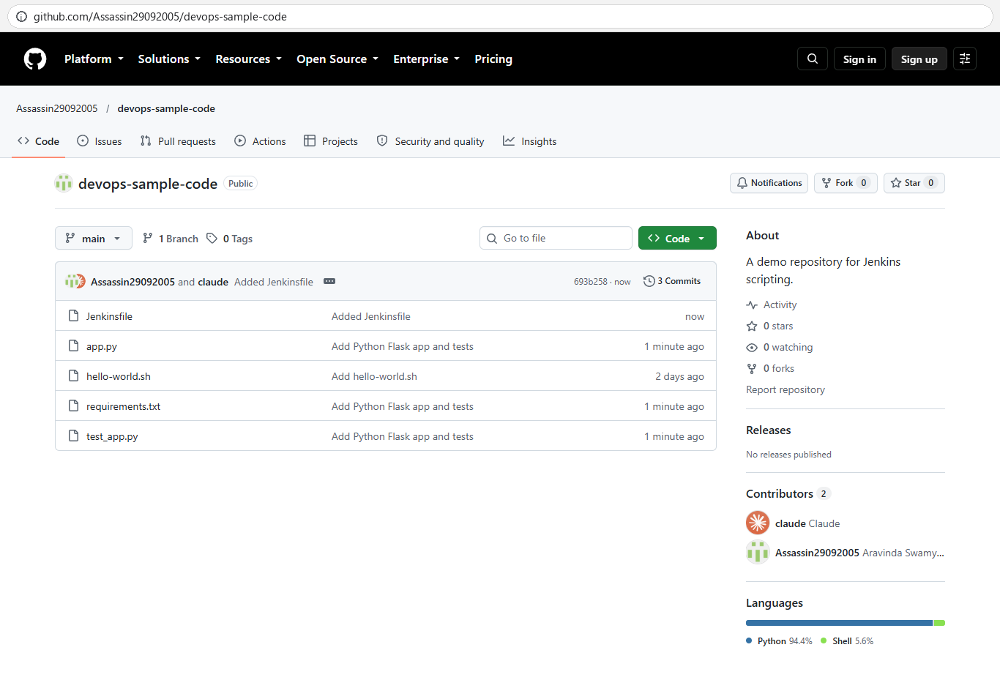

### Step 6: Configure the Jenkins job to read the Jenkinsfile from Git
Job -> **Configure** -> **Pipeline** section (`python jenkins_ui.py configure`):
1. **Definition:** changed from the default "Pipeline script" to **Pipeline script from SCM**.
2. **SCM:** **Git**, **Repository URL** `https://github.com/Assassin29092005/devops-sample-code.git`, **Credentials** `- none -` (the repository is public, so no credentials are necessary).
3. **Branch Specifier:** Jenkins pre-fills `*/master`; it was changed to **`*/main`** (see Issues & Fixes #3).
4. **Script Path:** left at the default `Jenkinsfile` (the file is in the repository root). "Lightweight checkout" stayed ticked.
5. **Save**.

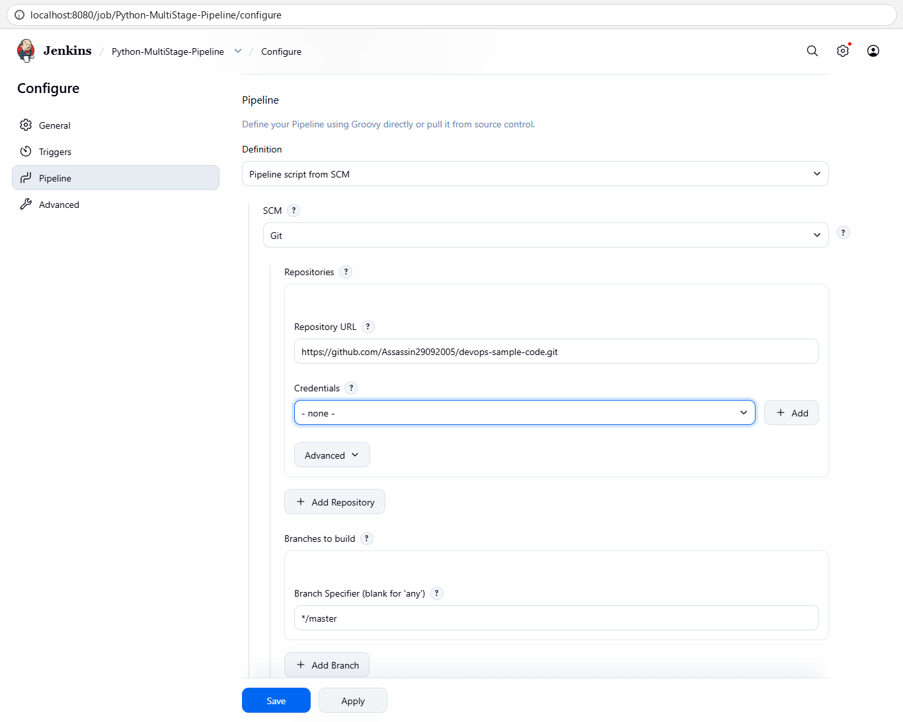

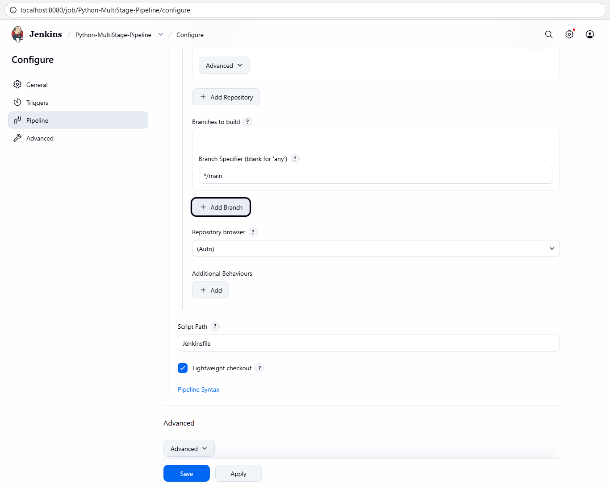

The saved configuration is in `Python-MultiStage-Pipeline-config.xml` (`CpsScmFlowDefinition`, Git URL, `*/main`, `scriptPath` `Jenkinsfile`).

### Step 7: Run the pipeline (first build fails, as the exercise predicts)
Job page -> **Build Now** (`jenkins_ui.py`, subcommand `build`).
* **Status:** Build `#1` = **FAILURE**. Jenkins fetched the Jenkinsfile from Git and checked out `693b258` from `refs/remotes/origin/main`; the **Build** stage passed (it only echoes), and the **Test** stage failed with
```text
+ python3 -m unittest discover -s .
/var/jenkins_home/workspace/Python-MultiStage-Pipeline@tmp/durable-e4e76f07/script.sh.copy: 1: python3: not found
...
Stage "Deploy" skipped due to earlier failure(s)
Stage "Run Application" skipped due to earlier failure(s)
Stage "Test Application" skipped due to earlier failure(s)
...
Pipeline failed. Check the logs for more details.
ERROR: script returned exit code 127
Finished: FAILURE
```
Exit code 127 is the shell's "command not found". The `post { failure { ... } }` block printed its message.

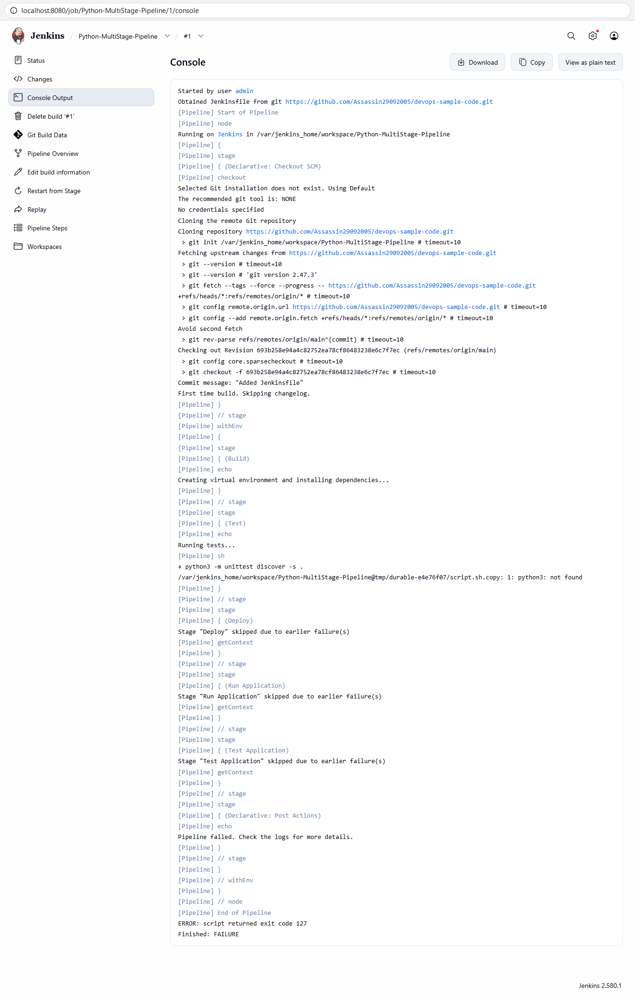

### Step 8: Handle the build errors (install Python inside the Jenkins container)
First the container and a root shell into it were checked, together with the missing tools:
```powershell
docker ps -a --filter "name=^jenkins$"
docker exec -u root jenkins bash -c "whoami; hostname; grep PRETTY_NAME /etc/os-release"
docker exec jenkins sh -c "python3 --version; pip --version"
```
* **Status:** Container `ca7ce4f8d4a3` (`jenkins/jenkins:lts`) is up; `docker exec -u root` gives a root shell in Debian 13 (trixie); `python3` and `pip` are not found.

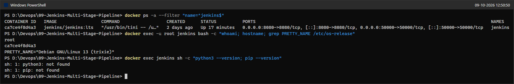

The exercise's commands were then run as root inside the container. Because this lab is automated, each command was run with its own non-interactive `docker exec -u root` instead of typing into an interactive `docker exec -it ... bash` session, with `-y` and `DEBIAN_FRONTEND=noninteractive` so apt does not wait for a confirmation (see Issues & Fixes #5). Some screenshots pipe the output through `Select-String -NotMatch` to hide dpkg's progress lines.
```powershell
docker exec -u root jenkins apt-get update
docker exec -u root -e DEBIAN_FRONTEND=noninteractive jenkins apt install -y python3
```
* **Status:** Package lists downloaded from the Debian trixie mirrors; `python3` 3.13.5-1 (Python 3.13) and 10 dependencies installed. The installed version is confirmed by the `dpkg-query` output in the `python3-flask` screenshot below.

```powershell
docker exec -u root -e DEBIAN_FRONTEND=noninteractive jenkins apt install -y pip
docker exec -u root -e DEBIAN_FRONTEND=noninteractive jenkins apt install -y python3.11-venv
docker exec -u root -e DEBIAN_FRONTEND=noninteractive jenkins apt install -y python3-venv
```
* **Status:** `apt install pip` was resolved by apt to the real package `python3-pip` (25.1.1) and installed it with 71 dependencies (including `build-essential` and the GCC toolchain). `python3.11-venv` **failed** with `Error: Unable to locate package python3.11-venv`, because Debian 13 ships Python 3.13, not 3.11. The version-independent package `python3-venv` (which pulls in `python3.13-venv`) was installed instead (see Issues & Fixes #6).

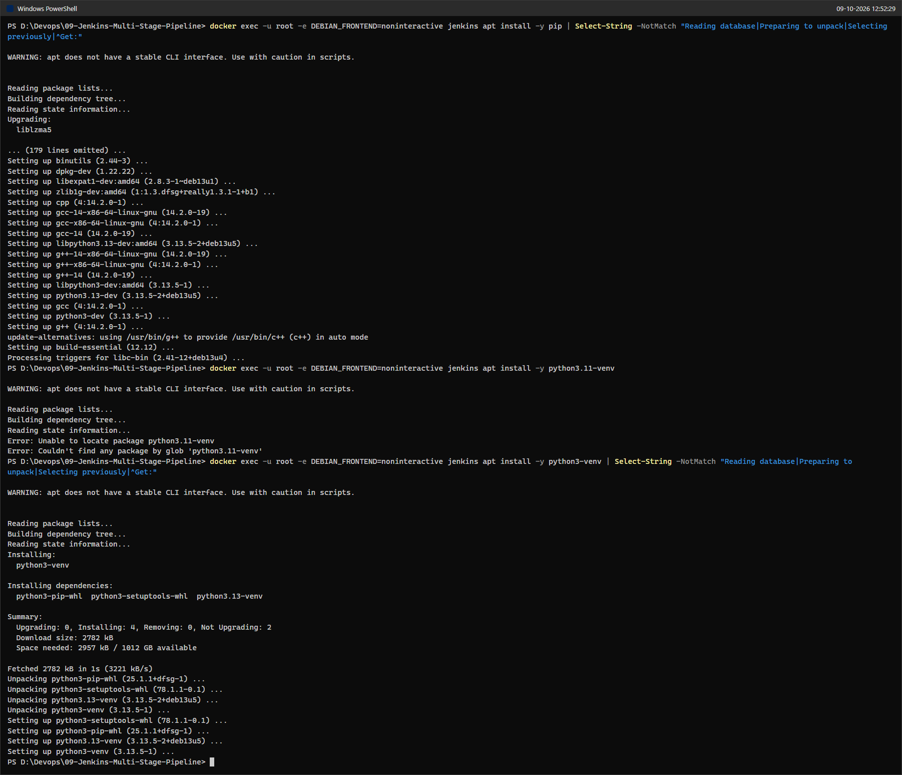

```powershell
docker exec -u root -e DEBIAN_FRONTEND=noninteractive jenkins apt install -y python3-flask
docker exec jenkins python3 --version
docker exec jenkins pip --version
docker exec jenkins python3 -c "import flask, importlib.metadata as m; print('Flask', m.version('flask'))"
docker exec jenkins dpkg-query -W python3 python3-pip python3-venv python3-flask
```
* **Status:** `python3-flask` 3.1.1 and its dependencies (Werkzeug 3.1.3, Jinja2 3.1.6, ...) installed. As the `jenkins` user: Python 3.13.5, pip 25.1.1, Flask 3.1.1.

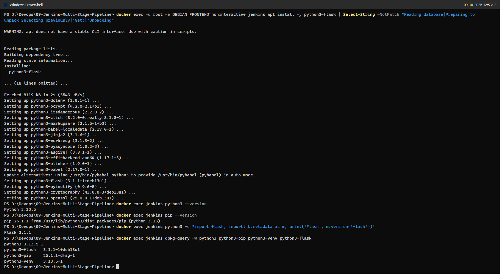

The last command of the exercise, `python3 -m unittest discover -s .`, was run in the job's workspace (where build #1 had checked out the code), as the `jenkins` user that the pipeline uses:
```powershell
docker exec -w /var/jenkins_home/workspace/Python-MultiStage-Pipeline jenkins ls -la
docker exec -w /var/jenkins_home/workspace/Python-MultiStage-Pipeline jenkins python3 -m unittest discover -s .
```
* **Status:** `Ran 1 test ... OK` and `Hello, Jenkins Multi-Stage Pipeline!` inside the container. The same command then passes inside the pipeline in build #2 below.

### Step 7 (again): Rebuild, now successful
Job page -> **Build Now** (`jenkins_ui.py`, subcommand `build`).
* **Status:** Build `#2` = **SUCCESS**. The console output matches the "Multi-stage successfully runs as follows" sample of the exercise stage by stage:
```text
[Pipeline] { (Test)
+ python3 -m unittest discover -s .
Ran 1 test in 0.006s
OK
Hello, Jenkins Multi-Stage Pipeline!
[Pipeline] { (Deploy)
+ mkdir -p /var/jenkins_home/workspace/Python-MultiStage-Pipeline/python-app-deploy
+ cp /var/jenkins_home/workspace/Python-MultiStage-Pipeline/app.py /var/jenkins_home/workspace/Python-MultiStage-Pipeline/python-app-deploy/
[Pipeline] { (Run Application)
+ echo 2235
+ nohup python3 /var/jenkins_home/workspace/Python-MultiStage-Pipeline/python-app-deploy/app.py
[Pipeline] { (Test Application)
+ python3 /var/jenkins_home/workspace/Python-MultiStage-Pipeline/test_app.py
Ran 1 test in 0.006s
OK
Hello, Jenkins Multi-Stage Pipeline!
[Pipeline] { (Declarative: Post Actions)
Pipeline completed successfully!
Finished: SUCCESS
```

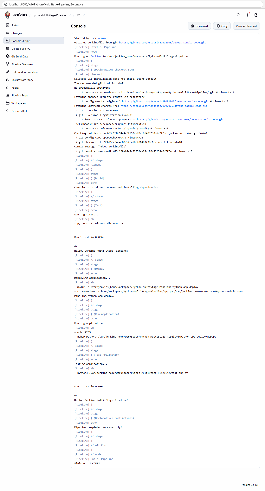

The deployed files were checked inside the container:
```powershell
docker exec jenkins ls -la /var/jenkins_home/workspace/Python-MultiStage-Pipeline/python-app-deploy
docker exec jenkins cat /var/jenkins_home/workspace/Python-MultiStage-Pipeline/python-app-deploy/app.pid
docker exec jenkins cat /var/jenkins_home/workspace/Python-MultiStage-Pipeline/python-app-deploy/app.log
docker exec jenkins sh -c 'ps -p $(cat /var/jenkins_home/workspace/Python-MultiStage-Pipeline/python-app-deploy/app.pid) || echo PID-NOT-RUNNING'
docker exec jenkins ps -ef | Select-String "UID|python"
```
* **Status:** The deploy directory contains `app.py` (the copy made by the Deploy stage), `app.pid` (`2235`) and `app.log`. The log proves that the Run Application stage really started the Flask development server (`Running on http://127.0.0.1:5000`, debug mode on). The process is no longer running after the build, because Jenkins kills processes that a build step leaves behind (see Issues & Fixes #8 and the Q&A).

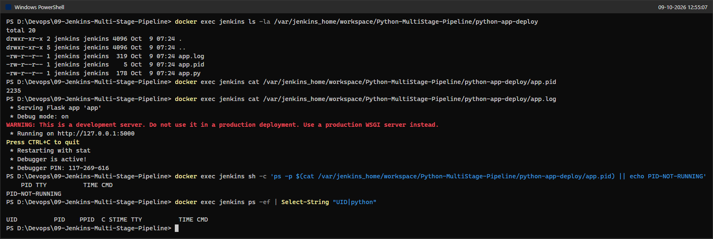

### Stage visualisation: Pipeline: Stage View plugin
The exercise expects the classic **Stage View** on the job page. This Jenkins release ships **Pipeline Graph View** instead (the per-build "Pipeline Overview" page). To show the classic view too, the plugin **Pipeline: Stage View** was installed through **Manage Jenkins -> Plugins -> Available plugins** (`jenkins_ui.py`, subcommand `stageview`). It installed together with its dependencies Pipeline: REST API and Pipeline Graph Analysis, and no Jenkins restart was needed.
* **Status:** The job page now shows the Stage View table: build #2 has every stage green; build #1 shows Checkout and Build green and Test red. Stage View also paints Deploy, Run Application and Test Application of #1 as "failed", although the console log of build #1 shows they were skipped (Issues & Fixes #9).

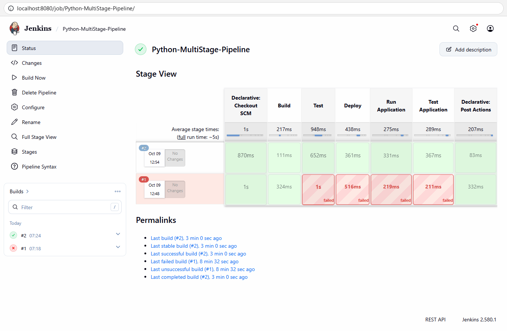

### Additional enhancement: Code Quality stage with flake8
The exercise suggests a `Code Quality` stage that runs `flake8 .`. First flake8 was installed in the container. On Debian 13 the `flake8` command comes from the package `flake8`; the package `python3-flake8`, which was tried first, only contains the Python module (Issues & Fixes #10).
```powershell
docker exec -u root -e DEBIAN_FRONTEND=noninteractive jenkins apt install -y flake8
docker exec jenkins flake8 --version
docker exec -w /var/jenkins_home/workspace/Python-MultiStage-Pipeline jenkins flake8 .
```
* **Status:** flake8 7.1.1 works. Running it in the workspace before adding the stage found 7 problems: E302/E305 (two blank lines are expected around top-level functions and classes) in `app.py` and `test_app.py`, E501 (line longer than 79 characters) in `test_app.py`, and the same E302/E305 in `python-app-deploy/app.py`, the copy left in the workspace by the Deploy stage of build #2.

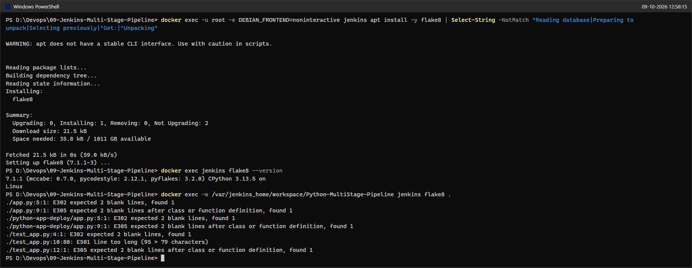

To keep the pipeline green, the findings were fixed in the code instead of being ignored: two blank lines were added before and after the top-level definitions, and the long assertion was wrapped onto two lines. A `.flake8` file excludes only `python-app-deploy/`, because that directory is build output inside the workspace (Git does not remove it between builds), not source code. The new stage was placed right after Build, so style problems stop the pipeline before the tests run:
```groovy
        stage('Code Quality') {
            steps {
                echo 'Running code quality checks...'
                sh 'flake8 .'
            }
        }
```
```ini
[flake8]
# python-app-deploy/ is the pipeline's deploy output (a copy of app.py from the previous build), not source code
extend-exclude = python-app-deploy
```
The changes were committed and pushed together:
```powershell
git add .flake8 Jenkinsfile app.py test_app.py
git commit -m "Add Code Quality stage (flake8) and fix lint findings" -m "Co-Authored-By: Claude Opus 5.5 <noreply@anthropic.com>"
git -c credential.helper= -c "credential.helper=!gh auth git-credential" push
```
* **Status:** Commit `29fa2fa`, pushed to `main`; build #3 below checks out exactly this revision.

Rebuild (`jenkins_ui.py`, subcommand `build`):
* **Status:** Build `#3` = **SUCCESS** at revision `29fa2fa` ("Add Code Quality stage (flake8) and fix lint findings"). The console shows the new stage `[Pipeline] { (Code Quality)` -> `Running code quality checks...` -> `+ flake8 .` with no findings (although the stale `python-app-deploy/app.py` from build #2 was still in the workspace), followed by the unchanged Test (`Ran 1 test ... OK`), Deploy, Run Application and Test Application stages, `Pipeline completed successfully!` and `Finished: SUCCESS`.

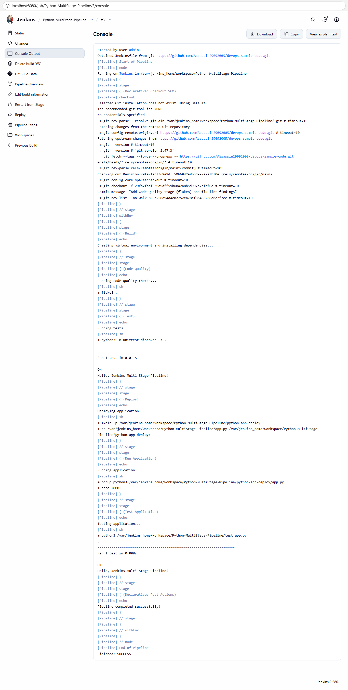

---

## Issues & Fixes

1. **The repository already existed.** The exercise creates `python-flask-app`, runs `git init` and `git remote add origin .../devops-sample-code.git`. That repository was already created and pushed in Lab 08 (with `hello-world.sh`), so `git init` and `git remote add` would have failed or been pointless. The application files were added to the root of the existing clone (which takes the place of the exercise's `python-flask-app` folder, because the Jenkinsfile expects `app.py` and `test_app.py` in `${WORKSPACE}`), committed and pushed with a plain `git push`. The commit messages "Add Python Flask app and tests" and "Added Jenkinsfile" were used; the exercise's "Initial commit" message would have been misleading for a third commit. A copy of the final files is in `python-flask-app/` in this folder.
2. **Line endings on Windows.** Git for Windows is configured with `core.autocrlf=true`, so every `git add` prints "LF will be replaced by CRLF the next time Git touches it". The files were written with LF endings and `git ls-files --eol` shows `i/lf` for all of them, so Jenkins (Linux) checks out LF files. The warning only concerns future checkouts on Windows.
3. **Jenkins defaults the Branch Specifier to `*/master`.** The exercise only says "enter your repository URL", but the Git SCM pre-fills `*/master` (screenshot 13), and this repository only has `main`. With the default the build would have stopped with "Couldn't find any revision to build". It was set to `*/main` (screenshot 14) and every build checked out `refs/remotes/origin/main`.
4. **The job was created twice.** The first run of the configuration script stopped before saving, because the Script Path field is called `_.scriptPath` and the script looked for `scriptPath`. The second run saved the job correctly, but its SCM screenshot cut off the Branch Specifier field, so the `*/master` default was not visible. Since the job had no builds yet, it was deleted and created again with a taller browser window. Screenshots 07, 13 and 14 come from that final, complete run. As a side effect the final New Item happened a few minutes after the Jenkinsfile push (Step 5); this makes no difference, because the job only reads the repository from Step 6 on.
5. **Interactive `docker exec -it` and `apt install` without `-y`.** The exercise logs into the container with `docker exec -it -u root <id> bash` and types the commands there. Automation has no terminal for an interactive shell, so the same commands were sent one by one with `docker exec -u root jenkins ...` (same user, same container). `apt install` asks "Do you want to continue? [Y/n]", which would hang without a terminal, so `-y` and `DEBIAN_FRONTEND=noninteractive` were added. `apt` also warns that it "does not have a stable CLI interface" when used from a script; this warning is harmless.
6. **`python3.11-venv` does not exist on this image.** The current `jenkins/jenkins:lts` image is based on Debian 13 (trixie), whose Python is 3.13. `apt install python3.11-venv` failed with "Unable to locate package" (screenshot 21). The version-independent package `python3-venv` was installed instead; it depends on `python3.13-venv`. `apt install pip` worked because apt resolves the name to the package `python3-pip`, but it pulls in 71 dependencies (the whole C/C++ build toolchain, 364 MB).
7. **Where to run `python3 -m unittest discover -s .`.** In the exercise this command is typed in the root shell, which starts in `/`, where there is no test code. It was run in the job's workspace (`-w /var/jenkins_home/workspace/Python-MultiStage-Pipeline`) as the `jenkins` user, which is what the pipeline itself does.
8. **Differences between the exercise text and what the pipeline really does.**
   * The Build stage only prints "Creating virtual environment and installing dependencies..."; it does not run `pip install -r requirements.txt`, although the "Expected Outcome" says so. Flask therefore comes from the Debian package `python3-flask` (3.1.1), not from `requirements.txt` (`flask==2.1.2`). The Jenkinsfile was kept as given. Installing `requirements.txt` system-wide with pip would also be refused on Debian 13 (PEP 668 "externally managed environment"), which is why a real Build stage would create a virtual environment first.
   * The "Expected Outcome" says the app is copied to `/tmp/python-app-deploy`, but the Jenkinsfile copies it to `${WORKSPACE}/python-app-deploy` = `/var/jenkins_home/workspace/Python-MultiStage-Pipeline/python-app-deploy` (screenshot 27).
   * The Run Application stage starts the Flask server in the background, and `app.log` proves it started, but Jenkins kills every process a build step leaves behind when the step ends (its "ProcessTreeKiller"), so the server does not keep running (screenshot 27). The Test Application stage still passes because `test_app.py` uses Flask's in-process test client and never connects to the server.
   * In build #2 the trace shows `+ echo 2235` before `+ nohup python3 ...`, and in build #3 the other way round. Both commands start at practically the same moment (the first one runs in the background), so the order of their trace lines is random. The exercise's sample shows the same effect.
9. **Stage View is not installed by default, and it behaves slightly differently from the graph view.** Jenkins 2.580.1's suggested plugins include Pipeline Graph View instead of Pipeline: Stage View, so the job page initially had no stage table; the stages were only visible per build under **Pipeline Overview** (the graph view). Pipeline: Stage View 2.41 was installed for screenshot 30 (it loaded without a restart). One quirk of Stage View: it paints the skipped stages of build #1 as "failed" (screenshot 30), while the console says "skipped due to earlier failure(s)" (screenshot 17).
10. **`python3-flake8` has no `flake8` command on Debian 13.** The exercise's enhancement only says to run `flake8 .`. Installing `python3-flake8` installed the module but no executable (`flake8` was still "executable file not found in $PATH"); the command is in the package `flake8`, which works (screenshot 32).
11. **flake8 findings and the deploy copy.** The code given by the exercise has seven flake8 findings (screenshot 32). To keep the pipeline green without switching checks off, the code was fixed (blank lines, one wrapped line). `flake8 .` also lints `python-app-deploy/app.py`, which the Deploy stage copies into the workspace and which survives the next checkout because Git does not delete untracked files. In build #3 that copy is still the old, unfixed `app.py` from build #2 when the Code Quality stage runs, so `.flake8` excludes exactly that directory (`extend-exclude` keeps flake8's default exclusions such as `.git` and `__pycache__`).
12. **The other suggested enhancements were not implemented.** "Deploy the application to a Docker container" and "email or Slack notifications" were not done: the task asked for the Code Quality stage, the Jenkins container has no Docker CLI yet (Lab 06 covers Docker from Jenkins), and no mail server or Slack workspace is configured.
13. **Time zones in the screenshots.** The terminal screenshots show local time (IST), while Jenkins shows server time in UTC (for example build #1 at 07:18 UTC = 12:48 IST). The Stage View table shows the browser's local time (12:48), so it differs from the build list (07:18) on the same page.

---

## Verification Summary
| Check | Result |
|---|---|
| Pipeline plugin | Pipeline 608.v67378e9d3db_1 installed and enabled |
| Application in Git | `app.py`, `requirements.txt`, `test_app.py` (commit `a513f1a`) and `Jenkinsfile` (commit `693b258`) on `main` of the public repository, LF endings |
| Jenkins job | Pipeline job `Python-MultiStage-Pipeline`, "Pipeline script from SCM", Git URL of the repository, branch `*/main`, Script Path `Jenkinsfile` |
| Build #1 | FAILURE in the Test stage: `python3: not found` (exit code 127), later stages skipped, failure message from `post` |
| Fix | `python3` 3.13.5, `python3-pip`, `python3-venv` and `python3-flask` 3.1.1 installed in the container with apt; `python3.11-venv` does not exist on Debian 13 |
| Build #2 | SUCCESS: Build, Test (`Ran 1 test ... OK`), Deploy, Run Application, Test Application (`OK`), "Pipeline completed successfully!", `Finished: SUCCESS` |
| Deploy result | `app.py`, `app.pid`, `app.log` in `/var/jenkins_home/workspace/Python-MultiStage-Pipeline/python-app-deploy`; the log shows the Flask server started on 127.0.0.1:5000 |
| Stage visualisation | Classic Stage View (plugin 2.41 installed) shows #2 with every stage green and #1 failed at Test |
| Enhancement | Code Quality stage with `flake8 .` (commit `29fa2fa`), lint findings fixed, build #3 SUCCESS with 0 flake8 findings |

---

## Q&A
The exercise does not ask explicit questions, so this section answers the questions that naturally come up while doing it.

**Q: What makes this a "multi-stage" pipeline, and why are stages useful?**
A: The Jenkinsfile splits the work into named `stage` blocks (Build, Test, Deploy, Run Application, Test Application, and later Code Quality). Jenkins runs them in order, records the time and result of each one, and shows them separately in the console, the graph view and the Stage View. When something breaks you can see immediately which step failed (here: Test in build #1), and later stages are skipped automatically so that broken code is never deployed.

**Q: What is the difference between "Pipeline script" and "Pipeline script from SCM"?**
A: With "Pipeline script" the Groovy code is typed into the job configuration and lives only in Jenkins. With "Pipeline script from SCM" Jenkins reads the `Jenkinsfile` from the Git repository on every build. The pipeline is then versioned, reviewed and changed together with the application code ("pipeline as code"); for example, adding the Code Quality stage was a normal Git commit and needed no change in Jenkins.

**Q: Why did the first build fail?**
A: Pipeline steps with `agent any` run on the built-in node, that is, inside the `jenkins/jenkins:lts` container. That image contains Java and Git but no Python, so the `sh 'python3 ...'` step ended with `python3: not found` and exit code 127. Jenkins marks a stage as failed as soon as a shell step returns a non-zero exit code.

**Q: Is installing packages with `apt` inside the container a good long-term fix?**
A: It is fine for a lab, but it is not reproducible. The packages live in the container's writable layer: they survive `docker restart`, but they are lost if the container is removed and re-created from the image. A durable solution is a custom image (`FROM jenkins/jenkins:lts` plus `RUN apt-get install ...`), a separate build agent with Python, or running the stages in a Docker agent such as `agent { docker { image 'python:3.13' } }`.

**Q: What do `${WORKSPACE}`, `nohup ... &` and `$!` do in the Jenkinsfile?**
A: `WORKSPACE` is an environment variable that Jenkins sets to the job's working directory (`/var/jenkins_home/workspace/Python-MultiStage-Pipeline`), where the repository is checked out. `nohup ... &` starts the Flask server in the background and keeps it from being stopped when the shell exits, and `$!` is the process ID of that last background command, which is saved in `app.pid`. However, Jenkins still kills the process when the `sh` step ends, because it looks for leftover processes of a build. To keep a server running after a step, it would need to be started outside the build's process tree (for example as a container or a system service), or the build would have to set `JENKINS_NODE_COOKIE=dontKillMe`.

**Q: Why did the Test Application stage pass even though the server was not running at the end?**
A: `test_app.py` uses `app.test_client()`, which calls the Flask application directly inside the test process. It never sends a real HTTP request to port 5000, so it tests the code, not the running server. A real smoke test would be something like `curl -f http://127.0.0.1:5000/` while the server is still running.

**Q: Why put the Code Quality stage before Test?**
A: Linting is fast and needs no running application, so it gives quick feedback and stops the pipeline early if the code does not meet the style rules. Fixing the findings in the code (instead of ignoring them) keeps the check meaningful for future changes.

---

## Cleanup / State Left Running
* **Jenkins container `jenkins`** (ports 8080 and 50000, volume `jenkins_home`) is still running on purpose for Lab 06. Changes made in this lab:
  * New Pipeline job `Python-MultiStage-Pipeline` with builds #1 (FAILURE, kept as evidence), #2 and #3 (SUCCESS). Its workspace, including `python-app-deploy/`, is kept.
  * New plugins Pipeline: Stage View 2.41, Pipeline: REST API 2.41 and Pipeline Graph Analysis.
  * apt packages in the container: `python3`, `python3-pip` (with `build-essential`), `python3-venv`, `python3-flask`, `python3-flake8` and `flake8`. They survive a container restart but not a re-creation of the container.
* **GitHub repository** <https://github.com/Assassin29092005/devops-sample-code> now has 4 commits on `main` (`d4c5988`, `a513f1a`, `693b258`, `29fa2fa`).
* The Flask processes started by the Run Application stage were already stopped by Jenkins at the end of each step; the temporary `/tmp/lintcheck` copy inside the container was removed. No background processes, port-forwards or browsers were left running, nothing was committed or pushed inside `D:\Devops`, and no tokens were created.
