# Lab 10: Multi-Node Kubernetes Cluster with Multiple Applications and ReplicaSets

## Objective
Build a small e-commerce back end out of two Flask micro-services, the **Product Catalog** (AppA, 2 replicas) and the **Shopping Cart** (AppB, 3 replicas). Containerise both, run them on a **3-node Minikube cluster**, and use `podAntiAffinity` so that no two replicas of the same service share a node. Expose both services with `NodePort` Services, reach them from the Windows host and test them with `curl`.

---

## Environment
| Item | Version / value |
|------|-----------------|
| OS | Windows 11 Home Single Language 25H2 |
| Shell | Windows PowerShell 5.1 (`curl.exe` is used, because `curl` is an alias of `Invoke-WebRequest` in PowerShell 5.1) |
| Docker Desktop engine | 29.8.0 (WSL2 backend, context `desktop-linux`) |
| Minikube | v1.38.1, driver `docker`, profile `devops-multinode`, base image v0.0.50 |
| Kubernetes (server) | v1.35.1. Three nodes: `devops-multinode` (control plane, 192.168.49.2), `devops-multinode-m02` (192.168.49.3) and `devops-multinode-m03` (192.168.49.4). All run Debian GNU/Linux 12, kernel 6.18.33.2-microsoft-standard-WSL2 |
| Container runtime inside the nodes | Docker 29.2.1 |
| kubectl (client) | v1.37.0 (Chocolatey). Minikube warns that it is newer than the server; this caused no problems |
| Registry add-on images | `docker.io/registry:3.0.0`, `registry.k8s.io/minikube/kube-registry-proxy:v0.0.11` |
| Application images | `product-catalog:latest` and `shopping-cart:latest`, built from `python:3.9-slim` (Python 3.9.25, Flask 3.1.3, Werkzeug 3.1.9) |

## Files in this folder
| File | Purpose |
|------|---------|
| `product_catalog.py` | AppA: `GET /products` returns three products. Exactly as given in the exercise |
| `shopping_cart.py` | AppB: `GET /cart` and `POST /cart` on an in-memory list. Exactly as given |
| `Dockerfile.product`, `Dockerfile.shopping` | Build the two images. Exactly as given |
| `product_catalog_deployment.yaml` | Deployment `product-catalog`: 2 replicas, required pod anti-affinity on `kubernetes.io/hostname`. Exactly as given |
| `shopping_cart_deployment.yaml` | Deployment `shopping-cart`: 3 replicas, same anti-affinity rule. **One line changed:** `namespace: devops-exercise` became `namespace: default` (see Issues & Fixes) |
| `product_catalog_service.yaml`, `shopping_cart_service.yaml` | `NodePort` Services on port 80. Exactly as given |
| `item.json` | The JSON body for the `POST /cart` test, `{"id": 1, "name": "Laptop", "quantity": 1}`. It avoids PowerShell's quoting problem (see Issues & Fixes) |
| `screenshot/` | Proof of the key results, numbered in execution order. The numbering has gaps because only the necessary screenshots were kept |

## A note on how this lab was run (interrupted and resumed)
I ran this lab in two sessions:
- **Session 1 (7 Oct 2026, screenshots 01 to 13):** Steps 0 to 6, up to the point where `kubectl apply -f shopping_cart_deployment.yaml` failed because of the namespace bug. The session stopped there (a usage limit was hit).
- **Session 2 (9 Oct 2026, screenshots 17 to 26):** The Windows machine had been **rebooted** in between, so all three node containers had stopped. I **restarted the existing cluster** with `minikube start -p devops-multinode`. I did not recreate it, and `--nodes 3` is not needed because the profile remembers its nodes. Then I fixed the manifest and finished Steps 6 to 10.

Because the cluster was restarted rather than recreated, the `product-catalog` Deployment from session 1 shows as `unchanged` and 46h old in screenshot 17, and its two pods show one restart in screenshot 19. The images loaded in session 1 were still on every node, because they are stored inside the node containers' Docker data. Nothing had to be rebuilt or reloaded: the new shopping-cart pods started on all three nodes with `imagePullPolicy: Never` (screenshot 19).

---

## Step-by-Step Execution

### Step 0: Clean up any existing Minikube cluster
```powershell
minikube stop
minikube delete
minikube profile list
```
**Status:** Success. The commands stopped and deleted the default `minikube` profile, which still held the single-node cluster from Lab 03. Afterwards `minikube profile list` reports that no profile exists.

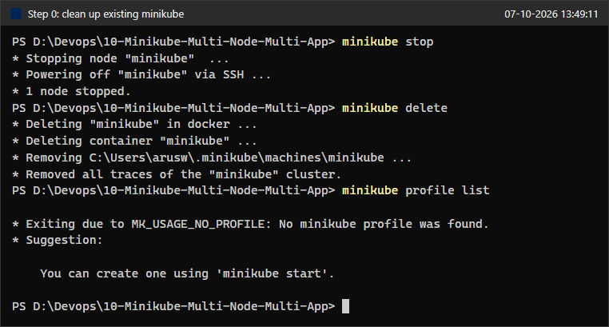

### Step 1a: Start Minikube with 3 nodes
```powershell
minikube start --nodes 3 -p devops-multinode --force
```
**Status:** Success. Minikube created the control-plane node `devops-multinode` and the worker nodes `devops-multinode-m02` and `devops-multinode-m03` on the Docker Desktop driver. Because of `--force`, it printed the warnings "skips various validations" and "Using Docker Desktop driver with root privileges", which is what the exercise expects. At the end it reported "Done! kubectl is now configured to use "devops-multinode" cluster".

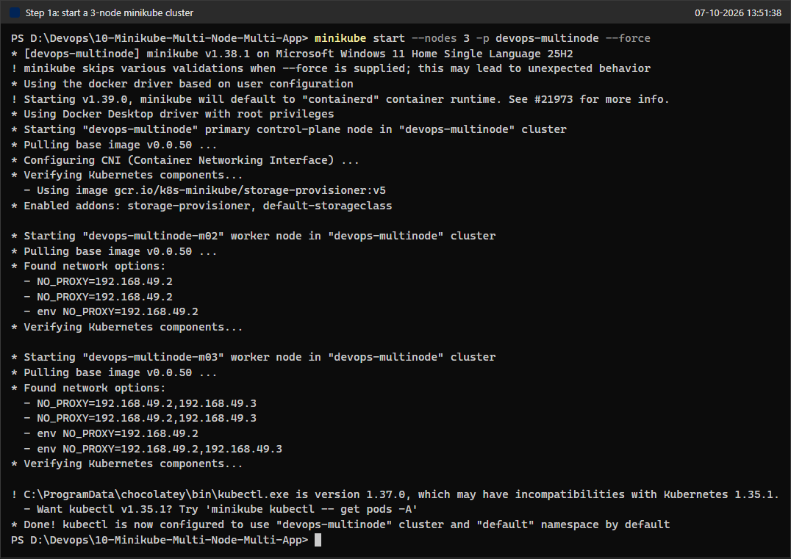

```powershell
minikube profile list
minikube -p devops-multinode status
kubectl get nodes -o wide
```
**Status:** The profile shows status `OK` with 3 nodes. The kubelet is running on all three nodes, and `kubectl get nodes` lists all three as `Ready`: one `control-plane` and two workers, with internal IPs 192.168.49.2, .3 and .4.

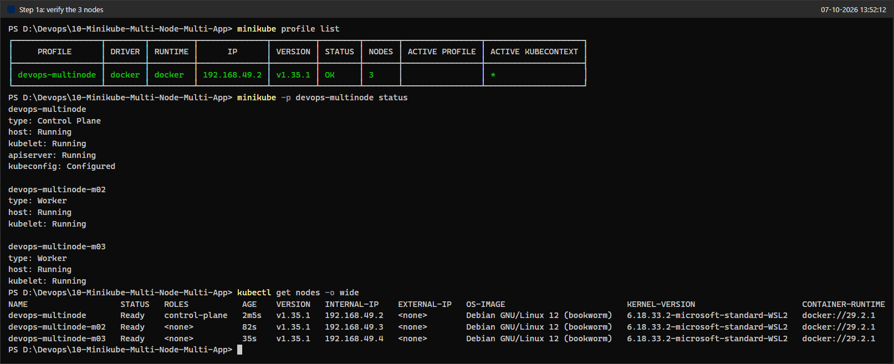

### Step 1b: Enable the registry add-on
```powershell
minikube -p devops-multinode addons enable registry
kubectl get pods -n kube-system -l kubernetes.io/minikube-addons=registry -o wide
kubectl get svc -n kube-system registry
```
**Status:** Success: "The 'registry' addon is enabled". With the Docker driver the add-on is published on a random host port. Here that was **56962** (the exercise shows 32775). One `registry` pod runs (on m03), and one `registry-proxy` pod runs on every node (a DaemonSet). The `registry` Service is a ClusterIP on ports 80 and 443.

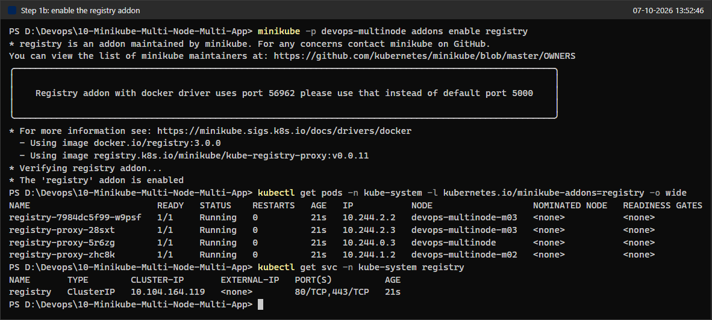

### Steps 2 and 3: Product Catalog and Shopping Cart code
Both Flask apps are saved exactly as given, in `product_catalog.py` and `shopping_cart.py`. `product_catalog.py` serves `GET /products`. `shopping_cart.py` serves `GET /cart` and `POST /cart`, which appends to the module-level list `cart = []`. Both apps listen on port 80.

### Step 4: Dockerise both applications
`Dockerfile.product` and `Dockerfile.shopping` are exactly as given: `python:3.9-slim`, copy the script, `pip install flask`, and run the script.

```powershell
docker context show
docker build -t product-catalog:latest -f Dockerfile.product .
docker build -t shopping-cart:latest -f Dockerfile.shopping .
docker images product-catalog
docker images shopping-cart
```
**Status:** Both builds succeeded with Docker Desktop (`desktop-linux`), and both images exist locally. Docker 29 uses a new table layout (IMAGE, ID, DISK USAGE, CONTENT SIZE): each image takes 203 MB on disk and has 49.7 MB of compressed content. The exercise shows 137 MB in the old layout.

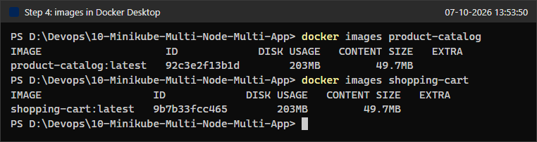

### Step 5: Load the images into the cluster
```powershell
minikube -p devops-multinode image load product-catalog:latest
minikube -p devops-multinode image load shopping-cart:latest
minikube -p devops-multinode image ls | Select-String "product-catalog|shopping-cart"
```
**Status:** Both `image load` commands returned without errors, and `minikube image ls` lists `docker.io/library/product-catalog:latest` and `docker.io/library/shopping-cart:latest`.

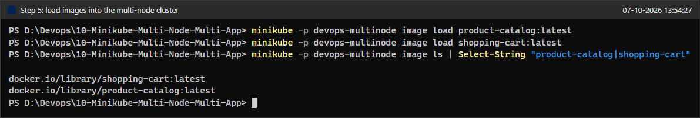

The exercise's verification command, `minikube -p devops-multinode ssh -- docker images`, lists both images next to the Kubernetes system images. Docker 29.2.1 inside the node prints only an `IMAGE` column there, not the old REPOSITORY/TAG/ID table, and the command checks only the primary node. The pods use `imagePullPolicy: Never`, so every node that may run a replica must already have the image. I therefore ran the check on each node separately, using a table format:
```powershell
minikube -p devops-multinode ssh -n devops-multinode -- "docker images --format 'table {{.Repository}}\t{{.Tag}}\t{{.ID}}\t{{.Size}}'" | Select-String "REPOSITORY|product-catalog|shopping-cart"
# ... the same for -n devops-multinode-m02 and -n devops-multinode-m03
```
**Status:** All three nodes have `shopping-cart:latest` (ID `a7c1ee2a7b51`) and `product-catalog:latest` (ID `8120fdf3aa86`), 134 MB each. The IDs are identical on every node, so `minikube image load` copied the same image into every node's Docker daemon.

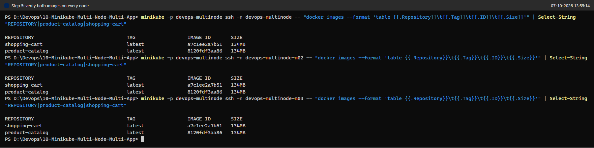

### Step 6: Deploy the applications (first attempt, manifests as given)
In the exercise, the Shopping Cart Deployment declares `namespace: devops-exercise`, while every other manifest uses `default`. I first applied both Deployments exactly as given:
```powershell
kubectl apply -f product_catalog_deployment.yaml
kubectl apply -f shopping_cart_deployment.yaml
kubectl get namespaces
```
**Status:** The Product Catalog worked (`deployment.apps/product-catalog created`). The Shopping Cart **failed**: `Error from server (NotFound): ... namespaces "devops-exercise" not found`. `kubectl get namespaces` confirms that only `default`, `kube-node-lease`, `kube-public` and `kube-system` exist. Session 1 ended here.

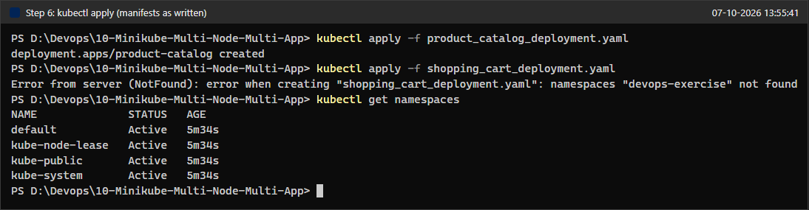

### Step 6 (fixed): Apply both Deployments
I changed line 6 of `shopping_cart_deployment.yaml` from `namespace: devops-exercise` to `namespace: default`. The reasons are explained under Issues & Fixes.
```powershell
Select-String -Path shopping_cart_deployment.yaml -Pattern "name:|namespace:"
kubectl apply -f product_catalog_deployment.yaml
kubectl apply -f shopping_cart_deployment.yaml
kubectl rollout status deployment/shopping-cart --timeout=120s
kubectl get deployments -o wide
```
**Status:** Success. `product-catalog` is `unchanged`, and `shopping-cart` is `created` and finished rolling out. `kubectl get deployments` shows `product-catalog 2/2` and `shopping-cart 3/3`.

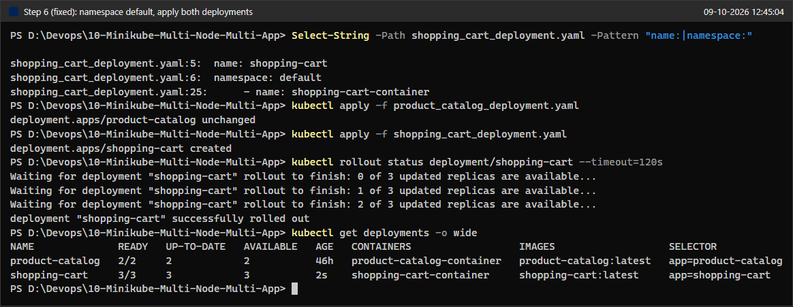

### Step 7: Expose the services
```powershell
kubectl apply -f product_catalog_service.yaml
kubectl apply -f shopping_cart_service.yaml
```
**Status:** Both Services were created as type `NodePort`: `product-catalog-service` (ClusterIP 10.106.51.95, `80:32577/TCP`, selector `app=product-catalog`) and `shopping-cart-service` (ClusterIP 10.96.24.142, `80:30240/TCP`, selector `app=shopping-cart`). Both appear in the Services table of the `kubectl get deploy,rs,svc` output under Step 8 (screenshot 20).

### Step 8: Verify the deployment and the distribution across nodes
```powershell
kubectl get pods -o wide
kubectl get pods -o custom-columns=POD:.metadata.name,APP:.metadata.labels.app,NODE:.spec.nodeName --sort-by=.metadata.labels.app
```
**Status:** All 5 pods are `1/1 Running`, and **no two replicas of the same app share a node**:

| App | Pod | Node |
|-----|-----|------|
| product-catalog | `product-catalog-6794cdc954-8hhlq` (10.244.1.3) | devops-multinode-m02 |
| product-catalog | `product-catalog-6794cdc954-qhdt5` (10.244.2.2) | devops-multinode-m03 |
| shopping-cart | `shopping-cart-7bf585c6f8-4pcvf` (10.244.1.4) | devops-multinode-m02 |
| shopping-cart | `shopping-cart-7bf585c6f8-j6j9f` (10.244.0.4) | devops-multinode (control plane) |
| shopping-cart | `shopping-cart-7bf585c6f8-wrhh9` (10.244.2.5) | devops-multinode-m03 |

The 3 shopping-cart replicas take all three nodes, one each. The 2 product-catalog replicas are on two different nodes. The anti-affinity rule only forbids two pods of the same app on one node, so the scheduler was free to leave the control plane without a catalog pod. This matches the expected output in the exercise.

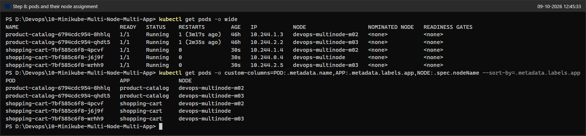

```powershell
kubectl get deploy,rs,svc -o wide
kubectl get endpointslices -l "kubernetes.io/service-name in (product-catalog-service,shopping-cart-service)"
```
**Status:** Each Deployment owns one ReplicaSet (`product-catalog-6794cdc954` 2/2/2 and `shopping-cart-7bf585c6f8` 3/3/3). The EndpointSlices show that each Service found all of its pods: 2 endpoints for the catalog and 3 for the cart. The cart Service could only find its pods because the namespace fix put them in `default`, next to the Service.

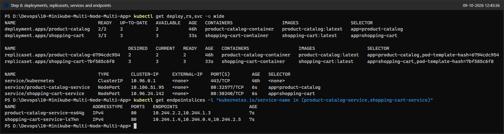

### Step 9: Access the services through `minikube service`
On Windows with the Docker driver, the node IPs (192.168.49.x) cannot be reached from the host. `minikube service` therefore opens an SSH tunnel to a random local port, and that tunnel lasts only as long as the command keeps running. I started both commands with `--url` in the background and redirected their stdout and stderr to files:
```powershell
Start-Process minikube -ArgumentList "-p devops-multinode service product-catalog-service --url" -RedirectStandardOutput svc-product.out -RedirectStandardError svc-product.err -WindowStyle Hidden -PassThru
Start-Process minikube -ArgumentList "-p devops-multinode service shopping-cart-service --url" -RedirectStandardOutput svc-cart.out -RedirectStandardError svc-cart.err -WindowStyle Hidden -PassThru
```
**Status:** Both tunnels came up:
- Product Catalog: **http://127.0.0.1:54583**
- Shopping Cart: **http://127.0.0.1:54582**

Each tunnel also printed "Because you are using a Docker driver on windows, the terminal needs to be open to run it." The tunnel processes ran from about 12:46 to 12:58. The image below was rendered afterwards from the captured output files, so the clock in its title bar shows the render time.

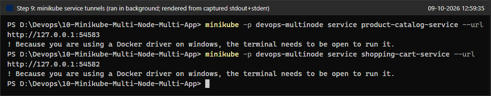

### Step 10: Test with `curl`
**Product Catalog:**
```powershell
curl.exe -s http://127.0.0.1:54583/products
curl.exe -s -i http://127.0.0.1:54583/products
```
**Status:** `HTTP/1.1 200 OK` with the expected list: Laptop 1200, Phone 800, Headphones 150. The `Server` header confirms that the reply came from the container (Werkzeug 3.1.9, Python 3.9.25). Flask returns compact JSON on one line, not the pretty-printed form shown in the exercise.

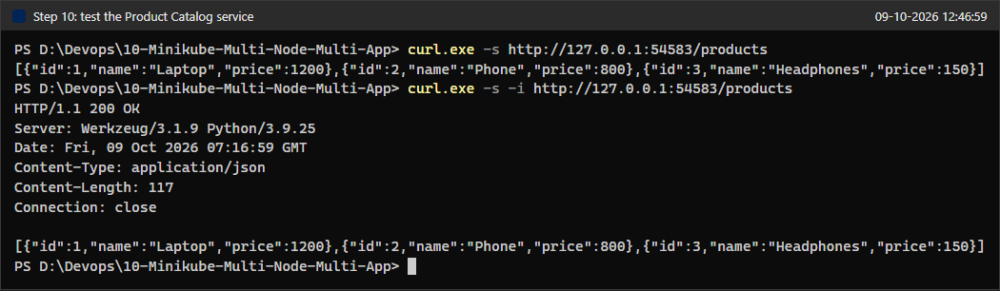

**Shopping Cart: empty cart, then add an item:**
```powershell
curl.exe -s http://127.0.0.1:54582/cart
Get-Content item.json
curl.exe -s -i -X POST http://127.0.0.1:54582/cart -H "Content-Type: application/json" --data-binary "@item.json"
```
**Status:** The first `GET /cart` returned `[]`. The `POST` returned `HTTP/1.1 201 CREATED` with `[{"id":1,"name":"Laptop","quantity":1}]`, which is exactly what the exercise expects.

![Step 10: GET /cart returns [], POST /cart returns 201 with the Laptop](./screenshot/23-curl-get-and-post-cart.png)

**What happens on the next `GET /cart`?** The exercise stops after the POST, so I sent more GET requests and then counted, from the pod logs, which replica had served each request:
```powershell
1..15 | ForEach-Object { "GET /cart #$_ -> " + (curl.exe -s http://127.0.0.1:54582/cart) }
kubectl get pods -l app=shopping-cart -o name | ForEach-Object { $l = kubectl logs $_; "{0}  GET /cart: {1}  POST /cart: {2}" -f $_, ($l | Select-String '"GET /cart').Count, ($l | Select-String 'POST /cart').Count }
```
**Status:** The answers alternate: 7 of the 15 requests returned the Laptop and 8 returned `[]`. The per-pod tally from the logs counts all 24 GET requests sent so far: these 15, the first GET in screenshot 23 and an earlier loop of 8. `4pcvf` served 10 GETs, `j6j9f` served 6, and `wrhh9` served 8 GETs plus the only POST. Every request that returned the Laptop was served by `wrhh9`. Each replica is a separate Python process with its **own in-memory cart**. The Service spreads new connections across the 3 replicas, and each `curl.exe` call opens a new connection. So the cart is not lost; it simply exists only in one of the three replicas.

![Step 10: 15 more GETs alternate between [] and the Laptop; per-pod request tally](./screenshot/25-cart-more-requests-tally-per-pod.png)

**The exercise's POST command as written** (for Issues & Fixes):
```powershell
curl -X POST http://127.0.0.1:54582/cart -H "Content-Type: application/json" -d '{"id": 1, "name": "Laptop", "quantity": 1}'
curl.exe -s -i -X POST http://127.0.0.1:54582/cart -H "Content-Type: application/json" -d '{"id": 1, "name": "Laptop", "quantity": 1}'
```
**Status:** Both forms fail in Windows PowerShell 5.1. `curl` is an alias of `Invoke-WebRequest`, which cannot bind `-H "Content-Type: ..."` to its `-Headers` dictionary. With `curl.exe`, PowerShell 5.1 strips the inner double quotes when it passes the argument to a native program, so Flask receives invalid JSON and answers `400 BAD REQUEST`. A failed request does not change any cart. The `item.json` and `--data-binary "@item.json"` form above avoids the problem.

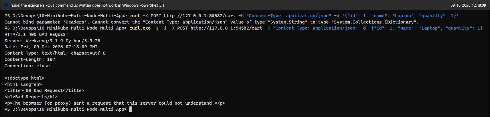

---

## Issues & Fixes
1. **`shopping_cart_deployment.yaml` uses a namespace that does not exist (Step 6).** As written, the Deployment declares `namespace: devops-exercise`. That namespace is never created, so `kubectl apply` fails with `namespaces "devops-exercise" not found` (screenshot 13). Creating the namespace would not have been enough either. A Service only selects pods in its own namespace, and `shopping-cart-service` is declared in `default`, so it would have had no endpoints. The rest of the exercise also assumes `default`: Step 8 lists all pods with a plain `kubectl get pods`, and the Step 9 output shows `NAMESPACE default`. **Fix:** I changed the one line to `namespace: default` and re-applied (screenshot 17). After that, the Service found all three pods (screenshot 20).
2. **The registry add-on uses a random port and newer images than shown.** The exercise shows port 32775 with `registry:2.8.3` and `kube-registry-proxy:0.0.6`. On this machine the port was 56962, with `registry:3.0.0` and `kube-registry-proxy:v0.0.11` (screenshot 04). Nothing in the later steps depends on the port: `minikube image load` copies the image straight into every node's Docker daemon, and the manifests use `imagePullPolicy: Never`. So the registry add-on was enabled as instructed but not actually needed. Screenshot 11 shows the images on each node.
3. **Docker 29 output formats differ from the exercise.** On Docker Desktop, `docker images` uses the new IMAGE / ID / DISK USAGE / CONTENT SIZE table (screenshot 08). Inside the node, `minikube ssh -- docker images` prints only an `IMAGE` column. **Fix:** None was needed. To show repository, tag and image ID on every node, I added `--format 'table {{.Repository}}\t{{.Tag}}\t{{.ID}}\t{{.Size}}'` and `-n <node>` (screenshot 11).
4. **`minikube service` blocks and opens a browser (Step 9).** The exercise runs `minikube -p devops-multinode service <name>` in a separate Linux or WSL terminal. This cluster is managed by the Windows minikube, and with the Docker driver on Windows the command must keep running to hold its SSH tunnel open. **Fix:** I ran each command with `--url` (prints the URL instead of opening a browser) as a hidden background process with redirected output (screenshot 21). The local ports were 54583 and 54582 instead of the exercise's 35855 and 38975, because they are chosen at random. I stopped both tunnels at the end (see Cleanup).
5. **The exercise's `curl -d '{...}'` command does not work in Windows PowerShell 5.1 (Step 10).** `curl` is an alias of `Invoke-WebRequest`. With `curl.exe`, PowerShell 5.1 removes the embedded double quotes, so the server receives `{id: 1, name: Laptop, quantity: 1}` and answers `400 BAD REQUEST` (screenshot 26). **Fix:** I saved the body as `item.json` and used `curl.exe ... --data-binary "@item.json"` (screenshot 23).
6. **The cart contents depend on which replica answers.** This is not a fault of the setup, but the exercise's expected output does not show it. The cart is a Python list in each pod's memory, and there are 3 replicas behind one Service. A GET only shows the item if it reaches the replica that received the POST (screenshot 25). The item is also lost when that pod is deleted or replaced, because nothing stores it outside the pod. **Not changed**, because the exercise gives this code. The proper fix is to keep carts in a shared store, such as Redis or a database, so that any replica can serve any request and the data survives pod restarts.
7. **Minor warnings, no action needed.** kubectl v1.37.0 is newer than the v1.35.1 server, and minikube says so; every command worked. Minikube v1.38.1 also announced that v1.39.0 will default to the containerd runtime; this cluster uses Docker.

---

## Verification Summary
| Check | Result | Evidence |
|-------|--------|----------|
| Old cluster removed | Default `minikube` profile stopped and deleted | 01 |
| 3-node cluster running | `devops-multinode` (control plane), `-m02` and `-m03`, all `Ready`, Kubernetes v1.35.1 | 02, 03 |
| Registry add-on enabled | `registry` pod plus a `registry-proxy` pod on each node | 04 |
| Images built | `product-catalog:latest`, `shopping-cart:latest` | 08 |
| Images on every node | Same image IDs (`8120fdf3aa86`, `a7c1ee2a7b51`) on all 3 nodes | 09, 11 |
| Namespace bug in the exercise | `namespaces "devops-exercise" not found`, fixed by using `default` | 13, 17 |
| Deployments | `product-catalog` 2/2, `shopping-cart` 3/3 (after the namespace fix) | 17, 20 |
| Replicas spread across nodes | Catalog on m02 and m03; cart on control plane, m02 and m03; never two of one app on a node | 19 |
| Services | Two `NodePort` Services (32577 and 30240), with 2 and 3 endpoints | 20 |
| Tunnels to the services | `http://127.0.0.1:54583` (catalog) and `http://127.0.0.1:54582` (cart) | 21 |
| `GET /products` | 200 with the 3 products | 22 |
| `GET /cart` (empty) | `[]` | 23 |
| `POST /cart` | 201 with `[{"id":1,"name":"Laptop","quantity":1}]` | 23 |
| Cart state per replica | Item visible only through the replica that received the POST | 25 |
| Exercise's `curl -d` in PowerShell 5.1 | Fails (alias error, then 400); `item.json` works | 26, 23 |

---

## Q&A
The exercise does not list explicit questions. The answers below cover the questions its storyboard and steps raise.

**1. Why can't we just use `eval $(minikube docker-env)` on a multi-node cluster, as in the single-node labs?**
`docker-env` points your Docker CLI at the Docker daemon of **one** node, the primary one. An image built there exists only on that node. Pods that the scheduler places on m02 or m03 would fail with `ErrImageNeverPull`, because the manifests say `imagePullPolicy: Never`. On a multi-node cluster every node needs the image. You can get it there by pushing it to a registry that all nodes pull from, which is what the registry add-on is for, or by having `minikube image load` copy it into every node, which is what Step 5 does and screenshot 11 proves.

**2. How does `podAntiAffinity` spread the replicas, and what does `requiredDuringSchedulingIgnoredDuringExecution` mean?**
The rule says: do not put this pod on a node (the `topologyKey` is `kubernetes.io/hostname`, so the topology domain is a single node) that already runs a pod with the label `app: shopping-cart` (or `app: product-catalog`). "Required during scheduling" makes it a hard rule: if no node qualifies, the pod stays `Pending` rather than doubling up. For example, if one of the three nodes fails, the replacement for its cart pod has no valid node left, because both healthy nodes already run a cart pod, so it stays `Pending` until the node returns. "Ignored during execution" means the scheduler checks the rule only when it places a pod. Pods that are already running are never moved because of it. A softer alternative is `preferredDuringSchedulingIgnoredDuringExecution`. It still spreads the pods when it can, but it allows two replicas on one node during an outage, so the cart would keep 3 running replicas instead of 2 Running and 1 Pending.

**3. Why did the Shopping Cart manifest fail, and why does the namespace matter for the Service?**
A namespaced object can only be created in a namespace that exists, and `devops-exercise` did not. Even with that namespace created, the Service would not have worked. A Service's label selector only matches pods **in the Service's own namespace**, and `shopping-cart-service` lives in `default`. Moving the Deployment to `default` fixes both problems.

**4. Why does `GET /cart` sometimes return the Laptop and sometimes `[]`?**
Each of the 3 replicas keeps its own `cart = []` list in memory. The Service (kube-proxy) chooses a backend pod for every new TCP connection, and each `curl.exe` call is a new connection, so consecutive requests land on different replicas. Only the replica that handled the POST has the item. The logs in screenshot 25 confirm this. Stateless services, such as the product catalog, are fine to replicate this way. Stateful data, such as a cart, should live in a shared store like Redis or a database. Otherwise it is inconsistent between replicas and is lost whenever a pod is replaced.

**5. What happens when a node fails?**
- When the node stops sending heartbeats, the control plane marks it `NotReady` after the node-monitor grace period (less than a minute by default).
- Kubernetes then marks that node's pods as not ready and removes them from the Services' ready endpoints. Traffic goes only to the replicas on the healthy nodes, so both services keep answering.
- After a further 300 seconds, the default toleration for the `node.kubernetes.io/unreachable` taint, Kubernetes evicts the pods. The ReplicaSets create replacements on the healthy nodes, as far as the anti-affinity rules allow.
- When the node returns, the old pods are cleaned up and any `Pending` replicas are scheduled.

Having replicas on different nodes is what keeps the service available during all of this. Placing them all on one node would make that node a single point of failure.

**6. Why must the terminal stay open for `minikube service` with the Docker driver?**
With the Docker driver, the nodes are containers on Docker Desktop's internal network (192.168.49.0/24), and the Windows host cannot route to it. So the NodePort on 192.168.49.x is not reachable from the host. `minikube service` works around this by opening an SSH tunnel from a random port on 127.0.0.1 into the cluster. The tunnel is a child process of the command, so it exists only while the command runs. In this lab I kept the command running in the background instead of in an open terminal. The same applies on Linux under WSL with Docker Desktop, where the exercise was written.

**7. What is the difference between the NodePort and the URL we actually used?**
The NodePort (32577 for the catalog, 30240 for the cart) is opened on **every** node's IP. From inside the Docker network you could call, for example, `http://192.168.49.3:30240/cart` on any node and still reach any cart replica. The `127.0.0.1:5458x` URLs exist only on this Windows host. They are the local ends of the minikube SSH tunnels, which forward the traffic into the cluster.

---

## Cleanup / State Left Running
- **Stopped:** both `minikube service --url` tunnel processes (Start-Process PIDs 4108 and 39648, together with their minikube.exe child processes and those processes' own children) were killed with `taskkill /T /F`.
- **Intentionally left running:** the 3-node Minikube cluster `devops-multinode` (current kubectl context). It still runs the `product-catalog` Deployment (2/2), the `shopping-cart` Deployment (3/3), the two NodePort Services and the registry add-on. To stop or remove it later:
  ```powershell
  minikube stop -p devops-multinode      # keep it for later
  minikube delete -p devops-multinode    # remove it completely
  ```
- The local Docker Desktop images `product-catalog:latest` and `shopping-cart:latest` were kept.
