# Lab 10: Multi-Node Kubernetes Cluster with Multiple Applications and ReplicaSets

## Objective
Build a small e-commerce back end out of two Flask micro-services, the **Product Catalog** (AppA, 2 replicas) and the **Shopping Cart** (AppB, 3 replicas). Containerise both, run them on a **3-node Minikube cluster**, and use `podAntiAffinity` so that no two replicas of the same service share a node. Expose both services with `NodePort` Services, reach them from the Windows host and test them with `curl`. As an extra, I stopped one worker node to show what the replica spread actually buys you when a node fails.

---

## Environment
| Item | Version / value |
|------|-----------------|
| OS | Windows 11 Home Single Language 25H2 |
| Shell | Windows PowerShell 5.1 (`curl.exe` is used, because `curl` is an alias of `Invoke-WebRequest` in PowerShell 5.1) |
| Docker Desktop engine | 29.8.0 (WSL2 backend, context `desktop-linux`) |
| Minikube | v1.38.1, driver `docker`, profile `devops-multinode`, base image v0.0.50 |
| Kubernetes (server) | v1.35.1. Three nodes: `devops-multinode` (control plane, 192.168.49.2), `devops-multinode-m02` (192.168.49.3) and `devops-multinode-m03` (192.168.49.4). All run Debian GNU/Linux 12, kernel 6.18.33.2-microsoft-standard-WSL2 |
| Container runtime inside the nodes | Docker 29.2.1 |
| kubectl (client) | v1.37.0 (Chocolatey). Minikube warns that it is newer than the server; this caused no problems |
| Registry add-on images | `docker.io/registry:3.0.0`, `registry.k8s.io/minikube/kube-registry-proxy:v0.0.11` |
| Application images | `product-catalog:latest` and `shopping-cart:latest`, built from `python:3.9-slim` (Python 3.9.25, Flask 3.1.3, Werkzeug 3.1.9) |
| Browser for the screenshots | Microsoft Edge (headless) |

## Files in this folder
| File | Purpose |
|------|---------|
| `product_catalog.py` | AppA: `GET /products` returns three products. Exactly as given in the exercise |
| `shopping_cart.py` | AppB: `GET /cart` and `POST /cart` on an in-memory list. Exactly as given |
| `Dockerfile.product`, `Dockerfile.shopping` | Build the two images. Exactly as given |
| `product_catalog_deployment.yaml` | Deployment `product-catalog`: 2 replicas, required pod anti-affinity on `kubernetes.io/hostname`. Exactly as given |
| `shopping_cart_deployment.yaml` | Deployment `shopping-cart`: 3 replicas, same anti-affinity rule. **One line changed:** `namespace: devops-exercise` became `namespace: default` (see Issues & Fixes) |
| `product_catalog_service.yaml`, `shopping_cart_service.yaml` | `NodePort` Services on port 80. Exactly as given |
| `item.json` | The JSON body for the `POST /cart` test, `{"id": 1, "name": "Laptop", "quantity": 1}`. It avoids PowerShell's quoting problem (see Issues & Fixes) |
| `screenshot/` | Proof of every step, numbered in execution order (01 to 35) |

## A note on how this lab was run (interrupted and resumed)
I ran this lab in two sessions:
- **Session 1 (7 Oct 2026, screenshots 01 to 13):** Steps 0 to 6, up to the point where `kubectl apply -f shopping_cart_deployment.yaml` failed because of the namespace bug. The session stopped there (a usage limit was hit).
- **Session 2 (9 Oct 2026, screenshots 14 to 35):** The Windows machine had been **rebooted** in between, so all three node containers had stopped. I **restarted the existing cluster** with `minikube start -p devops-multinode`. I did not recreate it. Then I checked again that the nodes were Ready and that both images were still on every node, fixed the manifest and finished Steps 6 to 10 and the fault-tolerance test.

I created all eight code files at the start of session 1, so the file listing in screenshot 05 already shows the manifests before the steps that use them.

---

## Step-by-Step Execution

### Step 0: Clean up any existing Minikube cluster
```powershell
minikube stop
minikube delete
minikube profile list
```
**Status:** Success. The commands stopped and deleted the default `minikube` profile, which still held the single-node cluster from Lab 03. Afterwards `minikube profile list` reports that no profile exists.


### Step 1a: Start Minikube with 3 nodes
```powershell
minikube start --nodes 3 -p devops-multinode --force
```
**Status:** Success. Minikube created the control-plane node `devops-multinode` and the worker nodes `devops-multinode-m02` and `devops-multinode-m03` on the Docker Desktop driver. Because of `--force`, it printed the warnings "skips various validations" and "Using Docker Desktop driver with root privileges", which is what the exercise expects. At the end it reported "Done! kubectl is now configured to use "devops-multinode" cluster".


```powershell
minikube profile list
minikube -p devops-multinode status
kubectl get nodes -o wide
```
**Status:** The profile shows status `OK` with 3 nodes. The kubelet is running on all three nodes, and `kubectl get nodes` lists all three as `Ready`: one `control-plane` and two workers, with internal IPs 192.168.49.2, .3 and .4.


### Step 1b: Enable the registry add-on
```powershell
minikube -p devops-multinode addons enable registry
kubectl get pods -n kube-system -l kubernetes.io/minikube-addons=registry -o wide
kubectl get svc -n kube-system registry
```
**Status:** Success: "The 'registry' addon is enabled". With the Docker driver the add-on is published on a random host port. Here that was **56962** (the exercise shows 32775), and after the restart in session 2 it was 63801. One `registry` pod runs (on m03), and one `registry-proxy` pod runs on every node (a DaemonSet). The `registry` Service is a ClusterIP on ports 80 and 443.


### Steps 2 and 3: Product Catalog and Shopping Cart code
```powershell
Get-ChildItem -Name
Get-Content product_catalog.py
Get-Content shopping_cart.py
```
**Status:** Both Flask apps are saved exactly as given. `product_catalog.py` serves `GET /products`. `shopping_cart.py` serves `GET /cart` and `POST /cart`, which appends to the module-level list `cart = []`. Both apps listen on port 80.

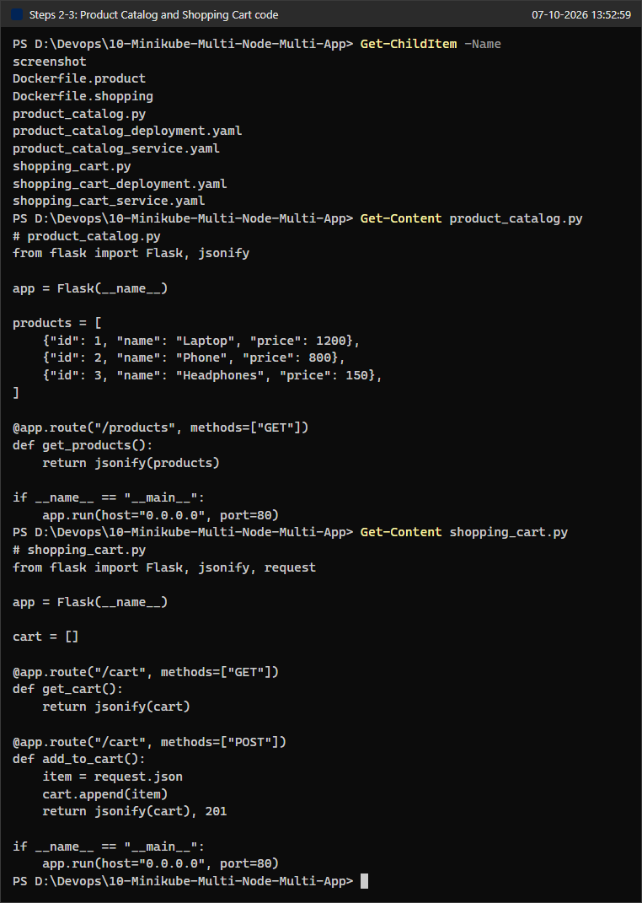

### Step 4: Dockerise both applications
```powershell
Get-Content Dockerfile.product
Get-Content Dockerfile.shopping
```
**Status:** Both Dockerfiles are exactly as given: `python:3.9-slim`, copy the script, `pip install flask`, and run the script.

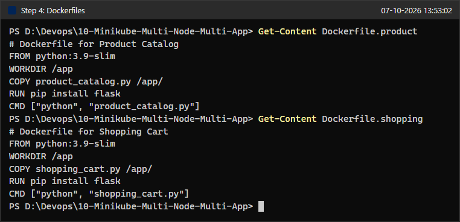

```powershell
docker context show
docker build -t product-catalog:latest -f Dockerfile.product .
docker build -t shopping-cart:latest -f Dockerfile.shopping .
```
**Status:** Both builds succeeded with Docker Desktop (`desktop-linux`). pip installed Flask 3.1.3, and BuildKit ended each build with `naming to docker.io/library/product-catalog:latest done` and `naming to docker.io/library/shopping-cart:latest done`. Some lines in the middle are cut off in the screenshot (marked "lines omitted"). The pip warning about running as root is normal inside a container build.

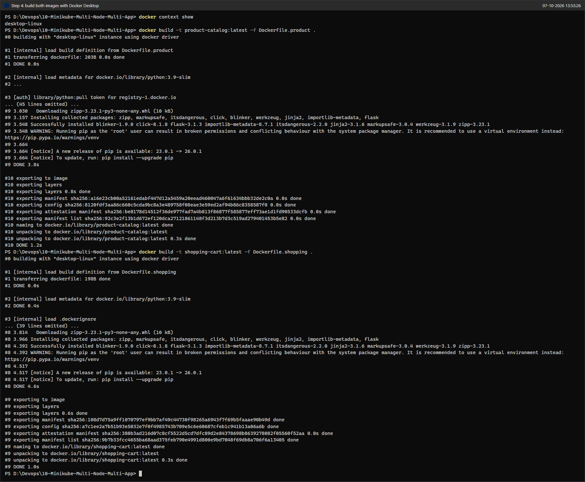

```powershell
docker images product-catalog
docker images shopping-cart
```
**Status:** Both images exist locally. Docker 29 uses a new table layout (IMAGE, ID, DISK USAGE, CONTENT SIZE): each image takes 203 MB on disk and has 49.7 MB of compressed content. The exercise shows 137 MB in the old layout.


### Step 5: Load the images into the cluster
```powershell
minikube -p devops-multinode image load product-catalog:latest
minikube -p devops-multinode image load shopping-cart:latest
minikube -p devops-multinode image ls | Select-String "product-catalog|shopping-cart"
```
**Status:** Both `image load` commands returned without errors, and `minikube image ls` lists `docker.io/library/product-catalog:latest` and `docker.io/library/shopping-cart:latest`.


The exercise's verification command:
```powershell
minikube -p devops-multinode ssh -- docker images
```
**Status:** `product-catalog:latest` and `shopping-cart:latest` are listed next to the Kubernetes system images. Docker 29.2.1 inside the node prints only an `IMAGE` column here, not the old REPOSITORY/TAG/ID table. This command also checks only the primary node.

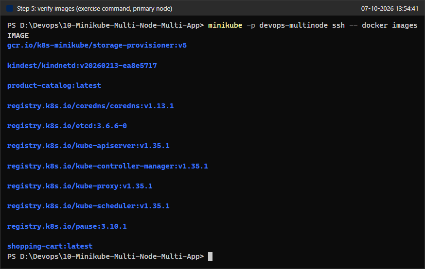

The pods use `imagePullPolicy: Never`, so every node that may run a replica must already have the image. I therefore checked each node separately, using a table format:
```powershell
minikube -p devops-multinode ssh -n devops-multinode -- "docker images --format 'table {{.Repository}}\t{{.Tag}}\t{{.ID}}\t{{.Size}}'" | Select-String "REPOSITORY|product-catalog|shopping-cart"
# ... the same for -n devops-multinode-m02 and -n devops-multinode-m03
```
**Status:** All three nodes have `shopping-cart:latest` (ID `a7c1ee2a7b51`) and `product-catalog:latest` (ID `8120fdf3aa86`), 134 MB each. These IDs are the image config digests from the build output in screenshot 07 (`exporting config sha256:8120fdf...` and `sha256:a7c1ee2a...`). So `minikube image load` copied the same image into every node's Docker daemon.


### Step 6: Deploy the applications (first attempt, manifests as given)
```powershell
Get-Content product_catalog_deployment.yaml
Get-Content shopping_cart_deployment.yaml
```
**Status:** This screenshot shows both manifests exactly as the exercise gives them. Note `namespace: devops-exercise` in the Shopping Cart Deployment.

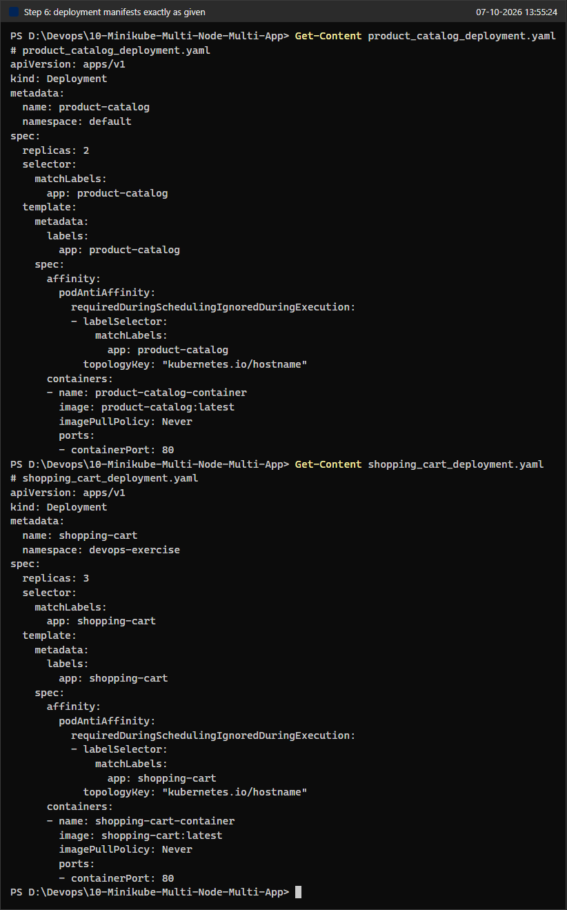

```powershell
kubectl apply -f product_catalog_deployment.yaml
kubectl apply -f shopping_cart_deployment.yaml
kubectl get namespaces
```
**Status:** The Product Catalog worked (`deployment.apps/product-catalog created`). The Shopping Cart **failed**: `Error from server (NotFound): ... namespaces "devops-exercise" not found`. `kubectl get namespaces` confirms that only `default`, `kube-node-lease`, `kube-public` and `kube-system` exist. Session 1 ended here.


### Resuming after the reboot: restart the existing 3-node cluster
```powershell
minikube profile list
docker ps -a --filter name=devops-multinode --format "table {{.Names}}\t{{.Status}}"
minikube start -p devops-multinode
```
**Status:** Before the restart the profile was `Stopped`, and all three node containers were `Exited (137) 45 hours ago` because of the reboot. `minikube start -p devops-multinode` started the existing control plane and both workers again; `--nodes 3` is not needed because the profile remembers its nodes. It also re-enabled the registry add-on, this time on host port 63801. It ended with "Done!".

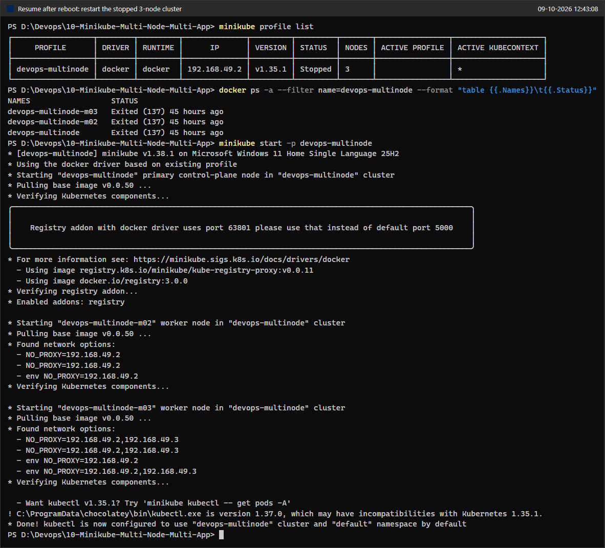

```powershell
minikube -p devops-multinode status
kubectl get nodes -o wide
kubectl get deploy,pods -o wide
```
**Status:** All three nodes are `Ready` again (age 46h, so these are the same nodes as in session 1). The `product-catalog` Deployment from session 1 survived the reboot at `2/2`. Its two pods restarted once (`RESTARTS 1`) when the nodes came back, and they run on **different nodes** (`devops-multinode-m02` and `devops-multinode-m03`).

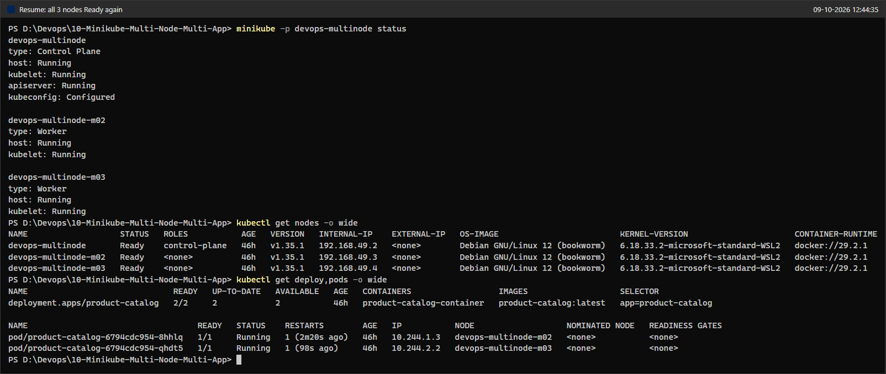

```powershell
# same three per-node commands as in screenshot 11
```
**Status:** Both images are still on every node with the same IDs, because they are stored inside the node containers' Docker data, which survives a stop and start. Nothing had to be rebuilt or reloaded.


### Step 6 (fixed): Apply both Deployments
I changed line 6 of `shopping_cart_deployment.yaml` from `namespace: devops-exercise` to `namespace: default`. The reasons are explained under Issues & Fixes.
```powershell
Select-String -Path shopping_cart_deployment.yaml -Pattern "name:|namespace:"
kubectl apply -f product_catalog_deployment.yaml
kubectl apply -f shopping_cart_deployment.yaml
kubectl rollout status deployment/shopping-cart --timeout=120s
kubectl get deployments -o wide
```
**Status:** Success. `product-catalog` is `unchanged`, and `shopping-cart` is `created` and finished rolling out. `kubectl get deployments` shows `product-catalog 2/2` and `shopping-cart 3/3`.


### Step 7: Expose the services
```powershell
Get-Content product_catalog_service.yaml
Get-Content shopping_cart_service.yaml
kubectl apply -f product_catalog_service.yaml
kubectl apply -f shopping_cart_service.yaml
kubectl get svc -o wide
```
**Status:** Both Services were created as type `NodePort`: `product-catalog-service` (ClusterIP 10.106.51.95, `80:32577/TCP`, selector `app=product-catalog`) and `shopping-cart-service` (ClusterIP 10.96.24.142, `80:30240/TCP`, selector `app=shopping-cart`).

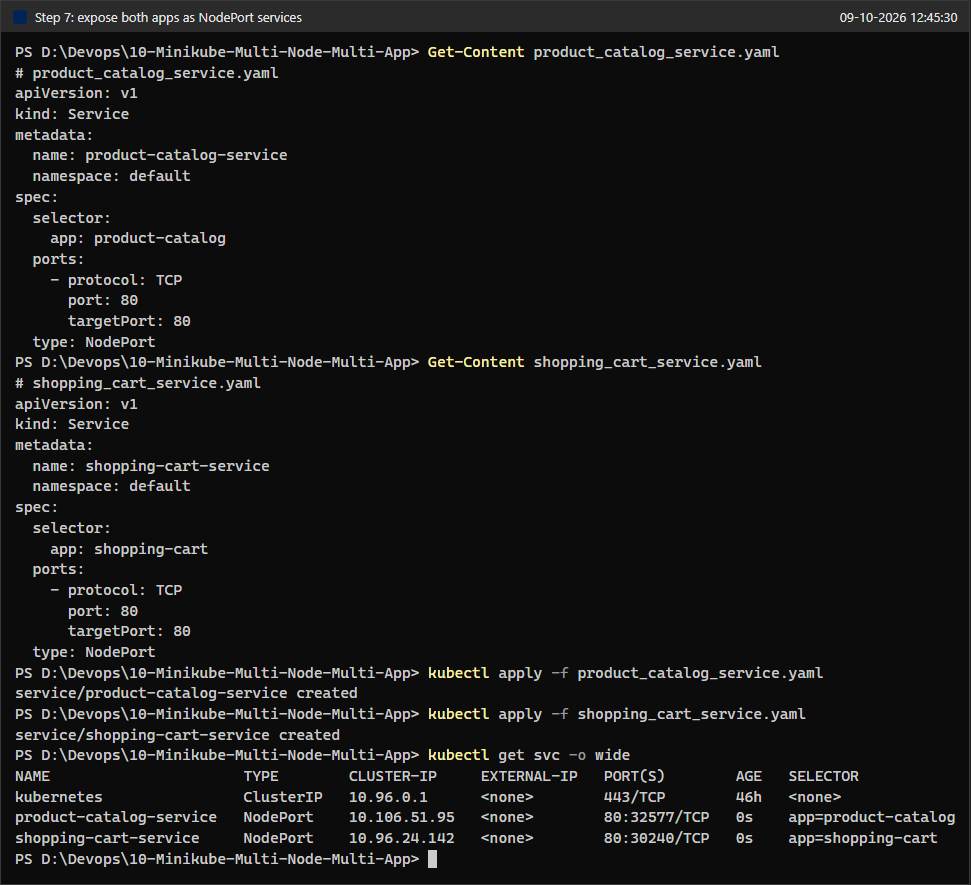

### Step 8: Verify the deployment and the distribution across nodes
```powershell
kubectl get pods -o wide
kubectl get pods -o custom-columns=POD:.metadata.name,APP:.metadata.labels.app,NODE:.spec.nodeName --sort-by=.metadata.labels.app
```
**Status:** All 5 pods are `1/1 Running`, and **no two replicas of the same app share a node**:

| App | Pod | Node |
|-----|-----|------|
| product-catalog | `product-catalog-6794cdc954-8hhlq` (10.244.1.3) | devops-multinode-m02 |
| product-catalog | `product-catalog-6794cdc954-qhdt5` (10.244.2.2) | devops-multinode-m03 |
| shopping-cart | `shopping-cart-7bf585c6f8-4pcvf` (10.244.1.4) | devops-multinode-m02 |
| shopping-cart | `shopping-cart-7bf585c6f8-j6j9f` (10.244.0.4) | devops-multinode (control plane) |
| shopping-cart | `shopping-cart-7bf585c6f8-wrhh9` (10.244.2.5) | devops-multinode-m03 |

The 3 shopping-cart replicas take all three nodes, one each. The 2 product-catalog replicas are on two different nodes. The anti-affinity rule only forbids two pods of the same app on one node, so the scheduler was free to leave the control plane without a catalog pod. This matches the expected output in the exercise.


```powershell
kubectl get deploy,rs,svc -o wide
kubectl get endpointslices -l "kubernetes.io/service-name in (product-catalog-service,shopping-cart-service)"
```
**Status:** Each Deployment owns one ReplicaSet (`product-catalog-6794cdc954` 2/2/2 and `shopping-cart-7bf585c6f8` 3/3/3). The EndpointSlices show that each Service found all of its pods: 2 endpoints for the catalog and 3 for the cart. The cart Service could only find its pods because the namespace fix put them in `default`, next to the Service.


### Step 9: Access the services through `minikube service`
On Windows with the Docker driver, the node IPs (192.168.49.x) cannot be reached from the host. `minikube service` therefore opens an SSH tunnel to a random local port, and that tunnel lasts only as long as the command keeps running. I started both commands with `--url` in the background and redirected their stdout and stderr to files:
```powershell
Start-Process minikube -ArgumentList "-p devops-multinode service product-catalog-service --url" -RedirectStandardOutput svc-product.out -RedirectStandardError svc-product.err -WindowStyle Hidden -PassThru
Start-Process minikube -ArgumentList "-p devops-multinode service shopping-cart-service --url" -RedirectStandardOutput svc-cart.out -RedirectStandardError svc-cart.err -WindowStyle Hidden -PassThru
```
**Status:** Both tunnels came up:
- Product Catalog: **http://127.0.0.1:54583**
- Shopping Cart: **http://127.0.0.1:54582**

Each tunnel also printed "Because you are using a Docker driver on windows, the terminal needs to be open to run it." The tunnel processes ran from about 12:46 to 12:58. The image below was rendered afterwards from the captured output files, so the clock in its title bar shows the render time.


### Step 10: Test with `curl`
**Product Catalog:**
```powershell
curl.exe -s http://127.0.0.1:54583/products
curl.exe -s -i http://127.0.0.1:54583/products
```
**Status:** `HTTP/1.1 200 OK` with the expected list: Laptop 1200, Phone 800, Headphones 150. The `Server` header confirms that the reply came from the container (Werkzeug 3.1.9, Python 3.9.25). Flask returns compact JSON on one line, not the pretty-printed form shown in the exercise.


**Shopping Cart: empty cart, then add an item:**
```powershell
curl.exe -s http://127.0.0.1:54582/cart
Get-Content item.json
curl.exe -s -i -X POST http://127.0.0.1:54582/cart -H "Content-Type: application/json" --data-binary "@item.json"
```
**Status:** The first `GET /cart` returned `[]`. The `POST` returned `HTTP/1.1 201 CREATED` with `[{"id":1,"name":"Laptop","quantity":1}]`, which is exactly what the exercise expects.

![Step 10: GET /cart returns [], POST /cart returns 201 with the Laptop](./screenshot/23-curl-get-and-post-cart.png)

**What happens on the next `GET /cart`?** The exercise stops after the POST, so I sent more GET requests:
```powershell
1..8 | ForEach-Object { "GET /cart #$_ -> " + (curl.exe -s http://127.0.0.1:54582/cart) }
kubectl logs -l app=shopping-cart --prefix --tail=20 | Select-String "/cart"
```
**Status:** All 8 requests returned `[]`, so the Laptop seemed to be gone. The pod logs explain why. The POST (and the first GET) were served by `shopping-cart-7bf585c6f8-wrhh9` on m03. These 8 GETs went to the other two replicas (4 to `4pcvf`, 4 to `j6j9f`), and their own `cart` lists are still empty. Each replica is a separate Python process with its **own in-memory cart**. The Service spreads new connections across the 3 replicas, and each `curl.exe` call opens a new connection.

![Step 10: 8 more GET /cart all return []; the logs show they hit the two pods that never received the POST](./screenshot/24-cart-per-pod-in-memory.png)

```powershell
1..15 | ForEach-Object { "GET /cart #$_ -> " + (curl.exe -s http://127.0.0.1:54582/cart) }
kubectl get pods -l app=shopping-cart -o name | ForEach-Object { $l = kubectl logs $_; "{0}  GET /cart: {1}  POST /cart: {2}" -f $_, ($l | Select-String '"GET /cart').Count, ($l | Select-String 'POST /cart').Count }
```
**Status:** This time the answers alternate: 7 of the 15 requests returned the Laptop and 8 returned `[]`. The per-pod tally from the logs adds up to all 24 GET requests sent so far (1 + 8 + 15). `4pcvf` served 10 GETs, `j6j9f` served 6, and `wrhh9` served 8 GETs plus the only POST. Every request that returned the Laptop was served by `wrhh9`. So the cart is not lost; it simply exists only in one of the three replicas. (The 8 misses in a row in the previous screenshot were just chance.)

![Step 10: 15 more GETs alternate between [] and the Laptop; per-pod request tally](./screenshot/25-cart-more-requests-tally-per-pod.png)

**The exercise's POST command as written** (for Issues & Fixes):
```powershell
curl -X POST http://127.0.0.1:54582/cart -H "Content-Type: application/json" -d '{"id": 1, "name": "Laptop", "quantity": 1}'
curl.exe -s -i -X POST http://127.0.0.1:54582/cart -H "Content-Type: application/json" -d '{"id": 1, "name": "Laptop", "quantity": 1}'
```
**Status:** Both forms fail in Windows PowerShell 5.1. `curl` is an alias of `Invoke-WebRequest`, which cannot bind `-H "Content-Type: ..."` to its `-Headers` dictionary. With `curl.exe`, PowerShell 5.1 strips the inner double quotes when it passes the argument to a native program, so Flask receives invalid JSON and answers `400 BAD REQUEST`. A failed request does not change any cart. The `item.json` and `--data-binary "@item.json"` form above avoids the problem.


**In the browser:**
```text
http://127.0.0.1:54583/products
http://127.0.0.1:54582/cart
```
**Status:** The catalog page shows the three products. The first load of `/cart` landed on a replica with an empty cart (`[]`). A separate script then reloaded `/cart` in a fresh browser context (so a new connection) until a reply contained the Laptop. The first load in that script already did, so it was served by `wrhh9`. These two cart screenshots show the per-pod state in the browser too.

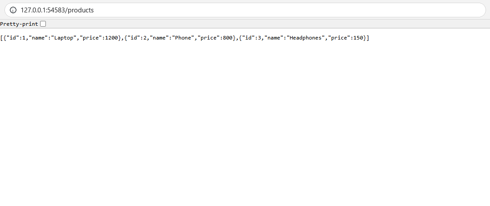

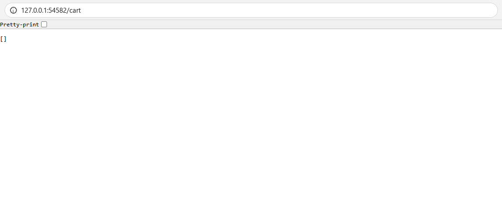

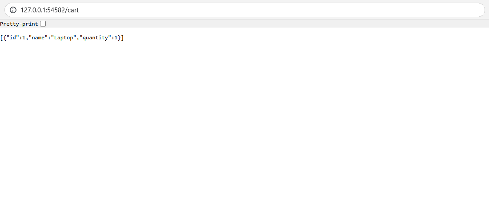

---

## Extra: Fault tolerance, stopping one worker node
The storyboard says the services should remain available "even if one node fails". I tested this by stopping worker m03, which ran one catalog replica and one cart replica (the one holding the Laptop).

```powershell
minikube -p devops-multinode node stop devops-multinode-m03
minikube -p devops-multinode node list
kubectl get nodes
```
**Status:** The node container was powered off at 12:50:00. Right afterwards Kubernetes still reports m03 as `Ready`, because the control plane only notices a dead node when its heartbeats stop arriving.

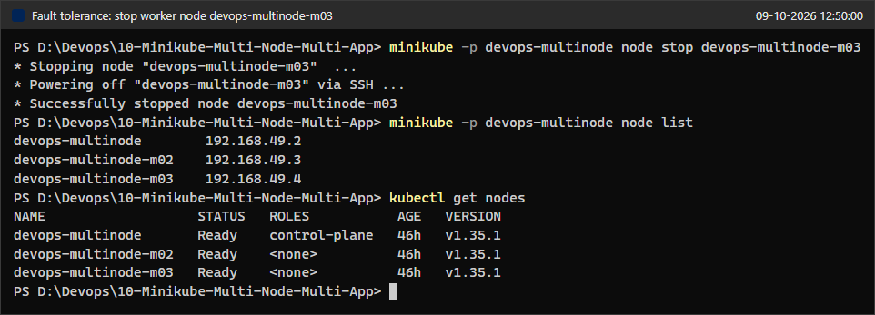

About 35 seconds later (12:50:35) m03 became `NotReady`:
```powershell
kubectl get nodes
kubectl get pods -o wide
kubectl get endpointslices -l "kubernetes.io/service-name in (product-catalog-service,shopping-cart-service)"
1..3 | ForEach-Object { "GET /products #$_ -> " + (curl.exe -s --max-time 5 http://127.0.0.1:54583/products) }
1..6 | ForEach-Object { "GET /cart #$_ -> " + (curl.exe -s --max-time 5 http://127.0.0.1:54582/cart) }
```
**Status:** **Both services kept answering.** All 3 catalog requests returned the product list, and all 6 cart requests answered, with no time-outs. When the node went NotReady, Kubernetes marked the m03 endpoints as not ready (shown as `ready=false` in screenshot 32), so the Services stopped sending traffic there. The pod list still shows the m03 pods as `1/1 Running`, because nobody can update their container status while the node's kubelet is down. Every cart answer was now `[]`, because the only replica holding the Laptop is on the dead node.

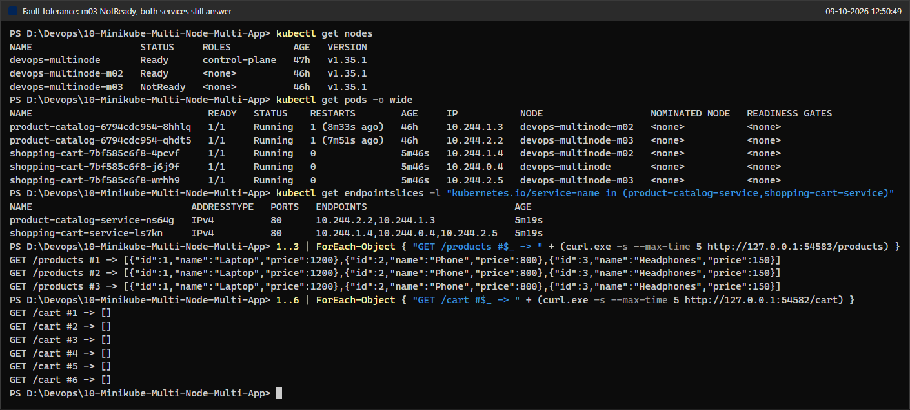

About 5 minutes after the node went NotReady (12:55:33), Kubernetes evicted the pods from it. By default every pod tolerates the `node.kubernetes.io/unreachable` taint for only 300 seconds:
```powershell
kubectl get endpointslices -l "kubernetes.io/service-name in (product-catalog-service,shopping-cart-service)" -o jsonpath="{range .items[*]}{.metadata.name}{'\n'}{range .endpoints[*]}  {.addresses[0]}  {.nodeName}  ready={.conditions.ready}{'\n'}{end}{end}"
kubectl get pods -o wide
kubectl get events --field-selector reason=FailedScheduling --sort-by=.lastTimestamp
```
**Status:**
- The endpoints on m03 (10.244.2.2 and 10.244.2.5) are `ready=false`.
- The two m03 pods are `Terminating`. They cannot finish terminating until the node is back.
- The replacement catalog pod `product-catalog-6794cdc954-tqzpj` started on the **control plane** (10.244.0.5). The anti-affinity rule allows this, because the control plane had no catalog pod.
- The replacement cart pod `shopping-cart-7bf585c6f8-7sjh6` stays **`Pending`**. The event explains why: `0/3 nodes are available: 1 node(s) had untolerated taint(s), 2 node(s) didn't match pod anti-affinity rules`. Both healthy nodes already run a cart pod, and the rule is *required*, so the scheduler will not double up.

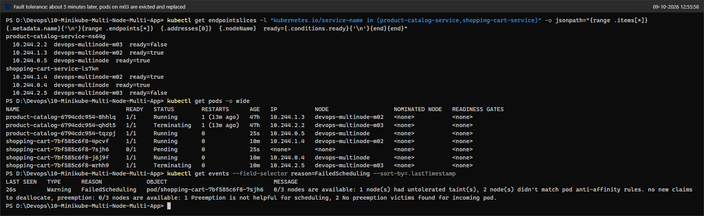

```powershell
minikube -p devops-multinode node start devops-multinode-m03
kubectl wait --for=condition=Ready node/devops-multinode-m03 --timeout=180s
kubectl rollout status deployment/shopping-cart --timeout=180s
```
**Status:** m03 started again, became `Ready`, and the `shopping-cart` rollout went back to 3 of 3 available.

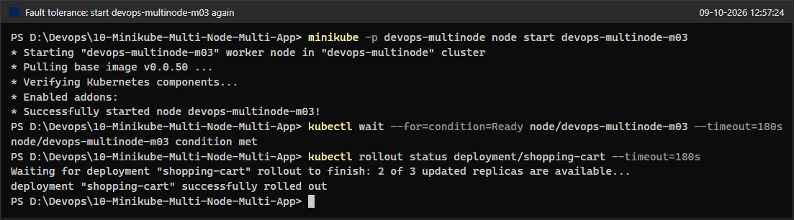

```powershell
kubectl get nodes
kubectl get pods -o wide
kubectl get deploy
1..6 | ForEach-Object { "GET /cart #$_ -> " + (curl.exe -s --max-time 5 http://127.0.0.1:54582/cart) }
```
**Status:** All three nodes are `Ready`. The Pending cart pod `7sjh6` was scheduled onto m03 as soon as the node came back, and the two old Terminating pods are gone. Both Deployments are back at `2/2` and `3/3`, with every replica on its own node. The catalog now runs on m02 and the control plane, and the cart on all three nodes. The Laptop is **gone for good** (every GET returns `[]`), because it lived only in the memory of the evicted pod `wrhh9`.

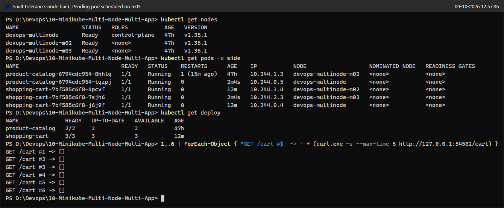

---

## Issues & Fixes
1. **`shopping_cart_deployment.yaml` uses a namespace that does not exist (Step 6).** As written, the Deployment declares `namespace: devops-exercise`. That namespace is never created, so `kubectl apply` fails with `namespaces "devops-exercise" not found` (screenshot 13). Creating the namespace would not have been enough either. A Service only selects pods in its own namespace, and `shopping-cart-service` is declared in `default`, so it would have had no endpoints. The rest of the exercise also assumes `default`: Step 8 lists all pods with a plain `kubectl get pods`, and the Step 9 output shows `NAMESPACE default`. **Fix:** I changed the one line to `namespace: default` and re-applied (screenshot 17). After that, the Service found all three pods (screenshot 20).
2. **The session was interrupted, and the machine was rebooted in between.** Session 1 stopped right after the namespace error. The reboot stopped the three node containers (`Exited (137)`). **Fix:** In session 2 I ran `minikube start -p devops-multinode` (screenshot 14) instead of recreating the cluster. Then I checked again that the nodes were Ready (screenshot 15) and that both images were still on every node (screenshot 16). The `product-catalog` Deployment from session 1 survived, and its pods restarted once.
3. **The registry add-on uses a random port and newer images than shown.** The exercise shows port 32775 with `registry:2.8.3` and `kube-registry-proxy:0.0.6`. On this machine the port was 56962 (63801 after the restart), with `registry:3.0.0` and `kube-registry-proxy:v0.0.11`. Nothing in the later steps depends on the port: `minikube image load` copies the image straight into every node's Docker daemon, and the manifests use `imagePullPolicy: Never`. So the registry add-on was enabled as instructed but not actually needed. Screenshots 11 and 16 show the images on each node.
4. **Docker 29 output formats differ from the exercise.** On Docker Desktop, `docker images` uses the new IMAGE / ID / DISK USAGE / CONTENT SIZE table (screenshot 08). Inside the node, `minikube ssh -- docker images` prints only an `IMAGE` column (screenshot 10). **Fix:** None was needed. To show repository, tag and image ID on every node, I added `--format 'table {{.Repository}}\t{{.Tag}}\t{{.ID}}\t{{.Size}}'` and `-n <node>` (screenshot 11).
5. **`minikube service` blocks and opens a browser (Step 9).** The exercise runs `minikube -p devops-multinode service <name>` in a separate Linux or WSL terminal. This cluster is managed by the Windows minikube, and with the Docker driver on Windows the command must keep running to hold its SSH tunnel open. **Fix:** I ran each command with `--url` (prints the URL instead of opening a browser) as a hidden background process with redirected output (screenshot 21). The local ports were 54583 and 54582 instead of the exercise's 35855 and 38975, because they are chosen at random. I stopped both tunnels at the end (screenshot 35).
6. **The exercise's `curl -d '{...}'` command does not work in Windows PowerShell 5.1 (Step 10).** `curl` is an alias of `Invoke-WebRequest`. With `curl.exe`, PowerShell 5.1 removes the embedded double quotes, so the server receives `{id: 1, name: Laptop, quantity: 1}` and answers `400 BAD REQUEST` (screenshot 26). **Fix:** I saved the body as `item.json` and used `curl.exe ... --data-binary "@item.json"` (screenshot 23).
7. **The cart contents depend on which replica answers.** This is not a fault of the setup, but the exercise's expected output does not show it. The cart is a Python list in each pod's memory, and there are 3 replicas behind one Service. A GET only shows the item if it reaches the replica that received the POST (screenshots 24, 25, 28 and 29). The data is also lost when that pod dies (screenshot 34). **Not changed**, because the exercise gives this code. The proper fix is to keep carts in a shared store, such as Redis or a database, so that any replica can serve any request and the data survives pod restarts.
8. **Minor warnings, no action needed.** kubectl v1.37.0 is newer than the v1.35.1 server, and minikube says so; every command worked. Minikube v1.38.1 also announced that v1.39.0 will default to the containerd runtime; this cluster uses Docker.

---

## Verification Summary
| Check | Result | Evidence |
|-------|--------|----------|
| 3-node cluster running | `devops-multinode` (control plane), `-m02` and `-m03`, all `Ready`, Kubernetes v1.35.1 | 03, 15, 34 |
| Registry add-on enabled | `registry` pod plus a `registry-proxy` pod on each node | 04, 14 |
| Images built | `product-catalog:latest`, `shopping-cart:latest` | 07, 08 |
| Images on every node | Same image IDs (`8120fdf3aa86`, `a7c1ee2a7b51`) on all 3 nodes | 11, 16 |
| Deployments | `product-catalog` 2/2, `shopping-cart` 3/3 (after the namespace fix) | 17, 20 |
| Replicas spread across nodes | Catalog on m02 and m03; cart on control plane, m02 and m03; never two of one app on a node | 19 |
| Services | Two `NodePort` Services (32577 and 30240), with 2 and 3 endpoints | 18, 20 |
| `GET /products` | 200 with the 3 products (curl and browser) | 22, 27 |
| `GET /cart` (empty) | `[]` | 23, 28 |
| `POST /cart` | 201 with `[{"id":1,"name":"Laptop","quantity":1}]` | 23 |
| Cart state per replica | Item visible only through the replica that received the POST | 24, 25, 29 |
| Node failure | Both services kept answering with m03 down; pods were rescheduled within anti-affinity limits; the cart pod stayed Pending until the node returned | 30 to 34 |
| Tunnels stopped | No `minikube.exe` left running; the tunnel port refuses connections (curl exit 7) | 35 |

---

## Q&A
The exercise does not list explicit questions. The answers below cover the questions its storyboard and steps raise.

**1. Why can't we just use `eval $(minikube docker-env)` on a multi-node cluster, as in the single-node labs?**
`docker-env` points your Docker CLI at the Docker daemon of **one** node, the primary one. An image built there exists only on that node. Pods that the scheduler places on m02 or m03 would fail with `ErrImageNeverPull`, because the manifests say `imagePullPolicy: Never`. On a multi-node cluster every node needs the image. You can get it there by pushing it to a registry that all nodes pull from, which is what the registry add-on is for, or by having `minikube image load` copy it into every node, which is what Step 5 does and screenshot 11 proves.

**2. How does `podAntiAffinity` spread the replicas, and what does `requiredDuringSchedulingIgnoredDuringExecution` mean?**
The rule says: do not put this pod on a node (the `topologyKey` is `kubernetes.io/hostname`, so the topology domain is a single node) that already runs a pod with the label `app: shopping-cart` (or `app: product-catalog`). "Required during scheduling" makes it a hard rule: if no node qualifies, the pod stays `Pending` rather than doubling up. That is exactly what happened to the replacement cart pod while m03 was down (screenshot 32). "Ignored during execution" means the scheduler checks the rule only when it places a pod. Pods that are already running are never moved because of it. A softer alternative is `preferredDuringSchedulingIgnoredDuringExecution`. It still spreads the pods when it can, but it allows two replicas on one node during an outage, so the cart would have stayed at 3 running replicas instead of 2 Running and 1 Pending.

**3. Why did the Shopping Cart manifest fail, and why does the namespace matter for the Service?**
A namespaced object can only be created in a namespace that exists, and `devops-exercise` did not. Even with that namespace created, the Service would not have worked. A Service's label selector only matches pods **in the Service's own namespace**, and `shopping-cart-service` lives in `default`. Moving the Deployment to `default` fixes both problems.

**4. Why does `GET /cart` sometimes return the Laptop and sometimes `[]`?**
Each of the 3 replicas keeps its own `cart = []` list in memory. The Service (kube-proxy) chooses a backend pod for every new TCP connection, and each `curl.exe` call is a new connection, so consecutive requests land on different replicas. Only the replica that handled the POST has the item. The logs in screenshot 25 confirm this. Stateless services, such as the product catalog, are fine to replicate this way. Stateful data, such as a cart, should live in a shared store like Redis or a database. Otherwise it is inconsistent between replicas and is lost whenever a pod is replaced (screenshot 34).

**5. What exactly happens when a node fails?**
I observed this sequence:
- After about 35 to 40 seconds without heartbeats, the node becomes `NotReady`.
- Kubernetes then marks that node's pods as not ready and removes them from the Services' ready endpoints. Traffic goes only to the surviving replicas, which is why both services kept answering.
- After a further 300 seconds, the default toleration for the `unreachable` taint, Kubernetes evicts the pods. The ReplicaSets create replacements on the healthy nodes, as far as the anti-affinity rules allow.
- When the node returns, the old pods are cleaned up and any `Pending` replicas are scheduled.

Having replicas on different nodes is what keeps the service available during all of this. Placing them all on one node would make that node a single point of failure.

**6. Why must the terminal stay open for `minikube service` with the Docker driver?**
With the Docker driver, the nodes are containers on Docker Desktop's internal network (192.168.49.0/24), and the Windows host cannot route to it. So the NodePort on 192.168.49.x is not reachable from the host. `minikube service` works around this by opening an SSH tunnel from a random port on 127.0.0.1 into the cluster. The tunnel is a child process of the command, so it exists only while the command runs. In this lab I kept the command running in the background instead of in an open terminal. The same applies on Linux under WSL with Docker Desktop, where the exercise was written.

**7. What is the difference between the NodePort and the URL we actually used?**
The NodePort (32577 for the catalog, 30240 for the cart) is opened on **every** node's IP. From inside the Docker network you could call, for example, `http://192.168.49.3:30240/cart` on any node and still reach any cart replica. The `127.0.0.1:5458x` URLs exist only on this Windows host. They are the local ends of the minikube SSH tunnels, which forward the traffic into the cluster.

---

## Cleanup / State Left Running
- **Stopped:** both `minikube service --url` tunnel processes (Start-Process PIDs 4108 and 39648, together with their minikube.exe child processes and those processes' own children) were killed with `taskkill /T /F`. Screenshot 35 confirms that no `minikube.exe` is left running and that the tunnel port no longer accepts connections.
- **Intentionally left running:** the 3-node Minikube cluster `devops-multinode` (status `OK`, current kubectl context). It still runs the `product-catalog` Deployment (2/2), the `shopping-cart` Deployment (3/3), the two NodePort Services and the registry add-on. To stop or remove it later:
  ```powershell
  minikube stop -p devops-multinode      # keep it for later
  minikube delete -p devops-multinode    # remove it completely
  ```
- The local Docker Desktop images `product-catalog:latest` and `shopping-cart:latest` were kept.

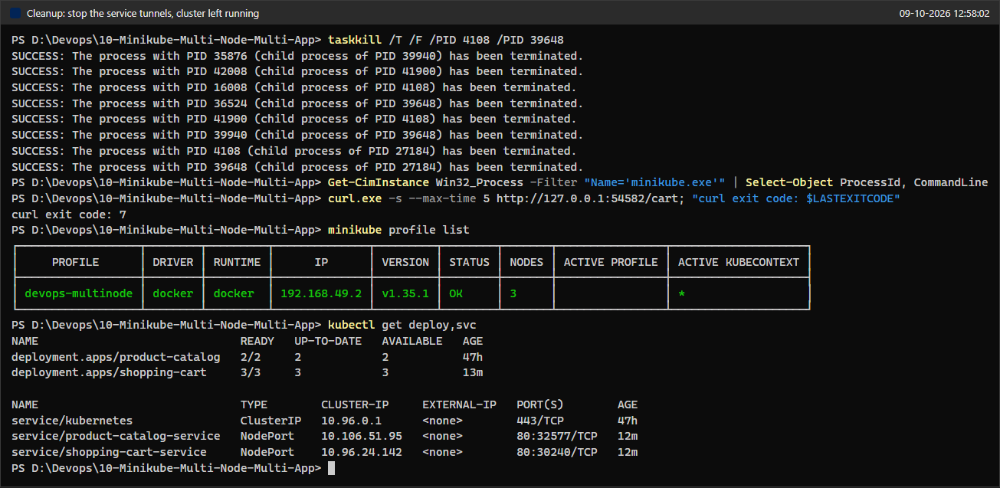
